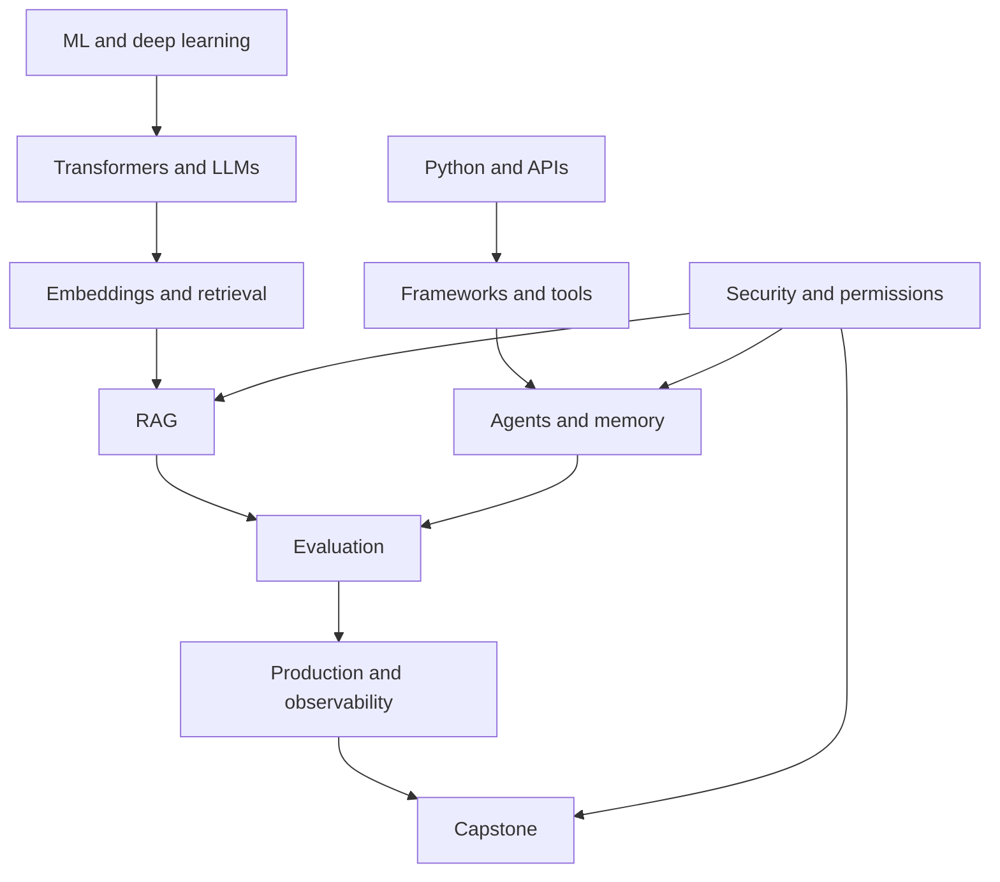

# Learning roadmap and dependencies

Aim to explain a mechanism, implement it, debug it, and justify its production boundary. Do not equate finishing a reading plan with senior engineering experience.

## Sequence

| Phase | Modules | Exit evidence |
|---|---|---|
| Software and ML foundations | 01–03 | Async processing lab, metrics, loss update |
| Language models | 04–06 | Attention calculation, token budgets, prompt tests |
| Retrieval | 07–10 | CRUD index, RAG baseline, retrieval evaluation |
| Frameworks and tools | 11–14 | Composed chain, validated tools, persisted workflow plan |
| Agents and memory | 15–17 | Bounded agent, scoped memory, evidence-preserving collaboration |
| Adaptation and measurement | 18–20 | Tuning experiment design, evaluation report, safe traces |
| Production engineering | 21–28 | Attack tests, cost experiment, deployment and incident plan |
| Interview and portfolio | 29–30 | Coding solutions, measured project walkthrough, mock rounds |

## Dependency map

Security accompanies implementation from the beginning; the numbered security chapter consolidates it later. Evaluation starts with the first runnable baseline rather than waiting until the end.

## Role paths

RAG engineer: retrieval, source lifecycle, evaluation, permissions, APIs. Agent engineer: tools, state, bounded orchestration, memory, action evaluation. AI backend engineer: Python, APIs, databases, queues, observability, cloud identity. Applied AI engineer: all of these plus task quality and business trade-offs.

## Project roadmap

Start with the RAG project. Add support or SQL automation once retrieval and tool boundaries work. Build evaluation before claiming improvements. Finish enterprise integration only after persistence, authentication, monitoring, and failure tests exist. Project guides list acceptance criteria and avoid fabricated portfolio metrics.

## Mock roadmap

Complete the corresponding concept group before attempting its round. Allow 2 minutes per short answer and 5–10 minutes for deep follow-ups. Score accuracy, mechanism, trade-offs, failures, and clarity from 0 to 4 each. Revisit a concept when you cannot explain the actual failure boundary.
