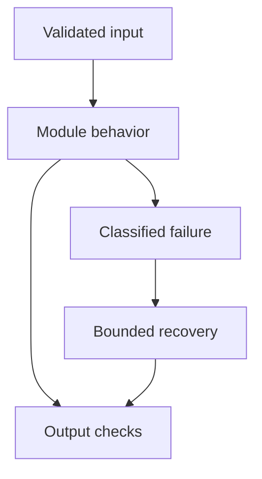

# 01: Python for GenAI

[Learning roadmap](../00-roadmap/learning-roadmap.md) · [Repository home](../README.md) · [Next module](../02-ml-fundamentals/README.md)

## Simple explanation

A GenAI service is mostly ordinary software around a probabilistic model. Python lets you validate requests, move documents, call models, and manage failures. A clever prompt cannot compensate for an API that blocks its event loop or leaks credentials.

## Why, when, and how

Study this module to answer engineering scenarios, not only definitions. Work through the concepts below, run the example, explain its boundaries, then solve the exercise before reading interview answers.

## Concepts

### Fundamentals and data structures

Use lists for ordered chunks, dictionaries for records keyed by ID, sets for deduplication, and tuples for immutable coordinates. Avoid mutable default arguments: a default list is shared between calls. Shallow copying a dictionary does not copy nested lists. Understand truthiness, comprehensions, slicing, scope, and equality versus identity before writing pipelines.

### OOP and dependency injection

A provider interface separates business logic from one vendor SDK. Prefer small objects with explicit collaborators: Retriever receives an Embedder and a Store. Composition makes tests simpler than deep inheritance. Inject a fake model in tests so tests do not depend on bills, network availability, or model nondeterminism.

### Decorators

A decorator wraps a function to add behavior such as tracing or timing. Preserve names and documentation with functools.wraps. An async decorator must await the wrapped coroutine. Retrying through a decorator is only safe when the operation is retryable; repeating a payment tool can charge twice.

### Iterators and generators

An iterator produces values on demand; a generator implements this with yield. Stream document records rather than loading a huge corpus into RAM. A generator is usually consumed once. Streaming parsing reduces memory, but embedding APIs still need bounded batches and backpressure.

### Context managers

with and async with express resource lifetime. Close files, HTTP clients, database sessions, and transactions even when exceptions happen. Open a shared HTTP client during application startup instead of constructing one per request. A transaction context should roll back when a write fails.

### Async and concurrency

async/await lets one thread serve other work while waiting for compatible nonblocking I/O. It does not make CPU-heavy tokenization parallel. Limit concurrent model calls with a semaphore and bound the producer queue. Cancellation should stop outstanding work and release resources; gather with return_exceptions changes how errors propagate.

### Threading and multiprocessing

Threads can isolate blocking I/O libraries; processes can parallelize CPU work on conventional GIL-enabled CPython. Serialization and process startup cost matter for small jobs. Some numerical libraries release the GIL. Know which runtime you use rather than treating every Python implementation as identical.

### Types and Pydantic

Type hints document contracts and support static checks; Python does not enforce them automatically. Pydantic validates data at runtime. Use explicit constraints and forbid extra fields for tool inputs. Coercion is sometimes useful, but strict validation is preferable when ambiguous input could execute a dangerous action.

### Errors and logging

Classify validation failures, rate limits, transient network failures, and permanent authorization failures. Retry only transient failures within a deadline. Log request IDs, stage, exception class, and duration; do not dump prompts or tokens by default. Preserve the original exception when raising a domain error.

### Environment and dependencies

Use Python 3.12 with uv or venv for these labs. Keep secrets in environment variables or a secret manager. Commit a dependency lock once resolved and tested. pyproject.toml defines the project; a virtual environment isolates installed packages. Pin deployment dependencies and review updates deliberately.

## Architecture and implementation boundary

The example isolates one mechanism from this module. Its inputs, state transitions, and outputs should be inspectable in code. Use it as a tested teaching primitive, then add the integrations described below. Offline lexical search and fixture answers are explicitly different from learned embeddings and live LLM generation.



## Real-world scenario

> An LLM takes five seconds per call. How would you process 100 documents efficiently?

**Recommended approach:** Use bounded asynchronous I/O for independent requests, a shared client, explicit timeouts, and a retry budget. Keep CPU-heavy parsing out of the event loop and respect provider request and token quotas.

**Technical reasoning:** With concurrency 10 and no other bottleneck, 100 five-second requests take roughly 50 seconds rather than 500. Little’s law relates in-flight requests to arrival rate and mean service time. Quotas and tail latency constrain useful concurrency. A semaphore limits active calls but a queue is also needed to bound queued memory. A document ID plus ingestion version makes retried writes idempotent. Measure queue delay separately from provider duration.

## Code

This example runs on Python 3.12 with the standard library.

Run from the repository root:

```bash
python -m examples.async_batch
```

```python
import asyncio, time
from examples.core import bounded_map
async def work(item):
    await asyncio.sleep(0.01)
    if item == 17:
        raise ValueError('synthetic bad record')
    return item * 2
async def main():
    for concurrency in (1, 5, 10):
        start = time.perf_counter()
        results = await bounded_map(range(100), work, concurrency)
        print(concurrency, round(time.perf_counter()-start, 3),
              'seconds; failures:', sum(x.error is not None for x in results))
if __name__ == '__main__':
    asyncio.run(main())
```

Shared implementation: [core.py](../examples/core.py). Tests: [test_core.py](../tests/test_core.py). Optional adapters have separate validation status in [VALIDATION.md](../VALIDATION.md).

## Interview case

### Question

An LLM takes five seconds per call. How would you process 100 documents efficiently?

### Difficulty

Hard

### What interviewer is testing

Whether you can identify the actual engineering constraint, choose a bounded implementation, and justify its trade-offs.

### Short Answer

Use bounded asynchronous I/O for independent requests, a shared client, explicit timeouts, and a retry budget. Keep CPU-heavy parsing out of the event loop and respect provider request and token quotas.

### Interview Answer

Use bounded asynchronous I/O for independent requests, a shared client, explicit timeouts, and a retry budget. Keep CPU-heavy parsing out of the event loop and respect provider request and token quotas. With concurrency 10 and no other bottleneck, 100 five-second requests take roughly 50 seconds rather than 500. Little’s law relates in-flight requests to arrival rate and mean service time. Quotas and tail latency constrain useful concurrency. A semaphore limits active calls but a queue is also needed to bound queued memory. A document ID plus ingestion version makes retried writes idempotent. Measure queue delay separately from provider duration. I would start with a representative failing or demanding workload and define measurable acceptance criteria. I would test both successful behavior and the likely failure path, then compare the new implementation with a fixed baseline. I would report the implemented scope and remaining assumptions clearly.

### Deep Technical Answer

With concurrency 10 and no other bottleneck, 100 five-second requests take roughly 50 seconds rather than 500. Little’s law relates in-flight requests to arrival rate and mean service time. Quotas and tail latency constrain useful concurrency. A semaphore limits active calls but a queue is also needed to bound queued memory. A document ID plus ingestion version makes retried writes idempotent. Measure queue delay separately from provider duration. Keep input assumptions, state scope, failure classification, and deployment configuration explicit. Verify that the implementation is doing what the architecture claims by inspecting stage-level traces and authoritative outcomes. A successful demonstration is not enough evidence for an unmeasured scale claim.

### Real-World Example

Use the scenario above with a fixed source version and representative inputs. Save the expected result, observed result, and relevant trace so the investigation can be repeated.

### Code

Use the runnable example above and inspect the shared core for validation, lifecycle, or budget logic. Extend it only after the baseline behavior is understood.

### Follow-up Question

How would you prove this improvement still works after a dependency, model, or source-data change?

### Follow-up Answer

Version inputs and configuration, keep independent regression cases, compare quality and operational metrics, and test a rollback. Add a slice for the failure this change specifically addresses.

### Common Mistake

Giving a component name as the whole answer without explaining its contract, limitations, measurement, or failure behavior.

### Senior-Level Insight

With concurrency 10 and no other bottleneck, 100 five-second requests take roughly 50 seconds rather than 500. Little’s law relates in-flight requests to arrival rate and mean service time. Quotas and tail latency constrain useful concurrency. A semaphore limits active calls but a queue is also needed to bound queued memory. A document ID plus ingestion version makes retried writes idempotent. Measure queue delay separately from provider duration. Explain the simplest design that meets the requirement and what workload or evidence would make you replace it.

## Follow-up tree

1. Explain the mechanism using a tiny input.
2. Show the implementation and edge cases.
3. Explain the scenario above and the main bottleneck.
4. Show which metric would identify a regression.
5. Explain recovery after failure or a partial result.
6. Design the boundary under multiple tenants and ten times the workload.

## Debugging exercise

**Symptom:** the scenario fails after a configuration or data change. **Investigation:** capture exact inputs, versions, and stage outcomes; compare with the prior baseline. **Root cause:** identify the first stage violating its contract. **Fix:** change that stage and replay the case. **Prevention:** add the failing case and an operational signal to the regression suite. For concrete incidents, see [debugging runbooks](../28-debugging/runbooks.md).

## Production considerations

- **Reliability:** define deadlines, cancellation behavior, retryability, and recovery of partial work.
- **Security:** derive caller identity from authentication; scope data and tool permissions in trusted code.
- **Cost and performance:** measure stage latency, memory, token use, throughput, and cost per successful task.
- **Testing and evaluation:** validate hard invariants separately from semantic quality; keep representative held-out cases.
- **Deployment:** use tested dependency versions, external configuration, safe telemetry, and an actual rollback procedure.

## Levels of understanding

**Junior:** explain each concept and run the example with a small input.

**Mid-level:** adapt it to the real-world scenario, write edge tests, and diagnose a demonstrated failure.

**Senior:** With concurrency 10 and no other bottleneck, 100 five-second requests take roughly 50 seconds rather than 500. Little’s law relates in-flight requests to arrival rate and mean service time. Quotas and tail latency constrain useful concurrency. A semaphore limits active calls but a queue is also needed to bound queued memory. A document ID plus ingestion version makes retried writes idempotent. Measure queue delay separately from provider duration.

## What I must remember

A GenAI service is mostly ordinary software around a probabilistic model. Python lets you validate requests, move documents, call models, and manage failures. A clever prompt cannot compensate for an API that blocks its event loop or leaks credentials. Use bounded asynchronous I/O for independent requests, a shared client, explicit timeouts, and a retry budget. Keep CPU-heavy parsing out of the event loop and respect provider request and token quotas.

## What I must be able to code

Run, modify, and explain [async_batch.py](../examples/async_batch.py); implement the exercise below and relevant edge tests.

## What an interviewer may ask

The case above, each concept’s failure boundary, and the topic-specific questions in the [interview bank](../interview-questions/README.md).

## What senior engineers are expected to know

Requirements, observable evidence, uncertainty, dependency lifecycle, authorization, and the cost of operating the design. Explain what would change your decision.

## Common mistakes

Confusing an example with a production deployment; assuming a framework enforces business permissions; reporting unmeasured performance; skipping the failure path; and tuning on the final test set.

## Practical exercise and mini project

Process 100 fake documents with concurrency 1, 5, and 10. Measure elapsed time and peak active calls. Inject one timeout and show that the failed record is reported while successful records are retained.

**Acceptance:** include a normal case, empty or missing input, invalid input, a failure case, and one stated limitation. Record the observed result and explain why the checks match the actual requirement.

## GitHub task

```bash
git switch -c learn/01-python
python -m unittest discover -s tests -v
git add 01-python examples tests
git commit -m "docs: study python for genai and record exercise results"
git push -u origin learn/01-python
```

Open a pull request with the implementation, measured validation, and remaining limits. Do not claim a lab result is a production benchmark.
