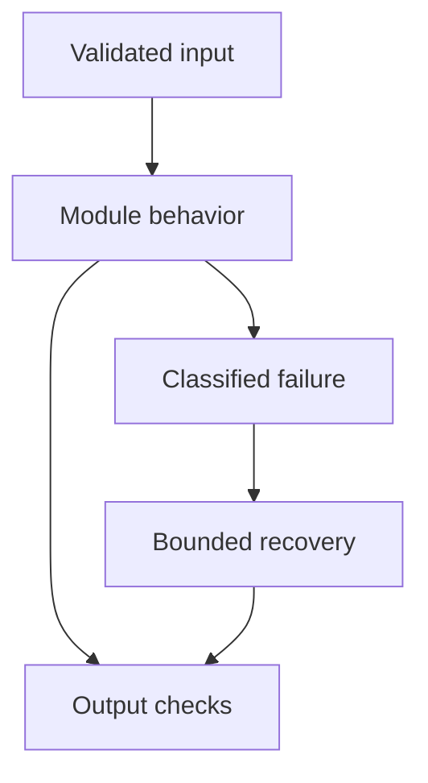

# 02: Machine Learning Fundamentals

[Previous module](../01-python/README.md) · [Repository home](../README.md) · [Next module](../03-deep-learning/README.md)

## Simple explanation

Machine learning fits patterns from examples. GenAI engineers still need ML fundamentals because retrieval relevance, routing, spam detection, reranking, and evaluation are all prediction problems.

## Why, when, and how

Study this module to answer engineering scenarios, not only definitions. Work through the concepts below, run the example, explain its boundaries, then solve the exercise before reading interview answers.

## Concepts

### Supervised learning

Learn from labeled input-output pairs. Classification predicts categories such as support intent; regression predicts a continuous value such as estimated request cost. A useful baseline is a simple model or rule with a measurable business outcome. More model complexity is justified only by held-out improvement.

### Unsupervised learning and clustering

Discover structure without target labels. Cluster support tickets to discover themes, but cluster IDs are not objective business meanings. Density and distance depend on representation and scaling. Human review is needed before assigning names or policies to clusters.

### Feature engineering

Construct informative inputs such as query length, language, domain, retrieved score gap, or recent error rate. Prevent features from using information unavailable at prediction time. Standardize scale-sensitive features using training-set statistics only. Keep transformation logic identical during training and serving.

### Overfitting and underfitting

Overfitting memorizes training specifics; underfitting misses useful structure. Compare training and validation errors. Regularization, simpler models, better data, and early stopping address different causes. A prompt can also overfit when repeatedly tuned on the same small evaluation set.

### Train validation test

Train fits parameters, validation chooses configurations, and test estimates final generalization. Split by user, document family, or time when records are correlated. Randomly splitting near-duplicate chunks from the same PDF leaks information. Freeze the test set before tuning prompts or retrieval settings.

### Cross-validation

Repeat training and validation across folds to estimate variability. Group folds keep related examples together; time splits simulate future deployment. Cross-validation is not a substitute for a final untouched benchmark. Report distribution and confidence rather than only the best fold.

### Precision recall and F1

Precision is TP/(TP+FP); recall is TP/(TP+FN); F1 is their harmonic mean. A low-recall safety filter misses attacks, while a low-precision filter blocks legitimate users. Choose a decision threshold from the cost of false positives and false negatives, not from a default of 0.5.

### ROC-AUC and imbalance

ROC-AUC summarizes ranking across thresholds through true-positive and false-positive rates. Precision-recall curves are often more revealing with rare positives. Accuracy can be misleading when 99% of requests are benign. Evaluate individual slices such as language and document type.

### Embeddings

Embeddings are learned features represented as vectors. They can feed classifiers, clustering, and semantic retrieval. A close vector is a similarity signal, not proof that a claim is true. Evaluate domain meaning and access constraints separately.

### Dimensionality reduction

PCA finds directions of high variance and can reduce storage or visualize structure. Fit PCA only on training data. Two-dimensional plots hide information and can distort neighborhoods. Compression should be evaluated using retrieval recall, not only a visually attractive scatter plot.

## Architecture and implementation boundary

The example isolates one mechanism from this module. Its inputs, state transitions, and outputs should be inspectable in code. Use it as a tested teaching primitive, then add the integrations described below. Offline lexical search and fixture answers are explicitly different from learned embeddings and live LLM generation.



## Real-world scenario

> A classifier is 99% accurate but misses almost every prompt injection. Is it useful?

**Recommended approach:** Not necessarily. With rare attacks, predicting benign for every input can produce high accuracy. Examine attack recall, false-positive rate, precision-recall curves, and costs on realistic slices.

**Technical reasoning:** Build a confusion matrix from independently labeled traffic. If attacks are 1%, a constant benign predictor already reaches 99% accuracy with zero attack recall. Tune thresholds using validation data and report uncertainty with sufficient positive examples. Combine detection with permission boundaries so one missed classification cannot grant access. Monitor drift because attackers adapt to the detector.

## Code

This example runs on Python 3.12 with the standard library.

Run from the repository root:

```bash
python -m examples.metrics
```

```python
from examples.core import classification_metrics
if __name__ == '__main__':
    print('Always benign:', classification_metrics(0, 0, 10, 990))
    print('Attack detector:', classification_metrics(8, 12, 2, 978))
```

Shared implementation: [core.py](../examples/core.py). Tests: [test_core.py](../tests/test_core.py). Optional adapters have separate validation status in [VALIDATION.md](../VALIDATION.md).

## Interview case

### Question

A classifier is 99% accurate but misses almost every prompt injection. Is it useful?

### Difficulty

Hard

### What interviewer is testing

Whether you can identify the actual engineering constraint, choose a bounded implementation, and justify its trade-offs.

### Short Answer

Not necessarily. With rare attacks, predicting benign for every input can produce high accuracy. Examine attack recall, false-positive rate, precision-recall curves, and costs on realistic slices.

### Interview Answer

Not necessarily. With rare attacks, predicting benign for every input can produce high accuracy. Examine attack recall, false-positive rate, precision-recall curves, and costs on realistic slices. Build a confusion matrix from independently labeled traffic. If attacks are 1%, a constant benign predictor already reaches 99% accuracy with zero attack recall. Tune thresholds using validation data and report uncertainty with sufficient positive examples. Combine detection with permission boundaries so one missed classification cannot grant access. Monitor drift because attackers adapt to the detector. I would start with a representative failing or demanding workload and define measurable acceptance criteria. I would test both successful behavior and the likely failure path, then compare the new implementation with a fixed baseline. I would report the implemented scope and remaining assumptions clearly.

### Deep Technical Answer

Build a confusion matrix from independently labeled traffic. If attacks are 1%, a constant benign predictor already reaches 99% accuracy with zero attack recall. Tune thresholds using validation data and report uncertainty with sufficient positive examples. Combine detection with permission boundaries so one missed classification cannot grant access. Monitor drift because attackers adapt to the detector. Keep input assumptions, state scope, failure classification, and deployment configuration explicit. Verify that the implementation is doing what the architecture claims by inspecting stage-level traces and authoritative outcomes. A successful demonstration is not enough evidence for an unmeasured scale claim.

### Real-World Example

Use the scenario above with a fixed source version and representative inputs. Save the expected result, observed result, and relevant trace so the investigation can be repeated.

### Code

Use the runnable example above and inspect the shared core for validation, lifecycle, or budget logic. Extend it only after the baseline behavior is understood.

### Follow-up Question

How would you prove this improvement still works after a dependency, model, or source-data change?

### Follow-up Answer

Version inputs and configuration, keep independent regression cases, compare quality and operational metrics, and test a rollback. Add a slice for the failure this change specifically addresses.

### Common Mistake

Giving a component name as the whole answer without explaining its contract, limitations, measurement, or failure behavior.

### Senior-Level Insight

Build a confusion matrix from independently labeled traffic. If attacks are 1%, a constant benign predictor already reaches 99% accuracy with zero attack recall. Tune thresholds using validation data and report uncertainty with sufficient positive examples. Combine detection with permission boundaries so one missed classification cannot grant access. Monitor drift because attackers adapt to the detector. Explain the simplest design that meets the requirement and what workload or evidence would make you replace it.

## Follow-up tree

1. Explain the mechanism using a tiny input.
2. Show the implementation and edge cases.
3. Explain the scenario above and the main bottleneck.
4. Show which metric would identify a regression.
5. Explain recovery after failure or a partial result.
6. Design the boundary under multiple tenants and ten times the workload.

## Debugging exercise

**Symptom:** the scenario fails after a configuration or data change. **Investigation:** capture exact inputs, versions, and stage outcomes; compare with the prior baseline. **Root cause:** identify the first stage violating its contract. **Fix:** change that stage and replay the case. **Prevention:** add the failing case and an operational signal to the regression suite. For concrete incidents, see [debugging runbooks](../28-debugging/runbooks.md).

## Production considerations

- **Reliability:** define deadlines, cancellation behavior, retryability, and recovery of partial work.
- **Security:** derive caller identity from authentication; scope data and tool permissions in trusted code.
- **Cost and performance:** measure stage latency, memory, token use, throughput, and cost per successful task.
- **Testing and evaluation:** validate hard invariants separately from semantic quality; keep representative held-out cases.
- **Deployment:** use tested dependency versions, external configuration, safe telemetry, and an actual rollback procedure.

## Levels of understanding

**Junior:** explain each concept and run the example with a small input.

**Mid-level:** adapt it to the real-world scenario, write edge tests, and diagnose a demonstrated failure.

**Senior:** Build a confusion matrix from independently labeled traffic. If attacks are 1%, a constant benign predictor already reaches 99% accuracy with zero attack recall. Tune thresholds using validation data and report uncertainty with sufficient positive examples. Combine detection with permission boundaries so one missed classification cannot grant access. Monitor drift because attackers adapt to the detector.

## What I must remember

Machine learning fits patterns from examples. GenAI engineers still need ML fundamentals because retrieval relevance, routing, spam detection, reranking, and evaluation are all prediction problems. Not necessarily. With rare attacks, predicting benign for every input can produce high accuracy. Examine attack recall, false-positive rate, precision-recall curves, and costs on realistic slices.

## What I must be able to code

Run, modify, and explain [metrics.py](../examples/metrics.py); implement the exercise below and relevant edge tests.

## What an interviewer may ask

The case above, each concept’s failure boundary, and the topic-specific questions in the [interview bank](../interview-questions/README.md).

## What senior engineers are expected to know

Requirements, observable evidence, uncertainty, dependency lifecycle, authorization, and the cost of operating the design. Explain what would change your decision.

## Common mistakes

Confusing an example with a production deployment; assuming a framework enforces business permissions; reporting unmeasured performance; skipping the failure path; and tuning on the final test set.

## Practical exercise and mini project

Compute precision, recall, F1, and accuracy for two filters. Choose which one to use when missing an attack costs 100 times more than incorrectly flagging a benign request.

**Acceptance:** include a normal case, empty or missing input, invalid input, a failure case, and one stated limitation. Record the observed result and explain why the checks match the actual requirement.

## GitHub task

```bash
git switch -c learn/02-ml-fundamentals
python -m unittest discover -s tests -v
git add 02-ml-fundamentals examples tests
git commit -m "docs: study machine learning fundamentals and record exercise results"
git push -u origin learn/02-ml-fundamentals
```

Open a pull request with the implementation, measured validation, and remaining limits. Do not claim a lab result is a production benchmark.
