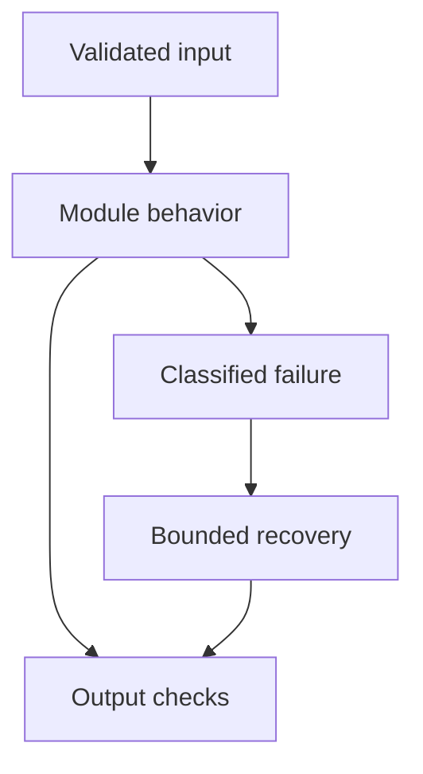

# 03: Deep Learning Fundamentals

[Previous module](../02-ml-fundamentals/README.md) · [Repository home](../README.md) · [Next module](../04-transformers/README.md)

## Simple explanation

A neural network composes learned transformations. During training, errors change weights; during inference, fixed weights transform a new input. Understanding this distinction helps explain why adding documents to a vector store does not train an LLM.

## Why, when, and how

Study this module to answer engineering scenarios, not only definitions. Work through the concepts below, run the example, explain its boundaries, then solve the exercise before reading interview answers.

## Concepts

### Neural networks

A layer computes a weighted transformation followed by a nonlinearity. Multiple layers learn progressively different representations. Width and depth increase capacity but also memory, compute, and overfitting risk. Parameters are learned weights; activations are intermediate values for one input.

### Backpropagation

The chain rule propagates loss gradients through the network. An optimizer uses those gradients to change parameters. Backpropagation computes derivatives; it is not itself the update rule. Inference usually does not retain gradients, reducing memory compared with training.

### Activation functions

ReLU, GELU, sigmoid, and tanh introduce nonlinearity. Sigmoid is useful for probabilities but saturates at extremes. ReLU is simple but can produce inactive units. Transformer feed-forward blocks often use GELU or gated variants; activation choice affects optimization and compute.

### Loss functions

Cross-entropy compares predicted token probabilities with the target token. Mean squared error is common for regression. Contrastive losses pull relevant embedding pairs together and separate negatives. Minimizing token loss does not directly guarantee truthful, safe, or helpful answers.

### Optimization

SGD and Adam-like optimizers adjust weights. Learning rate controls update scale; too high can destabilize training, too low can waste time. Batch size, warmup, clipping, and schedules matter. Record optimizer configuration and random seeds to investigate regressions.

### CNN

Convolutions apply shared local filters, useful for spatial features in images. A CNN processes nearby pixels efficiently and builds broader receptive fields across layers. For document intelligence, vision components can recover layout or classify page types before text retrieval.

### RNN

An RNN carries a hidden state across a sequence. Recurrent dependency makes training less parallel across positions. Long sequences can suffer vanishing or exploding gradients. RNNs remain useful in some streaming or resource-constrained tasks, despite transformers dominating many language workloads.

### LSTM

LSTM gates control which information to store, forget, and expose. This helps recurrent models retain longer dependencies, but does not remove sequential processing. Compare against task constraints rather than declaring one architecture universally obsolete.

### Attention

Attention weights relevant positions based on the current representation. It gives a direct mechanism to combine distant information instead of carrying it through every recurrent step. Attention maps alone are not reliable causal explanations of model decisions.

### Why transformers

Transformers allow parallel processing of sequence positions during training and flexible interactions through attention. Autoregressive generation still proceeds one token at a time. Standard full attention has quadratic score storage and computation in sequence length, while optimized attention implementations reduce memory traffic without making every interaction disappear.

## Architecture and implementation boundary

The example isolates one mechanism from this module. Its inputs, state transitions, and outputs should be inspectable in code. Use it as a tested teaching primitive, then add the integrations described below. Offline lexical search and fixture answers are explicitly different from learned embeddings and live LLM generation.



## Real-world scenario

> Why did transformers replace recurrent architectures for many large language models?

**Recommended approach:** They allow efficient parallel training across sequence positions and make long-distance interactions easier through attention. Their compute pattern scales well on accelerators, although generation remains autoregressive.

**Technical reasoning:** An RNN’s hidden state depends on the previous position; transformer attention computes interactions from all position representations together during teacher-forced training. Position information preserves order. Scaling data, parameters, and accelerator utilization made transformers effective. This does not mean unlimited context is cheap: KV cache and attention cost still grow with context length. Distinguish architectural advantages from the benefits of larger datasets and training budgets.

## Code

This example runs on Python 3.12 with the standard library.

Run from the repository root:

```bash
python -m examples.gradient
```

```python
def loss(weight, x=2.0, target=6.0):
    return (weight*x-target)**2
def step(weight, lr):
    gradient = 2 * (weight*2-6) * 2
    return weight - lr*gradient
if __name__ == '__main__':
    for lr in (0.01, 1.0):
        updated = step(0, lr)
        print('learning rate', lr, 'before', loss(0), 'after', loss(updated))
```

Shared implementation: [core.py](../examples/core.py). Tests: [test_core.py](../tests/test_core.py). Optional adapters have separate validation status in [VALIDATION.md](../VALIDATION.md).

## Interview case

### Question

Why did transformers replace recurrent architectures for many large language models?

### Difficulty

Hard

### What interviewer is testing

Whether you can identify the actual engineering constraint, choose a bounded implementation, and justify its trade-offs.

### Short Answer

They allow efficient parallel training across sequence positions and make long-distance interactions easier through attention. Their compute pattern scales well on accelerators, although generation remains autoregressive.

### Interview Answer

They allow efficient parallel training across sequence positions and make long-distance interactions easier through attention. Their compute pattern scales well on accelerators, although generation remains autoregressive. An RNN’s hidden state depends on the previous position; transformer attention computes interactions from all position representations together during teacher-forced training. Position information preserves order. Scaling data, parameters, and accelerator utilization made transformers effective. This does not mean unlimited context is cheap: KV cache and attention cost still grow with context length. Distinguish architectural advantages from the benefits of larger datasets and training budgets. I would start with a representative failing or demanding workload and define measurable acceptance criteria. I would test both successful behavior and the likely failure path, then compare the new implementation with a fixed baseline. I would report the implemented scope and remaining assumptions clearly.

### Deep Technical Answer

An RNN’s hidden state depends on the previous position; transformer attention computes interactions from all position representations together during teacher-forced training. Position information preserves order. Scaling data, parameters, and accelerator utilization made transformers effective. This does not mean unlimited context is cheap: KV cache and attention cost still grow with context length. Distinguish architectural advantages from the benefits of larger datasets and training budgets. Keep input assumptions, state scope, failure classification, and deployment configuration explicit. Verify that the implementation is doing what the architecture claims by inspecting stage-level traces and authoritative outcomes. A successful demonstration is not enough evidence for an unmeasured scale claim.

### Real-World Example

Use the scenario above with a fixed source version and representative inputs. Save the expected result, observed result, and relevant trace so the investigation can be repeated.

### Code

Use the runnable example above and inspect the shared core for validation, lifecycle, or budget logic. Extend it only after the baseline behavior is understood.

### Follow-up Question

How would you prove this improvement still works after a dependency, model, or source-data change?

### Follow-up Answer

Version inputs and configuration, keep independent regression cases, compare quality and operational metrics, and test a rollback. Add a slice for the failure this change specifically addresses.

### Common Mistake

Giving a component name as the whole answer without explaining its contract, limitations, measurement, or failure behavior.

### Senior-Level Insight

An RNN’s hidden state depends on the previous position; transformer attention computes interactions from all position representations together during teacher-forced training. Position information preserves order. Scaling data, parameters, and accelerator utilization made transformers effective. This does not mean unlimited context is cheap: KV cache and attention cost still grow with context length. Distinguish architectural advantages from the benefits of larger datasets and training budgets. Explain the simplest design that meets the requirement and what workload or evidence would make you replace it.

## Follow-up tree

1. Explain the mechanism using a tiny input.
2. Show the implementation and edge cases.
3. Explain the scenario above and the main bottleneck.
4. Show which metric would identify a regression.
5. Explain recovery after failure or a partial result.
6. Design the boundary under multiple tenants and ten times the workload.

## Debugging exercise

**Symptom:** the scenario fails after a configuration or data change. **Investigation:** capture exact inputs, versions, and stage outcomes; compare with the prior baseline. **Root cause:** identify the first stage violating its contract. **Fix:** change that stage and replay the case. **Prevention:** add the failing case and an operational signal to the regression suite. For concrete incidents, see [debugging runbooks](../28-debugging/runbooks.md).

## Production considerations

- **Reliability:** define deadlines, cancellation behavior, retryability, and recovery of partial work.
- **Security:** derive caller identity from authentication; scope data and tool permissions in trusted code.
- **Cost and performance:** measure stage latency, memory, token use, throughput, and cost per successful task.
- **Testing and evaluation:** validate hard invariants separately from semantic quality; keep representative held-out cases.
- **Deployment:** use tested dependency versions, external configuration, safe telemetry, and an actual rollback procedure.

## Levels of understanding

**Junior:** explain each concept and run the example with a small input.

**Mid-level:** adapt it to the real-world scenario, write edge tests, and diagnose a demonstrated failure.

**Senior:** An RNN’s hidden state depends on the previous position; transformer attention computes interactions from all position representations together during teacher-forced training. Position information preserves order. Scaling data, parameters, and accelerator utilization made transformers effective. This does not mean unlimited context is cheap: KV cache and attention cost still grow with context length. Distinguish architectural advantages from the benefits of larger datasets and training budgets.

## What I must remember

A neural network composes learned transformations. During training, errors change weights; during inference, fixed weights transform a new input. Understanding this distinction helps explain why adding documents to a vector store does not train an LLM. They allow efficient parallel training across sequence positions and make long-distance interactions easier through attention. Their compute pattern scales well on accelerators, although generation remains autoregressive.

## What I must be able to code

Run, modify, and explain [gradient.py](../examples/gradient.py); implement the exercise below and relevant edge tests.

## What an interviewer may ask

The case above, each concept’s failure boundary, and the topic-specific questions in the [interview bank](../interview-questions/README.md).

## What senior engineers are expected to know

Requirements, observable evidence, uncertainty, dependency lifecycle, authorization, and the cost of operating the design. Explain what would change your decision.

## Common mistakes

Confusing an example with a production deployment; assuming a framework enforces business permissions; reporting unmeasured performance; skipping the failure path; and tuning on the final test set.

## Practical exercise and mini project

Implement one gradient-descent update for a scalar linear model. Compute the derivative by hand, verify that a small update decreases loss, and explain why a huge learning rate can increase it.

**Acceptance:** include a normal case, empty or missing input, invalid input, a failure case, and one stated limitation. Record the observed result and explain why the checks match the actual requirement.

## GitHub task

```bash
git switch -c learn/03-deep-learning
python -m unittest discover -s tests -v
git add 03-deep-learning examples tests
git commit -m "docs: study deep learning fundamentals and record exercise results"
git push -u origin learn/03-deep-learning
```

Open a pull request with the implementation, measured validation, and remaining limits. Do not claim a lab result is a production benchmark.
