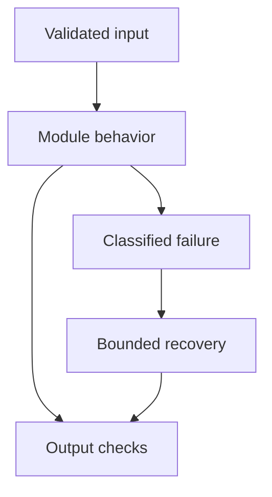

# 04: Transformers

[Previous module](../03-deep-learning/README.md) · [Repository home](../README.md) · [Next module](../05-llm-fundamentals/README.md)

## Simple explanation

A transformer repeatedly updates token representations using context. A decoder model then converts the final representation into a distribution over the next token and selects a token from that distribution.

## Why, when, and how

Study this module to answer engineering scenarios, not only definitions. Work through the concepts below, run the example, explain its boundaries, then solve the exercise before reading interview answers.

## Concepts

### Tokenization

Tokenizers map text to token IDs using learned subword vocabularies or related methods. A token is not always a word; different languages have different token counts. Tokenizer and model vocabulary must match. Chunk limits measured in characters are not model token limits.

### Token embeddings and positions

Each token ID indexes a learned embedding. Position information distinguishes order, using learned positions, sinusoidal encodings, rotary methods, or other designs. Rotary position embeddings transform query and key representations according to position. Different architectures do not all use the original sinusoidal scheme.

### Query key value

Project each representation into Q, K, and V. Query-key compatibility determines attention weights; those weights combine values. A useful analogy is a search request, an index label, and returned content, but the actual computation is learned matrix multiplication, not an external database lookup.

### Scaled dot-product attention

Attention(Q,K,V) = softmax(QKᵀ/√d_k + mask)V. Scaling controls logit magnitude as dimension grows. Masked positions receive effectively negative infinity before softmax. Normalize over the key positions for each query.

### Multi-head attention

Different heads use different learned projections and can represent different relations. Concatenate head outputs and apply an output projection. More heads are not automatically better. Grouped-query and multi-query variants share key/value projections to reduce inference cache cost.

### Feed-forward networks

Each token representation passes through a position-wise nonlinear network, often expanding then contracting the hidden dimension. Attention mixes positions; the feed-forward sublayer transforms features. Mixture-of-experts architectures selectively activate subsets of feed-forward parameters.

### Residual connections and normalization

Residual paths add earlier representations to sublayer outputs, improving gradient flow. LayerNorm or RMSNorm stabilizes scale. Pre-norm and post-norm place normalization differently; real models differ. These operations influence training stability, not just cosmetic implementation style.

### Encoder and decoder

Encoders usually attend bidirectionally and are useful for representations. Causal decoders see only previous positions and predict the next token. Encoder-decoder models encode an input and generate an output through causal decoding and cross-attention.

### Causal language modeling

Training uses shifted targets: previous tokens predict the following token. Teacher forcing exposes the true prefix during training. A causal mask prevents future-token leakage. At inference, generated tokens become part of the prefix, so errors can affect later generation.

### Generation and KV cache

Prefill computes representations for the prompt; decode generates subsequent tokens. Cached keys and values avoid recomputing previous positions at every step. The cache consumes memory proportional to sequence length, layer count, and KV head dimensions. Sampling settings influence selection, not model training.

## Architecture and implementation boundary

The example isolates one mechanism from this module. Its inputs, state transitions, and outputs should be inspectable in code. Use it as a tested teaching primitive, then add the integrations described below. Offline lexical search and fixture answers are explicitly different from learned embeddings and live LLM generation.



## Real-world scenario

> Explain how a transformer generates the next token, from beginner to expert level.

**Recommended approach:** It tokenizes the prefix, combines token and position representations through masked attention blocks, predicts probabilities for the next token, selects one token, appends it, and repeats.

**Technical reasoning:** Technically, the last-position hidden state is projected to vocabulary logits, then normalized and selected with an allowed decoding policy. Expert-level discussion separates prefill from decode, explains KV cache reuse, causal masks, attention variants, and the effect of batching on cache memory. Greedy decoding reduces sampling variability but does not promise bit-for-bit determinism across all hardware and provider changes. EOS or an output limit ends generation.

## Code

This example runs on Python 3.12 with the standard library.

Run from the repository root:

```bash
python -m examples.attention
```

```python
import math
def attention(q, keys, values, visible):
    if not 0 < visible <= len(keys) or len(keys) != len(values):
        raise ValueError('invalid visible count or shapes')
    logits = [sum(a*b for a,b in zip(q,k))/math.sqrt(len(q)) for k in keys[:visible]]
    shifted = [math.exp(x-max(logits)) for x in logits]
    weights = [x/sum(shifted) for x in shifted]
    return weights, [sum(w*v[j] for w,v in zip(weights,values[:visible]))
                     for j in range(len(values[0]))]
if __name__ == '__main__':
    q = [1.0, 0.0]
    keys = [[1.0,0.0],[0.0,1.0]]
    values = [[2.0,0.0],[0.0,4.0]]
    print('First-position causal:', attention(q,keys,values,1))
    print('Both positions:', attention(q,keys,values,2))
```

Shared implementation: [core.py](../examples/core.py). Tests: [test_core.py](../tests/test_core.py). Optional adapters have separate validation status in [VALIDATION.md](../VALIDATION.md).

## Interview case

### Question

Explain how a transformer generates the next token, from beginner to expert level.

### Difficulty

Hard

### What interviewer is testing

Whether you can identify the actual engineering constraint, choose a bounded implementation, and justify its trade-offs.

### Short Answer

It tokenizes the prefix, combines token and position representations through masked attention blocks, predicts probabilities for the next token, selects one token, appends it, and repeats.

### Interview Answer

It tokenizes the prefix, combines token and position representations through masked attention blocks, predicts probabilities for the next token, selects one token, appends it, and repeats. Technically, the last-position hidden state is projected to vocabulary logits, then normalized and selected with an allowed decoding policy. Expert-level discussion separates prefill from decode, explains KV cache reuse, causal masks, attention variants, and the effect of batching on cache memory. Greedy decoding reduces sampling variability but does not promise bit-for-bit determinism across all hardware and provider changes. EOS or an output limit ends generation. I would start with a representative failing or demanding workload and define measurable acceptance criteria. I would test both successful behavior and the likely failure path, then compare the new implementation with a fixed baseline. I would report the implemented scope and remaining assumptions clearly.

### Deep Technical Answer

Technically, the last-position hidden state is projected to vocabulary logits, then normalized and selected with an allowed decoding policy. Expert-level discussion separates prefill from decode, explains KV cache reuse, causal masks, attention variants, and the effect of batching on cache memory. Greedy decoding reduces sampling variability but does not promise bit-for-bit determinism across all hardware and provider changes. EOS or an output limit ends generation. Keep input assumptions, state scope, failure classification, and deployment configuration explicit. Verify that the implementation is doing what the architecture claims by inspecting stage-level traces and authoritative outcomes. A successful demonstration is not enough evidence for an unmeasured scale claim.

### Real-World Example

Use the scenario above with a fixed source version and representative inputs. Save the expected result, observed result, and relevant trace so the investigation can be repeated.

### Code

Use the runnable example above and inspect the shared core for validation, lifecycle, or budget logic. Extend it only after the baseline behavior is understood.

### Follow-up Question

How would you prove this improvement still works after a dependency, model, or source-data change?

### Follow-up Answer

Version inputs and configuration, keep independent regression cases, compare quality and operational metrics, and test a rollback. Add a slice for the failure this change specifically addresses.

### Common Mistake

Giving a component name as the whole answer without explaining its contract, limitations, measurement, or failure behavior.

### Senior-Level Insight

Technically, the last-position hidden state is projected to vocabulary logits, then normalized and selected with an allowed decoding policy. Expert-level discussion separates prefill from decode, explains KV cache reuse, causal masks, attention variants, and the effect of batching on cache memory. Greedy decoding reduces sampling variability but does not promise bit-for-bit determinism across all hardware and provider changes. EOS or an output limit ends generation. Explain the simplest design that meets the requirement and what workload or evidence would make you replace it.

## Follow-up tree

1. Explain the mechanism using a tiny input.
2. Show the implementation and edge cases.
3. Explain the scenario above and the main bottleneck.
4. Show which metric would identify a regression.
5. Explain recovery after failure or a partial result.
6. Design the boundary under multiple tenants and ten times the workload.

## Debugging exercise

**Symptom:** the scenario fails after a configuration or data change. **Investigation:** capture exact inputs, versions, and stage outcomes; compare with the prior baseline. **Root cause:** identify the first stage violating its contract. **Fix:** change that stage and replay the case. **Prevention:** add the failing case and an operational signal to the regression suite. For concrete incidents, see [debugging runbooks](../28-debugging/runbooks.md).

## Production considerations

- **Reliability:** define deadlines, cancellation behavior, retryability, and recovery of partial work.
- **Security:** derive caller identity from authentication; scope data and tool permissions in trusted code.
- **Cost and performance:** measure stage latency, memory, token use, throughput, and cost per successful task.
- **Testing and evaluation:** validate hard invariants separately from semantic quality; keep representative held-out cases.
- **Deployment:** use tested dependency versions, external configuration, safe telemetry, and an actual rollback procedure.

## Levels of understanding

**Junior:** explain each concept and run the example with a small input.

**Mid-level:** adapt it to the real-world scenario, write edge tests, and diagnose a demonstrated failure.

**Senior:** Technically, the last-position hidden state is projected to vocabulary logits, then normalized and selected with an allowed decoding policy. Expert-level discussion separates prefill from decode, explains KV cache reuse, causal masks, attention variants, and the effect of batching on cache memory. Greedy decoding reduces sampling variability but does not promise bit-for-bit determinism across all hardware and provider changes. EOS or an output limit ends generation.

## What I must remember

A transformer repeatedly updates token representations using context. A decoder model then converts the final representation into a distribution over the next token and selects a token from that distribution. It tokenizes the prefix, combines token and position representations through masked attention blocks, predicts probabilities for the next token, selects one token, appends it, and repeats.

## What I must be able to code

Run, modify, and explain [attention.py](../examples/attention.py); implement the exercise below and relevant edge tests.

## What an interviewer may ask

The case above, each concept’s failure boundary, and the topic-specific questions in the [interview bank](../interview-questions/README.md).

## What senior engineers are expected to know

Requirements, observable evidence, uncertainty, dependency lifecycle, authorization, and the cost of operating the design. Explain what would change your decision.

## Common mistakes

Confusing an example with a production deployment; assuming a framework enforces business permissions; reporting unmeasured performance; skipping the failure path; and tuning on the final test set.

## Practical exercise and mini project

Calculate attention weights for a two-token, two-dimensional example. Add a causal mask and show that the first token cannot attend to the second. Compare attention output with and without scaling.

**Acceptance:** include a normal case, empty or missing input, invalid input, a failure case, and one stated limitation. Record the observed result and explain why the checks match the actual requirement.

## GitHub task

```bash
git switch -c learn/04-transformers
python -m unittest discover -s tests -v
git add 04-transformers examples tests
git commit -m "docs: study transformers and record exercise results"
git push -u origin learn/04-transformers
```

Open a pull request with the implementation, measured validation, and remaining limits. Do not claim a lab result is a production benchmark.
