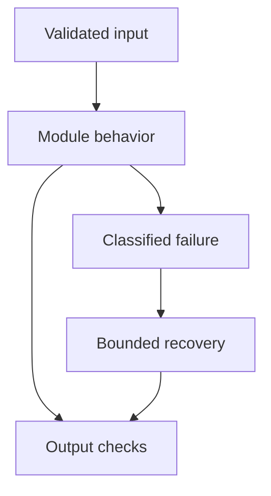

# 05: LLM Fundamentals

[Previous module](../04-transformers/README.md) · [Repository home](../README.md) · [Next module](../06-prompt-engineering/README.md)

## Simple explanation

An LLM predicts continuations conditioned on input. Instruction tuning makes that capability useful for tasks, but an application must still supply data, validate outputs, control tools, and measure quality.

## Why, when, and how

Study this module to answer engineering scenarios, not only definitions. Work through the concepts below, run the example, explain its boundaries, then solve the exercise before reading interview answers.

## Concepts

### Architecture and inference

Many chat models are decoder transformers, but architectures vary. Inference uses trained parameters to generate outputs. Parameter count alone does not predict task quality. Distinguish model quality from service properties such as quotas, residency, uptime, and latency.

### Tokens and context window

The input, conversation history, tool messages, and generated output share context constraints according to the provider’s accounting rules. Reserve output space before packing retrieved documents. Long context can contain the right evidence while the model still misses it. Count tokens with the relevant tokenizer when available.

### Temperature top-k top-p

Temperature rescales logits; lower values usually concentrate probability. Top-k restricts candidate count and top-p restricts cumulative probability mass. Not every API supports every parameter. Low temperature is not a truth guarantee and should not replace evaluation.

### Max tokens and stopping

An output cap bounds generated length and cost. Truncation can produce incomplete JSON or mid-sentence answers. Inspect finish reasons and validate completeness. Use task-specific budgets; one huge default wastes resources on simple classification.

### Messages and roles

System or developer instructions describe behavior, user messages express requests, assistant messages carry responses, and tool messages return observations. Provider schemas differ. Role labels are not authorization controls: tool code and data stores must enforce permissions.

### Structured output

Schema-constrained generation can improve syntactic reliability. Runtime validation still checks types, required fields, ranges, and allowed values. A well-formed object can still contain invented facts. Business invariants need independent verification.

### Function and tool calling

The model proposes a tool name and arguments; the application executes the call. Match result messages to call IDs. Validate tool permissions and input before execution. Tool calling provides an interface, not permission to perform arbitrary side effects.

### Streaming

Send incremental output to reduce perceived latency. Track time to first token and completion duration separately. Clients must handle partial output, errors, disconnects, and a final event. Never execute incomplete streamed tool arguments before the complete object is validated.

### Batching latency throughput

Batching can amortize overhead and improve throughput, but may increase individual waiting time. Continuous batching on self-hosted serving differs from an offline batch API. Measure p50, p95, p99, queue delay, and tokens per second under realistic concurrency.

### Provider abstraction

Normalize messages, usage, errors, and capabilities behind a small interface. OpenAI, Anthropic, Gemini, Groq, Hugging Face endpoints, and Ollama differ in supported schemas and operational behavior. Keep model identifiers in configuration and test adapters independently; a compatible HTTP shape does not guarantee equivalent behavior.

## Architecture and implementation boundary

The example isolates one mechanism from this module. Its inputs, state transitions, and outputs should be inspectable in code. Use it as a tested teaching primitive, then add the integrations described below. Offline lexical search and fixture answers are explicitly different from learned embeddings and live LLM generation.



## Real-world scenario

> Your company wants to reduce LLM costs by 40%. What would you investigate?

**Recommended approach:** Measure cost per successful task by model and stage. Inspect unused output tokens, repetitive context, failed retries, and simple tasks using oversized models. Evaluate routing, caching, and shorter context against a fixed quality baseline.

**Technical reasoning:** Estimate input and output cost from actual billed token categories, including cached input or reasoning categories where relevant. Build quality-versus-cost experiments before changing traffic. A 40% reduction from ₹5 lakh is ₹2 lakh, but reduced API cost may be offset by engineering or infrastructure. Separate eligible cached requests from personalized requests and enforce tenant scoping. Publish savings only after measurement over representative traffic.

## Code

This example runs on Python 3.12 with the standard library.

Run from the repository root:

```bash
python -m examples.cost
```

```python
from examples.core import fictional_cost
if __name__ == '__main__':
    for input_tokens, output_tokens in ((3000,500),(1500,500),(3000,250)):
        print('Fictional total for 10000 calls:', fictional_cost(input_tokens, output_tokens)*10000)
```

Shared implementation: [core.py](../examples/core.py). Tests: [test_core.py](../tests/test_core.py). Optional adapters have separate validation status in [VALIDATION.md](../VALIDATION.md).

## Interview case

### Question

Your company wants to reduce LLM costs by 40%. What would you investigate?

### Difficulty

Hard

### What interviewer is testing

Whether you can identify the actual engineering constraint, choose a bounded implementation, and justify its trade-offs.

### Short Answer

Measure cost per successful task by model and stage. Inspect unused output tokens, repetitive context, failed retries, and simple tasks using oversized models. Evaluate routing, caching, and shorter context against a fixed quality baseline.

### Interview Answer

Measure cost per successful task by model and stage. Inspect unused output tokens, repetitive context, failed retries, and simple tasks using oversized models. Evaluate routing, caching, and shorter context against a fixed quality baseline. Estimate input and output cost from actual billed token categories, including cached input or reasoning categories where relevant. Build quality-versus-cost experiments before changing traffic. A 40% reduction from ₹5 lakh is ₹2 lakh, but reduced API cost may be offset by engineering or infrastructure. Separate eligible cached requests from personalized requests and enforce tenant scoping. Publish savings only after measurement over representative traffic. I would start with a representative failing or demanding workload and define measurable acceptance criteria. I would test both successful behavior and the likely failure path, then compare the new implementation with a fixed baseline. I would report the implemented scope and remaining assumptions clearly.

### Deep Technical Answer

Estimate input and output cost from actual billed token categories, including cached input or reasoning categories where relevant. Build quality-versus-cost experiments before changing traffic. A 40% reduction from ₹5 lakh is ₹2 lakh, but reduced API cost may be offset by engineering or infrastructure. Separate eligible cached requests from personalized requests and enforce tenant scoping. Publish savings only after measurement over representative traffic. Keep input assumptions, state scope, failure classification, and deployment configuration explicit. Verify that the implementation is doing what the architecture claims by inspecting stage-level traces and authoritative outcomes. A successful demonstration is not enough evidence for an unmeasured scale claim.

### Real-World Example

Use the scenario above with a fixed source version and representative inputs. Save the expected result, observed result, and relevant trace so the investigation can be repeated.

### Code

Use the runnable example above and inspect the shared core for validation, lifecycle, or budget logic. Extend it only after the baseline behavior is understood.

### Follow-up Question

How would you prove this improvement still works after a dependency, model, or source-data change?

### Follow-up Answer

Version inputs and configuration, keep independent regression cases, compare quality and operational metrics, and test a rollback. Add a slice for the failure this change specifically addresses.

### Common Mistake

Giving a component name as the whole answer without explaining its contract, limitations, measurement, or failure behavior.

### Senior-Level Insight

Estimate input and output cost from actual billed token categories, including cached input or reasoning categories where relevant. Build quality-versus-cost experiments before changing traffic. A 40% reduction from ₹5 lakh is ₹2 lakh, but reduced API cost may be offset by engineering or infrastructure. Separate eligible cached requests from personalized requests and enforce tenant scoping. Publish savings only after measurement over representative traffic. Explain the simplest design that meets the requirement and what workload or evidence would make you replace it.

## Follow-up tree

1. Explain the mechanism using a tiny input.
2. Show the implementation and edge cases.
3. Explain the scenario above and the main bottleneck.
4. Show which metric would identify a regression.
5. Explain recovery after failure or a partial result.
6. Design the boundary under multiple tenants and ten times the workload.

## Debugging exercise

**Symptom:** the scenario fails after a configuration or data change. **Investigation:** capture exact inputs, versions, and stage outcomes; compare with the prior baseline. **Root cause:** identify the first stage violating its contract. **Fix:** change that stage and replay the case. **Prevention:** add the failing case and an operational signal to the regression suite. For concrete incidents, see [debugging runbooks](../28-debugging/runbooks.md).

## Production considerations

- **Reliability:** define deadlines, cancellation behavior, retryability, and recovery of partial work.
- **Security:** derive caller identity from authentication; scope data and tool permissions in trusted code.
- **Cost and performance:** measure stage latency, memory, token use, throughput, and cost per successful task.
- **Testing and evaluation:** validate hard invariants separately from semantic quality; keep representative held-out cases.
- **Deployment:** use tested dependency versions, external configuration, safe telemetry, and an actual rollback procedure.

## Levels of understanding

**Junior:** explain each concept and run the example with a small input.

**Mid-level:** adapt it to the real-world scenario, write edge tests, and diagnose a demonstrated failure.

**Senior:** Estimate input and output cost from actual billed token categories, including cached input or reasoning categories where relevant. Build quality-versus-cost experiments before changing traffic. A 40% reduction from ₹5 lakh is ₹2 lakh, but reduced API cost may be offset by engineering or infrastructure. Separate eligible cached requests from personalized requests and enforce tenant scoping. Publish savings only after measurement over representative traffic.

## What I must remember

An LLM predicts continuations conditioned on input. Instruction tuning makes that capability useful for tasks, but an application must still supply data, validate outputs, control tools, and measure quality. Measure cost per successful task by model and stage. Inspect unused output tokens, repetitive context, failed retries, and simple tasks using oversized models. Evaluate routing, caching, and shorter context against a fixed quality baseline.

## What I must be able to code

Run, modify, and explain [cost.py](../examples/cost.py); implement the exercise below and relevant edge tests.

## What an interviewer may ask

The case above, each concept’s failure boundary, and the topic-specific questions in the [interview bank](../interview-questions/README.md).

## What senior engineers are expected to know

Requirements, observable evidence, uncertainty, dependency lifecycle, authorization, and the cost of operating the design. Explain what would change your decision.

## Common mistakes

Confusing an example with a production deployment; assuming a framework enforces business permissions; reporting unmeasured performance; skipping the failure path; and tuning on the final test set.

## Practical exercise and mini project

Calculate cost for 10,000 requests with two fictional model rates. Compare reduced input tokens versus reduced output tokens. Add a quality constraint to model selection.

**Acceptance:** include a normal case, empty or missing input, invalid input, a failure case, and one stated limitation. Record the observed result and explain why the checks match the actual requirement.

## GitHub task

```bash
git switch -c learn/05-llm-fundamentals
python -m unittest discover -s tests -v
git add 05-llm-fundamentals examples tests
git commit -m "docs: study llm fundamentals and record exercise results"
git push -u origin learn/05-llm-fundamentals
```

Open a pull request with the implementation, measured validation, and remaining limits. Do not claim a lab result is a production benchmark.
