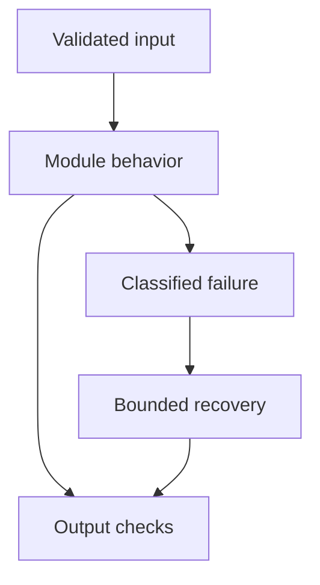

# 06: Prompt Engineering

[Previous module](../05-llm-fundamentals/README.md) · [Repository home](../README.md) · [Next module](../07-embeddings/README.md)

## Simple explanation

A prompt is an interface contract expressed in language. Good prompts define the task, trusted instructions, allowed evidence, output structure, and what to do when information is missing.

## Why, when, and how

Study this module to answer engineering scenarios, not only definitions. Work through the concepts below, run the example, explain its boundaries, then solve the exercise before reading interview answers.

## Concepts

### Zero-shot and few-shot

Zero-shot gives instructions without examples; few-shot adds representative input-output pairs. Examples improve consistency but consume context and can bias the output. Include ambiguous and abstention examples, not only easy successes. Keep examples separate from the final input.

### Reasoning concepts

Multi-step tasks can benefit from decomposition, intermediate calculations, and verifiable plans. Ask for concise explanations and evidence rather than private hidden chain-of-thought. A model’s stated reasoning is not guaranteed to describe its actual internal computation. Validate intermediate facts with tools where possible.

### Role prompting

A role can set tone and domain expectations but does not grant real expertise or system permissions. Replace vague instructions like act as an expert with explicit criteria and evidence requirements. Define escalation behavior for unsupported requests.

### Structured prompts

Use clear sections for task, context, constraints, examples, and output. XML-style tags or JSON can make boundaries readable but do not prevent prompt injection by themselves. Encode untrusted content and cap its length. Keep policy text outside retrieved document content.

### Output constraints

Specify the schema, supported citation IDs, null behavior, and maximum length. Validate the result using Pydantic or another runtime checker. Retry schema repair only within a budget. Never accept a malicious operation just because its JSON is valid.

### Templates

A template fills a stable instruction skeleton with request-specific data. Treat user values as data, not executable template expressions. Version the template with its output schema and evaluation dataset. Do not interpolate secrets into a prompt.

### Versioning and optimization

Change prompts through review, offline evaluation, and limited traffic rollout. Record version, model configuration, retrieval version, and metrics. Optimize against diverse held-out cases. A better average score can hide worse behavior on critical slices.

### Prompt injection

Injection occurs when untrusted input attempts to override intended behavior. Indirect injection arrives through retrieved documents, webpages, or tool output. Trust boundaries must live in code: authorization, allowed tools, and egress controls. A deny-list of suspicious phrases is insufficient.

### Task-specific prompts

Customer support should use policy evidence and escalation. Document analysis should extract fields with source spans. SQL generation should propose constrained query plans. Coding assistance should describe tests. Summaries should preserve units and uncertainty; classification should use closed labels; extraction should return null for missing fields.

### Failure analysis

Compare instruction compliance, factual accuracy, format validity, and retrieval sufficiency separately. If the answer invents a deadline, inspect the source before changing wording. If JSON fails, inspect truncation and schema complexity. Prompt improvements should target the observed failure mechanism.

## Architecture and implementation boundary

The example isolates one mechanism from this module. Its inputs, state transitions, and outputs should be inspectable in code. Use it as a tested teaching primitive, then add the integrations described below. Offline lexical search and fixture answers are explicitly different from learned embeddings and live LLM generation.



## Real-world scenario

> A support bot invents refund policies. How would you redesign the prompt and surrounding system?

**Recommended approach:** Provide current authorized policy excerpts, require citations to supported claims, define an abstention or escalation path, and validate policy references. Test unsupported and contradictory cases instead of relying on stronger wording alone.

**Technical reasoning:** The prompt should explicitly distinguish trusted policy instructions from customer text and retrieved content. Bind each policy excerpt to a stable version and source ID. Use a schema for answer, cited IDs, and escalation reason. Validate cited IDs and review whether the evidence entails the claim; ID presence alone is insufficient. Tool permissions must prevent refunds without explicit business authorization and, where needed, human approval.

## Code

This example runs on Python 3.12 with the standard library.

Run from the repository root:

```bash
python -m examples.prompts
```

```python
TASKS = {
    'support': 'Answer from the supplied policy. Cite source IDs. Escalate unsupported requests.',
    'document': 'Extract requested facts with source spans. Use null for missing values.',
    'sql': 'Return an allowed typed query plan. Do not execute or claim execution.',
    'coding': 'Propose code and meaningful tests. State assumptions and dependencies.',
    'summary': 'Summarize supported facts, preserving dates, units, negations, and uncertainty.',
    'classification': 'Choose exactly one allowed label; return unknown if no label applies.',
    'extraction': 'Return fields in the declared schema. Never invent absent values.',
}
def prompt(task, question, evidence):
    import json
    return {'version': 'v1', 'system': TASKS[task],
            'user': json.dumps({'question':question, 'untrusted_evidence':evidence})}
if __name__ == '__main__':
    print(prompt('support','Can I get a refund?',
                 [{'id':'P1','text':'Refunds within 14 days with receipt.'}]))
```

Shared implementation: [core.py](../examples/core.py). Tests: [test_core.py](../tests/test_core.py). Optional adapters have separate validation status in [VALIDATION.md](../VALIDATION.md).

## Interview case

### Question

A support bot invents refund policies. How would you redesign the prompt and surrounding system?

### Difficulty

Hard

### What interviewer is testing

Whether you can identify the actual engineering constraint, choose a bounded implementation, and justify its trade-offs.

### Short Answer

Provide current authorized policy excerpts, require citations to supported claims, define an abstention or escalation path, and validate policy references. Test unsupported and contradictory cases instead of relying on stronger wording alone.

### Interview Answer

Provide current authorized policy excerpts, require citations to supported claims, define an abstention or escalation path, and validate policy references. Test unsupported and contradictory cases instead of relying on stronger wording alone. The prompt should explicitly distinguish trusted policy instructions from customer text and retrieved content. Bind each policy excerpt to a stable version and source ID. Use a schema for answer, cited IDs, and escalation reason. Validate cited IDs and review whether the evidence entails the claim; ID presence alone is insufficient. Tool permissions must prevent refunds without explicit business authorization and, where needed, human approval. I would start with a representative failing or demanding workload and define measurable acceptance criteria. I would test both successful behavior and the likely failure path, then compare the new implementation with a fixed baseline. I would report the implemented scope and remaining assumptions clearly.

### Deep Technical Answer

The prompt should explicitly distinguish trusted policy instructions from customer text and retrieved content. Bind each policy excerpt to a stable version and source ID. Use a schema for answer, cited IDs, and escalation reason. Validate cited IDs and review whether the evidence entails the claim; ID presence alone is insufficient. Tool permissions must prevent refunds without explicit business authorization and, where needed, human approval. Keep input assumptions, state scope, failure classification, and deployment configuration explicit. Verify that the implementation is doing what the architecture claims by inspecting stage-level traces and authoritative outcomes. A successful demonstration is not enough evidence for an unmeasured scale claim.

### Real-World Example

Use the scenario above with a fixed source version and representative inputs. Save the expected result, observed result, and relevant trace so the investigation can be repeated.

### Code

Use the runnable example above and inspect the shared core for validation, lifecycle, or budget logic. Extend it only after the baseline behavior is understood.

### Follow-up Question

How would you prove this improvement still works after a dependency, model, or source-data change?

### Follow-up Answer

Version inputs and configuration, keep independent regression cases, compare quality and operational metrics, and test a rollback. Add a slice for the failure this change specifically addresses.

### Common Mistake

Giving a component name as the whole answer without explaining its contract, limitations, measurement, or failure behavior.

### Senior-Level Insight

The prompt should explicitly distinguish trusted policy instructions from customer text and retrieved content. Bind each policy excerpt to a stable version and source ID. Use a schema for answer, cited IDs, and escalation reason. Validate cited IDs and review whether the evidence entails the claim; ID presence alone is insufficient. Tool permissions must prevent refunds without explicit business authorization and, where needed, human approval. Explain the simplest design that meets the requirement and what workload or evidence would make you replace it.

## Follow-up tree

1. Explain the mechanism using a tiny input.
2. Show the implementation and edge cases.
3. Explain the scenario above and the main bottleneck.
4. Show which metric would identify a regression.
5. Explain recovery after failure or a partial result.
6. Design the boundary under multiple tenants and ten times the workload.

## Debugging exercise

**Symptom:** the scenario fails after a configuration or data change. **Investigation:** capture exact inputs, versions, and stage outcomes; compare with the prior baseline. **Root cause:** identify the first stage violating its contract. **Fix:** change that stage and replay the case. **Prevention:** add the failing case and an operational signal to the regression suite. For concrete incidents, see [debugging runbooks](../28-debugging/runbooks.md).

## Production considerations

- **Reliability:** define deadlines, cancellation behavior, retryability, and recovery of partial work.
- **Security:** derive caller identity from authentication; scope data and tool permissions in trusted code.
- **Cost and performance:** measure stage latency, memory, token use, throughput, and cost per successful task.
- **Testing and evaluation:** validate hard invariants separately from semantic quality; keep representative held-out cases.
- **Deployment:** use tested dependency versions, external configuration, safe telemetry, and an actual rollback procedure.

## Levels of understanding

**Junior:** explain each concept and run the example with a small input.

**Mid-level:** adapt it to the real-world scenario, write edge tests, and diagnose a demonstrated failure.

**Senior:** The prompt should explicitly distinguish trusted policy instructions from customer text and retrieved content. Bind each policy excerpt to a stable version and source ID. Use a schema for answer, cited IDs, and escalation reason. Validate cited IDs and review whether the evidence entails the claim; ID presence alone is insufficient. Tool permissions must prevent refunds without explicit business authorization and, where needed, human approval.

## What I must remember

A prompt is an interface contract expressed in language. Good prompts define the task, trusted instructions, allowed evidence, output structure, and what to do when information is missing. Provide current authorized policy excerpts, require citations to supported claims, define an abstention or escalation path, and validate policy references. Test unsupported and contradictory cases instead of relying on stronger wording alone.

## What I must be able to code

Run, modify, and explain [prompts.py](../examples/prompts.py); implement the exercise below and relevant edge tests.

## What an interviewer may ask

The case above, each concept’s failure boundary, and the topic-specific questions in the [interview bank](../interview-questions/README.md).

## What senior engineers are expected to know

Requirements, observable evidence, uncertainty, dependency lifecycle, authorization, and the cost of operating the design. Explain what would change your decision.

## Common mistakes

Confusing an example with a production deployment; assuming a framework enforces business permissions; reporting unmeasured performance; skipping the failure path; and tuning on the final test set.

## Practical exercise and mini project

Write prompts for seven tasks and test each on a normal case, missing information, conflicting evidence, and an injected instruction. Save versions and a comparison table.

**Acceptance:** include a normal case, empty or missing input, invalid input, a failure case, and one stated limitation. Record the observed result and explain why the checks match the actual requirement.

## GitHub task

```bash
git switch -c learn/06-prompt-engineering
python -m unittest discover -s tests -v
git add 06-prompt-engineering examples tests
git commit -m "docs: study prompt engineering and record exercise results"
git push -u origin learn/06-prompt-engineering
```

Open a pull request with the implementation, measured validation, and remaining limits. Do not claim a lab result is a production benchmark.
