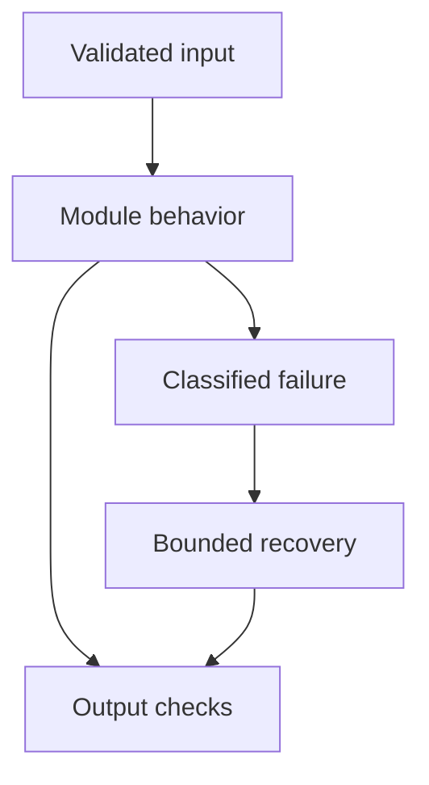

# 07: Embeddings and Similarity

[Previous module](../06-prompt-engineering/README.md) · [Repository home](../README.md) · [Next module](../08-vector-databases/README.md)

## Simple explanation

An embedding maps content into a vector so related content can be found efficiently. It captures useful patterns, but similarity is not the same as correctness, permission, or factual entailment.

## Why, when, and how

Study this module to answer engineering scenarios, not only definitions. Work through the concepts below, run the example, explain its boundaries, then solve the exercise before reading interview answers.

## Concepts

### Vector representation

A dense embedding has one numeric value per dimension. These dimensions are learned and usually have no simple human label. Different models produce different spaces. Never compare vectors from incompatible embedding models even when their dimensions match.

### Cosine similarity

Cosine is dot(a,b)/(norm(a) norm(b)). It compares direction and ranges from -1 to 1 for nonzero real vectors. Reject zero vectors or define an explicit policy. A threshold such as 0.8 is not universally meaningful across models and corpora.

### Euclidean distance

Euclidean distance is the length of the difference vector. Smaller is closer. For unit-normalized vectors, squared Euclidean distance equals 2 minus twice cosine similarity, so ranking agrees. Without normalization, vector magnitude changes results.

### Normalization

Divide a vector by its norm to make its length one. This permits dot product to act as cosine similarity. Apply the same normalization consistently to documents and queries when the index expects it. Do not blindly normalize a model designed for a different scoring convention.

### Dimensions and storage

Raw float32 storage is N × d × 4 bytes, excluding IDs, metadata, replicas, and index overhead. One million 768-dimensional vectors use about 3.072 GB decimal for values alone. Higher dimension can increase capacity and cost but does not guarantee relevance.

### Model selection

Compare domain retrieval, languages, short versus long inputs, latency, embedding cost, and licensing. Hosted OpenAI embeddings and local Sentence Transformers or Hugging Face models fit different operating constraints. Use real query-document relevance judgments to choose; generic leaderboard position is not enough.

### Query and document encoding

Some models use different instructions or functions for queries and documents. Respect the model’s intended encoding recipe. Long text may be silently truncated. Verify preprocessing, maximum input length, and whether titles or metadata should be included.

### Semantic search

Encode a query, retrieve nearest candidates, apply permissions, optionally rerank, then inspect results. Negation, identifiers, dates, and exact quantities can be difficult for dense retrieval. Combine semantic and lexical signals when exact matches matter.

### Migration and versioning

Store embedding model, revision, preprocessing, and dimension with each index version. Re-embed a new index, evaluate it, and switch an alias after validation. Mixing spaces corrupts ranking. Preserve a rollback path until the new index is proven.

### Updating and deleting

Changing document text requires new embeddings. Stable source and chunk IDs let you replace all outdated chunks and propagate deletions. Remove old chunks when a document gets shorter. Data deletion may also require clearing caches, checkpoints, and replicas under the retention policy.

## Architecture and implementation boundary

The example isolates one mechanism from this module. Its inputs, state transitions, and outputs should be inspectable in code. Use it as a tested teaching primitive, then add the integrations described below. Offline lexical search and fixture answers are explicitly different from learned embeddings and live LLM generation.



## Real-world scenario

> Semantic search returns documents with similar keywords but the wrong meaning. What do you inspect?

**Recommended approach:** Inspect query and document encoding, domain and language mismatch, truncation, index distance, normalization, and difficult cases such as negation. Evaluate lexical hybrid search and reranking on a labeled dataset.

**Technical reasoning:** First use exact search on a small sample to separate embedding failures from approximate-index failures. Compare top results for paraphrases, identifiers, negatives, and language slices. Confirm query instructions match the model and that old embeddings are not mixed with a new model. An approximate index can lose recall even if embeddings are good; a cross-encoder can reorder a candidate set but cannot recover relevant documents absent from that set.

## Code

This example runs on Python 3.12 with the standard library.

Run from the repository root:

```bash
python -m examples.vectors
```

```python
from examples.core import cosine
if __name__ == '__main__':
    for other in ([1.0,0.0],[0.0,1.0],[-1.0,0.0]):
        print(other, cosine([1.0,0.0],other))
```

Shared implementation: [core.py](../examples/core.py). Tests: [test_core.py](../tests/test_core.py). Optional adapters have separate validation status in [VALIDATION.md](../VALIDATION.md).

## Interview case

### Question

Semantic search returns documents with similar keywords but the wrong meaning. What do you inspect?

### Difficulty

Hard

### What interviewer is testing

Whether you can identify the actual engineering constraint, choose a bounded implementation, and justify its trade-offs.

### Short Answer

Inspect query and document encoding, domain and language mismatch, truncation, index distance, normalization, and difficult cases such as negation. Evaluate lexical hybrid search and reranking on a labeled dataset.

### Interview Answer

Inspect query and document encoding, domain and language mismatch, truncation, index distance, normalization, and difficult cases such as negation. Evaluate lexical hybrid search and reranking on a labeled dataset. First use exact search on a small sample to separate embedding failures from approximate-index failures. Compare top results for paraphrases, identifiers, negatives, and language slices. Confirm query instructions match the model and that old embeddings are not mixed with a new model. An approximate index can lose recall even if embeddings are good; a cross-encoder can reorder a candidate set but cannot recover relevant documents absent from that set. I would start with a representative failing or demanding workload and define measurable acceptance criteria. I would test both successful behavior and the likely failure path, then compare the new implementation with a fixed baseline. I would report the implemented scope and remaining assumptions clearly.

### Deep Technical Answer

First use exact search on a small sample to separate embedding failures from approximate-index failures. Compare top results for paraphrases, identifiers, negatives, and language slices. Confirm query instructions match the model and that old embeddings are not mixed with a new model. An approximate index can lose recall even if embeddings are good; a cross-encoder can reorder a candidate set but cannot recover relevant documents absent from that set. Keep input assumptions, state scope, failure classification, and deployment configuration explicit. Verify that the implementation is doing what the architecture claims by inspecting stage-level traces and authoritative outcomes. A successful demonstration is not enough evidence for an unmeasured scale claim.

### Real-World Example

Use the scenario above with a fixed source version and representative inputs. Save the expected result, observed result, and relevant trace so the investigation can be repeated.

### Code

Use the runnable example above and inspect the shared core for validation, lifecycle, or budget logic. Extend it only after the baseline behavior is understood.

### Follow-up Question

How would you prove this improvement still works after a dependency, model, or source-data change?

### Follow-up Answer

Version inputs and configuration, keep independent regression cases, compare quality and operational metrics, and test a rollback. Add a slice for the failure this change specifically addresses.

### Common Mistake

Giving a component name as the whole answer without explaining its contract, limitations, measurement, or failure behavior.

### Senior-Level Insight

First use exact search on a small sample to separate embedding failures from approximate-index failures. Compare top results for paraphrases, identifiers, negatives, and language slices. Confirm query instructions match the model and that old embeddings are not mixed with a new model. An approximate index can lose recall even if embeddings are good; a cross-encoder can reorder a candidate set but cannot recover relevant documents absent from that set. Explain the simplest design that meets the requirement and what workload or evidence would make you replace it.

## Follow-up tree

1. Explain the mechanism using a tiny input.
2. Show the implementation and edge cases.
3. Explain the scenario above and the main bottleneck.
4. Show which metric would identify a regression.
5. Explain recovery after failure or a partial result.
6. Design the boundary under multiple tenants and ten times the workload.

## Debugging exercise

**Symptom:** the scenario fails after a configuration or data change. **Investigation:** capture exact inputs, versions, and stage outcomes; compare with the prior baseline. **Root cause:** identify the first stage violating its contract. **Fix:** change that stage and replay the case. **Prevention:** add the failing case and an operational signal to the regression suite. For concrete incidents, see [debugging runbooks](../28-debugging/runbooks.md).

## Production considerations

- **Reliability:** define deadlines, cancellation behavior, retryability, and recovery of partial work.
- **Security:** derive caller identity from authentication; scope data and tool permissions in trusted code.
- **Cost and performance:** measure stage latency, memory, token use, throughput, and cost per successful task.
- **Testing and evaluation:** validate hard invariants separately from semantic quality; keep representative held-out cases.
- **Deployment:** use tested dependency versions, external configuration, safe telemetry, and an actual rollback procedure.

## Levels of understanding

**Junior:** explain each concept and run the example with a small input.

**Mid-level:** adapt it to the real-world scenario, write edge tests, and diagnose a demonstrated failure.

**Senior:** First use exact search on a small sample to separate embedding failures from approximate-index failures. Compare top results for paraphrases, identifiers, negatives, and language slices. Confirm query instructions match the model and that old embeddings are not mixed with a new model. An approximate index can lose recall even if embeddings are good; a cross-encoder can reorder a candidate set but cannot recover relevant documents absent from that set.

## What I must remember

An embedding maps content into a vector so related content can be found efficiently. It captures useful patterns, but similarity is not the same as correctness, permission, or factual entailment. Inspect query and document encoding, domain and language mismatch, truncation, index distance, normalization, and difficult cases such as negation. Evaluate lexical hybrid search and reranking on a labeled dataset.

## What I must be able to code

Run, modify, and explain [vectors.py](../examples/vectors.py); implement the exercise below and relevant edge tests.

## What an interviewer may ask

The case above, each concept’s failure boundary, and the topic-specific questions in the [interview bank](../interview-questions/README.md).

## What senior engineers are expected to know

Requirements, observable evidence, uncertainty, dependency lifecycle, authorization, and the cost of operating the design. Explain what would change your decision.

## Common mistakes

Confusing an example with a production deployment; assuming a framework enforces business permissions; reporting unmeasured performance; skipping the failure path; and tuning on the final test set.

## Practical exercise and mini project

Implement cosine without NumPy, handle invalid dimensions and zero vectors, then demonstrate that a normalized dot-product ranking equals cosine ranking.

**Acceptance:** include a normal case, empty or missing input, invalid input, a failure case, and one stated limitation. Record the observed result and explain why the checks match the actual requirement.

## GitHub task

```bash
git switch -c learn/07-embeddings
python -m unittest discover -s tests -v
git add 07-embeddings examples tests
git commit -m "docs: study embeddings and similarity and record exercise results"
git push -u origin learn/07-embeddings
```

Open a pull request with the implementation, measured validation, and remaining limits. Do not claim a lab result is a production benchmark.
