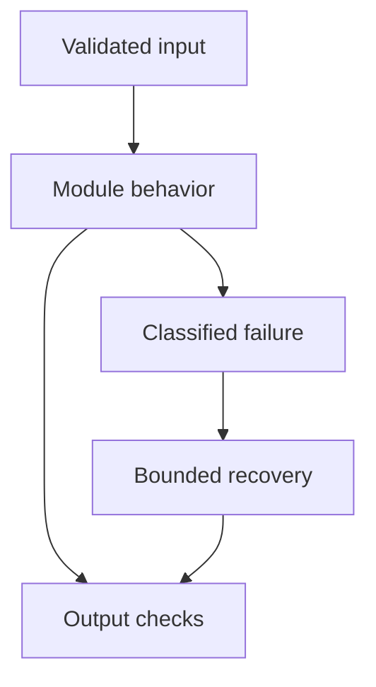

# 08: Vector Databases

[Previous module](../07-embeddings/README.md) · [Repository home](../README.md) · [Next module](../09-rag/README.md)

## Simple explanation

A vector index accelerates nearest-neighbor search. A vector database adds persistence, metadata, access patterns, and operational capabilities. Select a system from workload and failure requirements rather than its brand.

## Why, when, and how

Study this module to answer engineering scenarios, not only definitions. Work through the concepts below, run the example, explain its boundaries, then solve the exercise before reading interview answers.

## Concepts

### FAISS

FAISS provides local similarity-search algorithms, including exact and approximate indexes. It is useful for experiments and embedded services. The library does not by itself give a distributed database with tenant authorization, backups, or transactional metadata. Pair it with explicit ID mapping and source metadata.

### Chroma

Chroma supports collections, persistence, retrieval, and metadata operations. It is convenient for local RAG labs and supports additional deployment modes. Configure embeddings explicitly so an example does not unexpectedly download a model. Update text together with vectors; upsert and update have different missing-ID behavior.

### Pinecone

Pinecone offers managed vector infrastructure. Evaluate metadata filters, namespace strategy, ingest rate, residency, and billing for your workload. A namespace helps organize data but does not replace application authorization. Service limits and prices must be checked at design time.

### Qdrant

Qdrant exposes vector search with payload filtering and collection management. It can run locally or in managed infrastructure. Payload indexes matter for selective filters. Measure performance under the actual filter distribution, vector count, and concurrency, including updates.

### Weaviate

Weaviate combines object data and search capabilities, with configurations for vectorization and hybrid retrieval. Understand whether embeddings are generated by the service or application. Evaluate schema, tenant isolation, backups, and operational ownership against your requirements.

### Exact and ANN indexes

Exact search compares every vector and provides a correctness baseline. HNSW navigates a graph; IVF narrows search to partitions; quantization compresses representations. ANN trades some recall for speed and memory. Tune candidate exploration using recall-versus-latency curves.

### Metadata filtering

Filter by tenant, user permissions, document state, date, and type. Push authorization-aware constraints into candidate search whenever supported. Post-filtering only a tiny top-k can produce empty results despite relevant authorized documents. Recheck current permission before returning content.

### Hybrid search

Combine dense retrieval with lexical retrieval such as BM25. Their scores may have different scales; reciprocal rank fusion combines ranks instead. Tune candidate count and fusion on judged queries. Reranking is a separate stage after candidate collection.

### Collections namespaces persistence

Choose organization from lifecycle and isolation requirements. Too many tiny collections can raise overhead; one huge unfiltered collection risks cross-tenant mistakes. Persist source versions and index configuration. Test backup restore and deletion, not only successful ingestion.

### Scalability latency cost

Estimate vector bytes, metadata, index overhead, replicas, ingest throughput, query QPS, and filter selectivity. Test p95 under writes and failover. Managed operations reduce toil but introduce service dependency; self-hosting adds staffing, monitoring, and recovery work.

## Architecture and implementation boundary

The example isolates one mechanism from this module. Its inputs, state transitions, and outputs should be inspectable in code. Use it as a tested teaching primitive, then add the integrations described below. Offline lexical search and fixture answers are explicitly different from learned embeddings and live LLM generation.



## Real-world scenario

> FAISS works locally, but production needs millions of documents. What would you change?

**Recommended approach:** Measure vectors rather than document count, add persistent metadata and permissions, and choose an index or database that meets latency, update, availability, and backup requirements. A managed service is one option, not an automatic requirement.

**Technical reasoning:** Five million documents with ten chunks each yield fifty million vectors. Raw vector memory alone may exceed one node; replicas and ANN overhead add more. Partition according to query and isolation patterns, benchmark exact versus approximate recall, and build asynchronous versioned ingestion. Define recovery point and recovery time objectives. If FAISS remains appropriate, you still need a serving layer, routing, metadata consistency, snapshots, and recovery procedures.

## Code

This example runs on Python 3.12 with the standard library.

Run from the repository root:

```bash
python -m examples.vector_crud
```

```python
from examples.core import Record, VectorStore
if __name__ == '__main__':
    store = VectorStore(2)
    store.upsert(Record('1','demo','source','v1','Old text',(1,0)))
    print('Embeddings:', [r.vector for r in store.records('demo')])
    store.upsert(Record('1','demo','source','v2','Updated text',(0,1)))
    print('Updated:',store.search('demo',[0,1]))
    print('Other tenant:',store.search('other',[0,1]))
    store.delete('demo','1')
    print('After delete:',store.records('demo'))
```

Shared implementation: [core.py](../examples/core.py). Tests: [test_core.py](../tests/test_core.py). Optional adapters have separate validation status in [VALIDATION.md](../VALIDATION.md).

## Interview case

### Question

FAISS works locally, but production needs millions of documents. What would you change?

### Difficulty

Hard

### What interviewer is testing

Whether you can identify the actual engineering constraint, choose a bounded implementation, and justify its trade-offs.

### Short Answer

Measure vectors rather than document count, add persistent metadata and permissions, and choose an index or database that meets latency, update, availability, and backup requirements. A managed service is one option, not an automatic requirement.

### Interview Answer

Measure vectors rather than document count, add persistent metadata and permissions, and choose an index or database that meets latency, update, availability, and backup requirements. A managed service is one option, not an automatic requirement. Five million documents with ten chunks each yield fifty million vectors. Raw vector memory alone may exceed one node; replicas and ANN overhead add more. Partition according to query and isolation patterns, benchmark exact versus approximate recall, and build asynchronous versioned ingestion. Define recovery point and recovery time objectives. If FAISS remains appropriate, you still need a serving layer, routing, metadata consistency, snapshots, and recovery procedures. I would start with a representative failing or demanding workload and define measurable acceptance criteria. I would test both successful behavior and the likely failure path, then compare the new implementation with a fixed baseline. I would report the implemented scope and remaining assumptions clearly.

### Deep Technical Answer

Five million documents with ten chunks each yield fifty million vectors. Raw vector memory alone may exceed one node; replicas and ANN overhead add more. Partition according to query and isolation patterns, benchmark exact versus approximate recall, and build asynchronous versioned ingestion. Define recovery point and recovery time objectives. If FAISS remains appropriate, you still need a serving layer, routing, metadata consistency, snapshots, and recovery procedures. Keep input assumptions, state scope, failure classification, and deployment configuration explicit. Verify that the implementation is doing what the architecture claims by inspecting stage-level traces and authoritative outcomes. A successful demonstration is not enough evidence for an unmeasured scale claim.

### Real-World Example

Use the scenario above with a fixed source version and representative inputs. Save the expected result, observed result, and relevant trace so the investigation can be repeated.

### Code

Use the runnable example above and inspect the shared core for validation, lifecycle, or budget logic. Extend it only after the baseline behavior is understood.

### Follow-up Question

How would you prove this improvement still works after a dependency, model, or source-data change?

### Follow-up Answer

Version inputs and configuration, keep independent regression cases, compare quality and operational metrics, and test a rollback. Add a slice for the failure this change specifically addresses.

### Common Mistake

Giving a component name as the whole answer without explaining its contract, limitations, measurement, or failure behavior.

### Senior-Level Insight

Five million documents with ten chunks each yield fifty million vectors. Raw vector memory alone may exceed one node; replicas and ANN overhead add more. Partition according to query and isolation patterns, benchmark exact versus approximate recall, and build asynchronous versioned ingestion. Define recovery point and recovery time objectives. If FAISS remains appropriate, you still need a serving layer, routing, metadata consistency, snapshots, and recovery procedures. Explain the simplest design that meets the requirement and what workload or evidence would make you replace it.

## Follow-up tree

1. Explain the mechanism using a tiny input.
2. Show the implementation and edge cases.
3. Explain the scenario above and the main bottleneck.
4. Show which metric would identify a regression.
5. Explain recovery after failure or a partial result.
6. Design the boundary under multiple tenants and ten times the workload.

## Debugging exercise

**Symptom:** the scenario fails after a configuration or data change. **Investigation:** capture exact inputs, versions, and stage outcomes; compare with the prior baseline. **Root cause:** identify the first stage violating its contract. **Fix:** change that stage and replay the case. **Prevention:** add the failing case and an operational signal to the regression suite. For concrete incidents, see [debugging runbooks](../28-debugging/runbooks.md).

## Production considerations

- **Reliability:** define deadlines, cancellation behavior, retryability, and recovery of partial work.
- **Security:** derive caller identity from authentication; scope data and tool permissions in trusted code.
- **Cost and performance:** measure stage latency, memory, token use, throughput, and cost per successful task.
- **Testing and evaluation:** validate hard invariants separately from semantic quality; keep representative held-out cases.
- **Deployment:** use tested dependency versions, external configuration, safe telemetry, and an actual rollback procedure.

## Levels of understanding

**Junior:** explain each concept and run the example with a small input.

**Mid-level:** adapt it to the real-world scenario, write edge tests, and diagnose a demonstrated failure.

**Senior:** Five million documents with ten chunks each yield fifty million vectors. Raw vector memory alone may exceed one node; replicas and ANN overhead add more. Partition according to query and isolation patterns, benchmark exact versus approximate recall, and build asynchronous versioned ingestion. Define recovery point and recovery time objectives. If FAISS remains appropriate, you still need a serving layer, routing, metadata consistency, snapshots, and recovery procedures.

## What I must remember

A vector index accelerates nearest-neighbor search. A vector database adds persistence, metadata, access patterns, and operational capabilities. Select a system from workload and failure requirements rather than its brand. Measure vectors rather than document count, add persistent metadata and permissions, and choose an index or database that meets latency, update, availability, and backup requirements. A managed service is one option, not an automatic requirement.

## What I must be able to code

Run, modify, and explain [vector_crud.py](../examples/vector_crud.py); implement the exercise below and relevant edge tests.

## What an interviewer may ask

The case above, each concept’s failure boundary, and the topic-specific questions in the [interview bank](../interview-questions/README.md).

## What senior engineers are expected to know

Requirements, observable evidence, uncertainty, dependency lifecycle, authorization, and the cost of operating the design. Explain what would change your decision.

## Common mistakes

Confusing an example with a production deployment; assuming a framework enforces business permissions; reporting unmeasured performance; skipping the failure path; and tuning on the final test set.

## Practical exercise and mini project

Build a local CRUD collection, print vectors, update one document, delete it, and confirm filtered searches cannot return another tenant. Compare exact and approximate retrieval on the same queries.

**Acceptance:** include a normal case, empty or missing input, invalid input, a failure case, and one stated limitation. Record the observed result and explain why the checks match the actual requirement.

## GitHub task

```bash
git switch -c learn/08-vector-databases
python -m unittest discover -s tests -v
git add 08-vector-databases examples tests
git commit -m "docs: study vector databases and record exercise results"
git push -u origin learn/08-vector-databases
```

Open a pull request with the implementation, measured validation, and remaining limits. Do not claim a lab result is a production benchmark.
