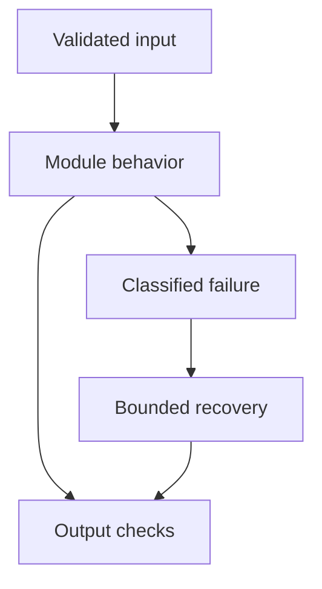

# 09: Retrieval-Augmented Generation

[Previous module](../08-vector-databases/README.md) · [Repository home](../README.md) · [Next module](../10-advanced-rag/README.md)

## Simple explanation

RAG supplies relevant external evidence at answer time. It is useful for changing or private knowledge. It reduces some factual errors but does not automatically make answers truthful or secure.

## Why, when, and how

Study this module to answer engineering scenarios, not only definitions. Work through the concepts below, run the example, explain its boundaries, then solve the exercise before reading interview answers.

## Concepts

### Document loading

Read source bytes, extract text and layout, and retain source identifiers, page numbers, versions, and permissions. Scanned PDFs need OCR; text extraction alone can return empty pages. Preserve table headers and units. Treat uploaded files as untrusted data with size and parsing limits.

### Recursive chunking

Split using a hierarchy of separators, trying to preserve paragraphs and sentences within a target budget. Overlap carries boundary context but increases storage and duplicate retrieval. Token-aware limits are preferable when model budgets are tight. Evaluate several sizes rather than declaring 1000/200 universally best.

### Semantic chunking

Use boundaries based on content transitions, often from embedding changes. This can preserve coherent meaning but costs preprocessing and introduces thresholds. A semantic boundary is not necessarily the right factual citation boundary. Compare against simpler structure-aware splitting.

### Parent-child chunking

Index small children for precise retrieval and supply their larger parent sections for context. Keep both IDs and avoid returning an entire oversized parent. Enforce permissions on parent and child together. Deduplicate parents when multiple children match.

### Metadata and ingestion

Assign stable IDs with document version, chunk offset, language, title, and access attributes. Persist the original source separately from derived text and vectors. Re-ingestion should atomically activate a complete new version rather than expose half an update.

### Retrieval and rewriting

Retrieve candidates using the current question and relevant conversational context. Query rewriting can resolve pronouns but can also introduce unsupported assumptions. Keep the original question and log the rewrite. Multi-query retrieval increases coverage at the expense of extra calls and duplicate candidates.

### Hybrid reranking and compression

Fuse lexical and dense candidates, then apply a cross-encoder or other reranker to a bounded set. Contextual compression extracts relevant portions, but must preserve provenance and avoid changing meaning. Relevance filtering removes weak evidence; thresholds need calibration.

### Prompt and answer

Pack evidence within a token budget, use explicit source IDs, and define an abstention policy. Separate retrieved content from trusted instructions. Ask for claims supported by evidence and validate the output shape. The application retains responsibility for authorization.

### Citations

Tie each citation to immutable document version and source span. Validate that the ID exists in the supplied evidence and assess whether the span supports the claim. A correct URL attached to an unsupported answer is still a bad citation. Do not fabricate page numbers.

### Testing and hallucination reduction

Measure parsing coverage, chunk coverage, Recall@k, ranking, answer correctness, faithfulness, abstention, and citation quality separately. Add missing-answer, contradictory-source, outdated-source, and injection tests. Better retrieval cannot fix every generation failure, and better generation cannot invent missing evidence.

## Architecture and implementation boundary

The example isolates one mechanism from this module. Its inputs, state transitions, and outputs should be inspectable in code. Use it as a tested teaching primitive, then add the integrations described below. Offline lexical search and fixture answers are explicitly different from learned embeddings and live LLM generation.



## Real-world scenario

> Retrieval returns relevant context, but the answer still hallucinates. How do you debug it?

**Recommended approach:** Inspect the exact prompt sent to the model, truncation, conflicting instructions, source versions, and the unsupported claim. Separate retrieval relevance from evidence sufficiency, then test grounding and abstention with a fixed benchmark.

**Technical reasoning:** A relevant document may not contain the requested fact. Verify the retrieved span actually supports the answer, then check whether packing dropped that span or placed it among conflicting content. Inspect chat history and retrieved instructions for contamination. Require source-linked claims and independent citation checks. If correct context is ignored, compare a minimal prompt, smaller evidence set, and a model change. Keep latency and quality budgets visible rather than endlessly increasing top-k.

## Code

This example runs on Python 3.12 with the standard library.

Run from the repository root:

```bash
python -m examples.rag
```

```python
from examples.core import OfflineRAG, demo_documents
if __name__ == '__main__':
    rag = OfflineRAG(demo_documents())
    for question in ('refund receipt','delivery','astronomy quantum'):
        print(question,rag.answer('demo',question))
    print('This is lexical retrieval and extractive answering, not an LLM.')
```

Shared implementation: [core.py](../examples/core.py). Tests: [test_core.py](../tests/test_core.py). Optional adapters have separate validation status in [VALIDATION.md](../VALIDATION.md).

## Interview case

### Question

Retrieval returns relevant context, but the answer still hallucinates. How do you debug it?

### Difficulty

Hard

### What interviewer is testing

Whether you can identify the actual engineering constraint, choose a bounded implementation, and justify its trade-offs.

### Short Answer

Inspect the exact prompt sent to the model, truncation, conflicting instructions, source versions, and the unsupported claim. Separate retrieval relevance from evidence sufficiency, then test grounding and abstention with a fixed benchmark.

### Interview Answer

Inspect the exact prompt sent to the model, truncation, conflicting instructions, source versions, and the unsupported claim. Separate retrieval relevance from evidence sufficiency, then test grounding and abstention with a fixed benchmark. A relevant document may not contain the requested fact. Verify the retrieved span actually supports the answer, then check whether packing dropped that span or placed it among conflicting content. Inspect chat history and retrieved instructions for contamination. Require source-linked claims and independent citation checks. If correct context is ignored, compare a minimal prompt, smaller evidence set, and a model change. Keep latency and quality budgets visible rather than endlessly increasing top-k. I would start with a representative failing or demanding workload and define measurable acceptance criteria. I would test both successful behavior and the likely failure path, then compare the new implementation with a fixed baseline. I would report the implemented scope and remaining assumptions clearly.

### Deep Technical Answer

A relevant document may not contain the requested fact. Verify the retrieved span actually supports the answer, then check whether packing dropped that span or placed it among conflicting content. Inspect chat history and retrieved instructions for contamination. Require source-linked claims and independent citation checks. If correct context is ignored, compare a minimal prompt, smaller evidence set, and a model change. Keep latency and quality budgets visible rather than endlessly increasing top-k. Keep input assumptions, state scope, failure classification, and deployment configuration explicit. Verify that the implementation is doing what the architecture claims by inspecting stage-level traces and authoritative outcomes. A successful demonstration is not enough evidence for an unmeasured scale claim.

### Real-World Example

Use the scenario above with a fixed source version and representative inputs. Save the expected result, observed result, and relevant trace so the investigation can be repeated.

### Code

Use the runnable example above and inspect the shared core for validation, lifecycle, or budget logic. Extend it only after the baseline behavior is understood.

### Follow-up Question

How would you prove this improvement still works after a dependency, model, or source-data change?

### Follow-up Answer

Version inputs and configuration, keep independent regression cases, compare quality and operational metrics, and test a rollback. Add a slice for the failure this change specifically addresses.

### Common Mistake

Giving a component name as the whole answer without explaining its contract, limitations, measurement, or failure behavior.

### Senior-Level Insight

A relevant document may not contain the requested fact. Verify the retrieved span actually supports the answer, then check whether packing dropped that span or placed it among conflicting content. Inspect chat history and retrieved instructions for contamination. Require source-linked claims and independent citation checks. If correct context is ignored, compare a minimal prompt, smaller evidence set, and a model change. Keep latency and quality budgets visible rather than endlessly increasing top-k. Explain the simplest design that meets the requirement and what workload or evidence would make you replace it.

## Follow-up tree

1. Explain the mechanism using a tiny input.
2. Show the implementation and edge cases.
3. Explain the scenario above and the main bottleneck.
4. Show which metric would identify a regression.
5. Explain recovery after failure or a partial result.
6. Design the boundary under multiple tenants and ten times the workload.

## Debugging exercise

**Symptom:** the scenario fails after a configuration or data change. **Investigation:** capture exact inputs, versions, and stage outcomes; compare with the prior baseline. **Root cause:** identify the first stage violating its contract. **Fix:** change that stage and replay the case. **Prevention:** add the failing case and an operational signal to the regression suite. For concrete incidents, see [debugging runbooks](../28-debugging/runbooks.md).

## Production considerations

- **Reliability:** define deadlines, cancellation behavior, retryability, and recovery of partial work.
- **Security:** derive caller identity from authentication; scope data and tool permissions in trusted code.
- **Cost and performance:** measure stage latency, memory, token use, throughput, and cost per successful task.
- **Testing and evaluation:** validate hard invariants separately from semantic quality; keep representative held-out cases.
- **Deployment:** use tested dependency versions, external configuration, safe telemetry, and an actual rollback procedure.

## Levels of understanding

**Junior:** explain each concept and run the example with a small input.

**Mid-level:** adapt it to the real-world scenario, write edge tests, and diagnose a demonstrated failure.

**Senior:** A relevant document may not contain the requested fact. Verify the retrieved span actually supports the answer, then check whether packing dropped that span or placed it among conflicting content. Inspect chat history and retrieved instructions for contamination. Require source-linked claims and independent citation checks. If correct context is ignored, compare a minimal prompt, smaller evidence set, and a model change. Keep latency and quality budgets visible rather than endlessly increasing top-k.

## What I must remember

RAG supplies relevant external evidence at answer time. It is useful for changing or private knowledge. It reduces some factual errors but does not automatically make answers truthful or secure. Inspect the exact prompt sent to the model, truncation, conflicting instructions, source versions, and the unsupported claim. Separate retrieval relevance from evidence sufficiency, then test grounding and abstention with a fixed benchmark.

## What I must be able to code

Run, modify, and explain [rag.py](../examples/rag.py); implement the exercise below and relevant edge tests.

## What an interviewer may ask

The case above, each concept’s failure boundary, and the topic-specific questions in the [interview bank](../interview-questions/README.md).

## What senior engineers are expected to know

Requirements, observable evidence, uncertainty, dependency lifecycle, authorization, and the cost of operating the design. Explain what would change your decision.

## Common mistakes

Confusing an example with a production deployment; assuming a framework enforces business permissions; reporting unmeasured performance; skipping the failure path; and tuning on the final test set.

## Practical exercise and mini project

Run the offline RAG example, add an unanswerable question, and verify abstention. Replace lexical vectors with a real embedding adapter, measure Recall@k, then add citations and evaluate unsupported claims.

**Acceptance:** include a normal case, empty or missing input, invalid input, a failure case, and one stated limitation. Record the observed result and explain why the checks match the actual requirement.

## GitHub task

```bash
git switch -c learn/09-rag
python -m unittest discover -s tests -v
git add 09-rag examples tests
git commit -m "docs: study retrieval-augmented generation and record exercise results"
git push -u origin learn/09-rag
```

Open a pull request with the implementation, measured validation, and remaining limits. Do not claim a lab result is a production benchmark.
