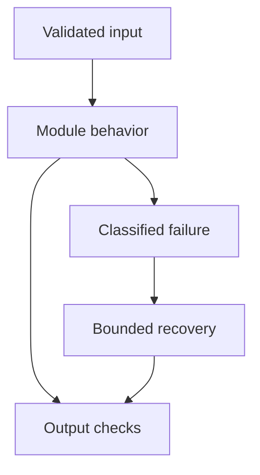

# 10: Advanced RAG and Scale

[Previous module](../09-rag/README.md) · [Repository home](../README.md) · [Next module](../11-langchain/README.md)

## Simple explanation

Advanced RAG is disciplined improvement of the weakest stage. Start with a measurable baseline and preserve provenance through every transformation. Extra model calls without evaluation can make the system slower and less reliable.

## Why, when, and how

Study this module to answer engineering scenarios, not only definitions. Work through the concepts below, run the example, explain its boundaries, then solve the exercise before reading interview answers.

## Concepts

### 500000-document design

Estimate average chunks per document before sizing. Store originals in object storage, metadata and permissions in a relational store, and derived vectors in a versioned search index. Use queues for extraction and embedding, idempotent workers, an activation record for versions, and dead-letter handling for failed sources.

### Irrelevant results

Inspect actual query, rewriting, corpus coverage, filters, chunk text, embedding revision, index recall, and rank order. Compare exact search on a small labeled sample. Fix missing extraction or incorrect ACLs before tuning scores. Separate weak candidate retrieval from weak reranking.

### Correct answer wrong citation

Track whether citations refer to parent IDs, child IDs, or source spans. A common bug is positional numbering after reranking while generation uses older numbering. Another is cached answer text paired with fresh citations. Bind answer and evidence version as one immutable result.

### Correct context wrong answer

Check truncation, confusing source order, units, negatives, conflicting policy versions, and conversation contamination. Decompose multi-hop questions and use tools for arithmetic. Relevance does not imply completeness. Abstain when all required evidence is not present.

### Variable answers

Sampling, changing indexes, approximate search, provider model changes, rewriting, and prompt changes can all vary responses. Lower temperature reduces one source of variation. Version configurations and use canonical evidence ordering, but do not promise universal determinism.

### Multi-query and decomposition

Create paraphrases or subquestions to improve coverage. Merge and deduplicate candidates before reranking. Constrain rewriting so user identifiers, dates, and amounts survive. Every extra query consumes latency, tokens, and quota; compare improvement per added cost.

### Reranking and relevance

Rerank a candidate set larger than the final context. Cross-encoders score query-document pairs jointly and can improve ranking. They cannot recover an absent relevant document. Calibrate acceptance thresholds for the actual domain and evaluate false abstentions.

### Freshness and lifecycle

Use change tracking, source checksums, tombstones, and index version aliases. Delete or replace all chunks belonging to an outdated version. Permissions may change more often than content; recheck authorization against the source of truth. Define acceptable ingestion lag.

### Evaluation experiments

Separate retrieval, context selection, generation, and citation experiments. Use paired comparisons on the same queries and slice by language, PDF type, and question complexity. Prevent prompt tuning on the final test set. Record confidence and inspect failures, not only aggregate averages.

### Scaling and failure

Bound query fanout and context length. Cache only permission-scoped, versioned results. Maintain partial-service behavior if reranking fails, but label the degraded path and validate quality. Load-test mixed ingestion and queries and test restore from snapshots.

## Architecture and implementation boundary

The example isolates one mechanism from this module. Its inputs, state transitions, and outputs should be inspectable in code. Use it as a tested teaching primitive, then add the integrations described below. Offline lexical search and fixture answers are explicitly different from learned embeddings and live LLM generation.



## Real-world scenario

> Design a RAG system for 500,000 documents with frequent policy changes.

**Recommended approach:** Use asynchronous versioned ingestion, object storage, metadata and ACL records, filtered retrieval, bounded reranking, a provider gateway, and independent retrieval and answer evaluations. Treat freshness and permission updates as first-class requirements.

**Technical reasoning:** If each document produces twenty chunks, plan for ten million vectors. Build parsing and embedding stages with deduplication and per-source version checks. Activate a source version only after complete ingestion. Track ingestion lag, permission freshness, index recall, query p95, and citation support. During model or embedding migration, build a shadow index and compare on fixed queries before alias switching. Restrict fanout to keep provider quotas and costs predictable.

## Code

This example runs on Python 3.12 with the standard library.

Run from the repository root:

```bash
python -m examples.hybrid
```

```python
from examples.core import rrf
if __name__ == '__main__':
    lexical = ['exact-invoice','policy','overview']
    dense_fixture = ['policy','overview','exact-invoice']
    print('Fusion of two fixture rankings:',rrf([lexical,dense_fixture]))
```

Shared implementation: [core.py](../examples/core.py). Tests: [test_core.py](../tests/test_core.py). Optional adapters have separate validation status in [VALIDATION.md](../VALIDATION.md).

## Interview case

### Question

Design a RAG system for 500,000 documents with frequent policy changes.

### Difficulty

Hard

### What interviewer is testing

Whether you can identify the actual engineering constraint, choose a bounded implementation, and justify its trade-offs.

### Short Answer

Use asynchronous versioned ingestion, object storage, metadata and ACL records, filtered retrieval, bounded reranking, a provider gateway, and independent retrieval and answer evaluations. Treat freshness and permission updates as first-class requirements.

### Interview Answer

Use asynchronous versioned ingestion, object storage, metadata and ACL records, filtered retrieval, bounded reranking, a provider gateway, and independent retrieval and answer evaluations. Treat freshness and permission updates as first-class requirements. If each document produces twenty chunks, plan for ten million vectors. Build parsing and embedding stages with deduplication and per-source version checks. Activate a source version only after complete ingestion. Track ingestion lag, permission freshness, index recall, query p95, and citation support. During model or embedding migration, build a shadow index and compare on fixed queries before alias switching. Restrict fanout to keep provider quotas and costs predictable. I would start with a representative failing or demanding workload and define measurable acceptance criteria. I would test both successful behavior and the likely failure path, then compare the new implementation with a fixed baseline. I would report the implemented scope and remaining assumptions clearly.

### Deep Technical Answer

If each document produces twenty chunks, plan for ten million vectors. Build parsing and embedding stages with deduplication and per-source version checks. Activate a source version only after complete ingestion. Track ingestion lag, permission freshness, index recall, query p95, and citation support. During model or embedding migration, build a shadow index and compare on fixed queries before alias switching. Restrict fanout to keep provider quotas and costs predictable. Keep input assumptions, state scope, failure classification, and deployment configuration explicit. Verify that the implementation is doing what the architecture claims by inspecting stage-level traces and authoritative outcomes. A successful demonstration is not enough evidence for an unmeasured scale claim.

### Real-World Example

Use the scenario above with a fixed source version and representative inputs. Save the expected result, observed result, and relevant trace so the investigation can be repeated.

### Code

Use the runnable example above and inspect the shared core for validation, lifecycle, or budget logic. Extend it only after the baseline behavior is understood.

### Follow-up Question

How would you prove this improvement still works after a dependency, model, or source-data change?

### Follow-up Answer

Version inputs and configuration, keep independent regression cases, compare quality and operational metrics, and test a rollback. Add a slice for the failure this change specifically addresses.

### Common Mistake

Giving a component name as the whole answer without explaining its contract, limitations, measurement, or failure behavior.

### Senior-Level Insight

If each document produces twenty chunks, plan for ten million vectors. Build parsing and embedding stages with deduplication and per-source version checks. Activate a source version only after complete ingestion. Track ingestion lag, permission freshness, index recall, query p95, and citation support. During model or embedding migration, build a shadow index and compare on fixed queries before alias switching. Restrict fanout to keep provider quotas and costs predictable. Explain the simplest design that meets the requirement and what workload or evidence would make you replace it.

## Follow-up tree

1. Explain the mechanism using a tiny input.
2. Show the implementation and edge cases.
3. Explain the scenario above and the main bottleneck.
4. Show which metric would identify a regression.
5. Explain recovery after failure or a partial result.
6. Design the boundary under multiple tenants and ten times the workload.

## Debugging exercise

**Symptom:** the scenario fails after a configuration or data change. **Investigation:** capture exact inputs, versions, and stage outcomes; compare with the prior baseline. **Root cause:** identify the first stage violating its contract. **Fix:** change that stage and replay the case. **Prevention:** add the failing case and an operational signal to the regression suite. For concrete incidents, see [debugging runbooks](../28-debugging/runbooks.md).

## Production considerations

- **Reliability:** define deadlines, cancellation behavior, retryability, and recovery of partial work.
- **Security:** derive caller identity from authentication; scope data and tool permissions in trusted code.
- **Cost and performance:** measure stage latency, memory, token use, throughput, and cost per successful task.
- **Testing and evaluation:** validate hard invariants separately from semantic quality; keep representative held-out cases.
- **Deployment:** use tested dependency versions, external configuration, safe telemetry, and an actual rollback procedure.

## Levels of understanding

**Junior:** explain each concept and run the example with a small input.

**Mid-level:** adapt it to the real-world scenario, write edge tests, and diagnose a demonstrated failure.

**Senior:** If each document produces twenty chunks, plan for ten million vectors. Build parsing and embedding stages with deduplication and per-source version checks. Activate a source version only after complete ingestion. Track ingestion lag, permission freshness, index recall, query p95, and citation support. During model or embedding migration, build a shadow index and compare on fixed queries before alias switching. Restrict fanout to keep provider quotas and costs predictable.

## What I must remember

Advanced RAG is disciplined improvement of the weakest stage. Start with a measurable baseline and preserve provenance through every transformation. Extra model calls without evaluation can make the system slower and less reliable. Use asynchronous versioned ingestion, object storage, metadata and ACL records, filtered retrieval, bounded reranking, a provider gateway, and independent retrieval and answer evaluations. Treat freshness and permission updates as first-class requirements.

## What I must be able to code

Run, modify, and explain [hybrid.py](../examples/hybrid.py); implement the exercise below and relevant edge tests.

## What an interviewer may ask

The case above, each concept’s failure boundary, and the topic-specific questions in the [interview bank](../interview-questions/README.md).

## What senior engineers are expected to know

Requirements, observable evidence, uncertainty, dependency lifecycle, authorization, and the cost of operating the design. Explain what would change your decision.

## Common mistakes

Confusing an example with a production deployment; assuming a framework enforces business permissions; reporting unmeasured performance; skipping the failure path; and tuning on the final test set.

## Practical exercise and mini project

Create a migration plan with old and new indexes. Simulate a shorter updated document and a permission revocation. Demonstrate that old chunks and unauthorized cached answers are not returned.

**Acceptance:** include a normal case, empty or missing input, invalid input, a failure case, and one stated limitation. Record the observed result and explain why the checks match the actual requirement.

## GitHub task

```bash
git switch -c learn/10-advanced-rag
python -m unittest discover -s tests -v
git add 10-advanced-rag examples tests
git commit -m "docs: study advanced rag and scale and record exercise results"
git push -u origin learn/10-advanced-rag
```

Open a pull request with the implementation, measured validation, and remaining limits. Do not claim a lab result is a production benchmark.
