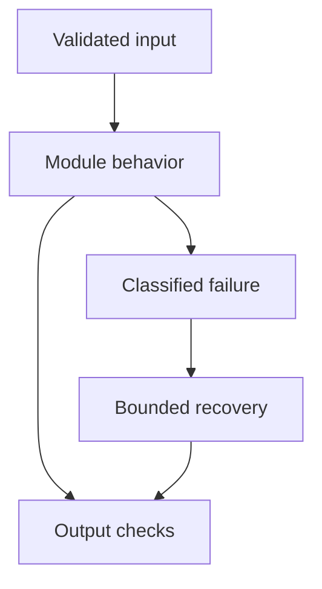

# 11: LangChain

[Previous module](../10-advanced-rag/README.md) · [Repository home](../README.md) · [Next module](../12-tools/README.md)

## Simple explanation

LangChain supplies composable model, prompt, retrieval, tool, and agent interfaces. Learn what each component does so you can debug the actual pipeline rather than treating a chain as a black box.

## Why, when, and how

Study this module to answer engineering scenarios, not only definitions. Work through the concepts below, run the example, explain its boundaries, then solve the exercise before reading interview answers.

## Concepts

### Prompts and templates

A prompt template formats trusted instructions and request data into messages. Use ChatPromptTemplate for role-aware chat formatting. Why: repeatable task contracts. Where: classification and grounded answering. Example: prompt.invoke({question: ...}). Follow-up: what happens when user input contains template syntax? Keep user values as data and verify formatted messages in tests.

### Models and provider switching

A chat model accepts messages and returns an AI message, often with usage and tool-call metadata. init_chat_model and provider integration packages offer a common surface. Why: isolate vendor changes. Where: model routing. Follow-up: can every model support the same schema? No; capability checks and adapter contract tests are required.

### Output parsers

Parsers convert model output into a useful form, such as text or a validated object. StrOutputParser extracts string content in a simple text pipeline. Why: downstream code needs contracts. Where: a summary endpoint. Common mistake: assuming parsing proves factual correctness. Schema validation and business validation remain separate.

### Runnable and LCEL

Runnable supports invoke, ainvoke, batch, and stream style composition. LCEL uses the pipe operator to connect compatible stages. Why: explicit reusable pipelines. Where: prompt to model to parser. Follow-up: what if one stage blocks? Async composition cannot turn a synchronous blocking SDK into nonblocking I/O automatically.

### Chains and boundaries

A chain is a fixed composition of steps. Prefer inspectable pipelines over deprecated monolithic patterns. Why: deterministic control flow. Where: retrieval then answering. Common mistake: reaching for an agent when a fixed pipeline covers the task. Record per-stage inputs and outputs with redaction.

### Retrievers and vector stores

A vector store manages stored vectors; a retriever exposes a query-to-documents interface. Convert supported stores with as_retriever and configure search options. Why: hide storage-specific lookup. Where: RAG. Follow-up: where do ACLs belong? In trusted retrieval code and the underlying permission system, not in user-selected filter arguments.

### Loaders and splitters

Loaders produce Document objects with text and metadata. Text splitters create chunks while retaining provenance. Modern installations use separate packages such as langchain_text_splitters. Why: modular ingestion. Where: PDF RAG. Common mistake: importing an obsolete path or losing page metadata during custom transformations.

### Callbacks and tracing

Callbacks expose events such as model start, tool end, and errors; LangSmith can collect traces. Why: see where latency and failures occur. Where: production incidents. Follow-up: can traces leak PII? Yes; redact and control retention. Trace IDs should connect application, retrieval, and provider activity.

### Memory concepts

History is message state, not a magical truth store. Keep sessions scoped, trim to a budget, and use durable persistence where needed. Why: conversational continuity. Where: support sessions. Common mistake: one global conversation list for all users. Store factual records in an authoritative database.

### Tools and agents

Tools are typed capabilities; create_agent supplies a model-driven loop around tools. Why: variable task steps. Where: constrained support automation. Follow-up: who executes and authorizes the tool? The application. Keep step limits, timeouts, and approval rules outside model text.

### LlamaIndex comparison

LlamaIndex offers document ingestion, indexing, and query-oriented abstractions, including VectorStoreIndex. LangChain offers broad composition and agent interfaces; LangGraph exposes explicit stateful orchestration. Compare the actual task and extension needs. Framework choice does not remove retrieval, evaluation, permission, or operational design responsibilities.

## Architecture and implementation boundary

The example isolates one mechanism from this module. Its inputs, state transitions, and outputs should be inspectable in code. Use it as a tested teaching primitive, then add the integrations described below. Offline lexical search and fixture answers are explicitly different from learned embeddings and live LLM generation.



## Real-world scenario

> When would you use a plain SDK, LCEL, LangGraph, or LlamaIndex?

**Recommended approach:** Use a plain SDK for a small direct call, LCEL for a fixed composed pipeline, LangGraph for explicit stateful control flow, and LlamaIndex when its document indexing and query abstractions fit the problem.

**Technical reasoning:** Framework overhead must earn its place through maintainability, tracing, persistence, or reusable integrations. A plain SDK can still support robust production behavior. LCEL is convenient for composable stages; LangGraph is appropriate for loops, branching, checkpointing, and approvals. LlamaIndex is an alternative abstraction for data-oriented applications, not a substitute for source quality and authorization. Evaluate team familiarity, dependency surface, and version stability.

## Code

Optional dependencies and external access may be required; read examples/README.md first.

Run from the repository root:

```bash
python -m examples.langchain_example
```

```python
# Optional: uv sync --extra frameworks
from langchain_core.prompts import ChatPromptTemplate
from langchain_core.language_models.fake_chat_models import FakeListChatModel
from langchain_core.output_parsers import StrOutputParser
prompt = ChatPromptTemplate.from_messages([
    ('system','Summarize supported evidence. Say unknown if missing.'),
    ('human','Question: {question}\nEvidence: {evidence}')])
model = FakeListChatModel(responses=['Fixture answer: refunds within 14 days.'])
chain = prompt | model | StrOutputParser()
if __name__ == '__main__':
    print(chain.invoke({'question':'Refund period?', 'evidence':'14 days.'}))
    print('The fake model is a protocol test, not a quality demonstration.')
```

Shared implementation: [core.py](../examples/core.py). Tests: [test_core.py](../tests/test_core.py). Optional adapters have separate validation status in [VALIDATION.md](../VALIDATION.md).

## Interview case

### Question

When would you use a plain SDK, LCEL, LangGraph, or LlamaIndex?

### Difficulty

Hard

### What interviewer is testing

Whether you can identify the actual engineering constraint, choose a bounded implementation, and justify its trade-offs.

### Short Answer

Use a plain SDK for a small direct call, LCEL for a fixed composed pipeline, LangGraph for explicit stateful control flow, and LlamaIndex when its document indexing and query abstractions fit the problem.

### Interview Answer

Use a plain SDK for a small direct call, LCEL for a fixed composed pipeline, LangGraph for explicit stateful control flow, and LlamaIndex when its document indexing and query abstractions fit the problem. Framework overhead must earn its place through maintainability, tracing, persistence, or reusable integrations. A plain SDK can still support robust production behavior. LCEL is convenient for composable stages; LangGraph is appropriate for loops, branching, checkpointing, and approvals. LlamaIndex is an alternative abstraction for data-oriented applications, not a substitute for source quality and authorization. Evaluate team familiarity, dependency surface, and version stability. I would start with a representative failing or demanding workload and define measurable acceptance criteria. I would test both successful behavior and the likely failure path, then compare the new implementation with a fixed baseline. I would report the implemented scope and remaining assumptions clearly.

### Deep Technical Answer

Framework overhead must earn its place through maintainability, tracing, persistence, or reusable integrations. A plain SDK can still support robust production behavior. LCEL is convenient for composable stages; LangGraph is appropriate for loops, branching, checkpointing, and approvals. LlamaIndex is an alternative abstraction for data-oriented applications, not a substitute for source quality and authorization. Evaluate team familiarity, dependency surface, and version stability. Keep input assumptions, state scope, failure classification, and deployment configuration explicit. Verify that the implementation is doing what the architecture claims by inspecting stage-level traces and authoritative outcomes. A successful demonstration is not enough evidence for an unmeasured scale claim.

### Real-World Example

Use the scenario above with a fixed source version and representative inputs. Save the expected result, observed result, and relevant trace so the investigation can be repeated.

### Code

Use the runnable example above and inspect the shared core for validation, lifecycle, or budget logic. Extend it only after the baseline behavior is understood.

### Follow-up Question

How would you prove this improvement still works after a dependency, model, or source-data change?

### Follow-up Answer

Version inputs and configuration, keep independent regression cases, compare quality and operational metrics, and test a rollback. Add a slice for the failure this change specifically addresses.

### Common Mistake

Giving a component name as the whole answer without explaining its contract, limitations, measurement, or failure behavior.

### Senior-Level Insight

Framework overhead must earn its place through maintainability, tracing, persistence, or reusable integrations. A plain SDK can still support robust production behavior. LCEL is convenient for composable stages; LangGraph is appropriate for loops, branching, checkpointing, and approvals. LlamaIndex is an alternative abstraction for data-oriented applications, not a substitute for source quality and authorization. Evaluate team familiarity, dependency surface, and version stability. Explain the simplest design that meets the requirement and what workload or evidence would make you replace it.

## Follow-up tree

1. Explain the mechanism using a tiny input.
2. Show the implementation and edge cases.
3. Explain the scenario above and the main bottleneck.
4. Show which metric would identify a regression.
5. Explain recovery after failure or a partial result.
6. Design the boundary under multiple tenants and ten times the workload.

## Debugging exercise

**Symptom:** the scenario fails after a configuration or data change. **Investigation:** capture exact inputs, versions, and stage outcomes; compare with the prior baseline. **Root cause:** identify the first stage violating its contract. **Fix:** change that stage and replay the case. **Prevention:** add the failing case and an operational signal to the regression suite. For concrete incidents, see [debugging runbooks](../28-debugging/runbooks.md).

## Production considerations

- **Reliability:** define deadlines, cancellation behavior, retryability, and recovery of partial work.
- **Security:** derive caller identity from authentication; scope data and tool permissions in trusted code.
- **Cost and performance:** measure stage latency, memory, token use, throughput, and cost per successful task.
- **Testing and evaluation:** validate hard invariants separately from semantic quality; keep representative held-out cases.
- **Deployment:** use tested dependency versions, external configuration, safe telemetry, and an actual rollback procedure.

## Levels of understanding

**Junior:** explain each concept and run the example with a small input.

**Mid-level:** adapt it to the real-world scenario, write edge tests, and diagnose a demonstrated failure.

**Senior:** Framework overhead must earn its place through maintainability, tracing, persistence, or reusable integrations. A plain SDK can still support robust production behavior. LCEL is convenient for composable stages; LangGraph is appropriate for loops, branching, checkpointing, and approvals. LlamaIndex is an alternative abstraction for data-oriented applications, not a substitute for source quality and authorization. Evaluate team familiarity, dependency surface, and version stability.

## What I must remember

LangChain supplies composable model, prompt, retrieval, tool, and agent interfaces. Learn what each component does so you can debug the actual pipeline rather than treating a chain as a black box. Use a plain SDK for a small direct call, LCEL for a fixed composed pipeline, LangGraph for explicit stateful control flow, and LlamaIndex when its document indexing and query abstractions fit the problem.

## What I must be able to code

Run, modify, and explain [langchain_example.py](../examples/langchain_example.py); implement the exercise below and relevant edge tests.

## What an interviewer may ask

The case above, each concept’s failure boundary, and the topic-specific questions in the [interview bank](../interview-questions/README.md).

## What senior engineers are expected to know

Requirements, observable evidence, uncertainty, dependency lifecycle, authorization, and the cost of operating the design. Explain what would change your decision.

## Common mistakes

Confusing an example with a production deployment; assuming a framework enforces business permissions; reporting unmeasured performance; skipping the failure path; and tuning on the final test set.

## Practical exercise and mini project

Run a fake-model LCEL chain, inspect the formatted prompt, and compare it with the equivalent plain Python pipeline. Add retrieval using the offline core and preserve source IDs.

**Acceptance:** include a normal case, empty or missing input, invalid input, a failure case, and one stated limitation. Record the observed result and explain why the checks match the actual requirement.

## GitHub task

```bash
git switch -c learn/11-langchain
python -m unittest discover -s tests -v
git add 11-langchain examples tests
git commit -m "docs: study langchain and record exercise results"
git push -u origin learn/11-langchain
```

Open a pull request with the implementation, measured validation, and remaining limits. Do not claim a lab result is a production benchmark.
