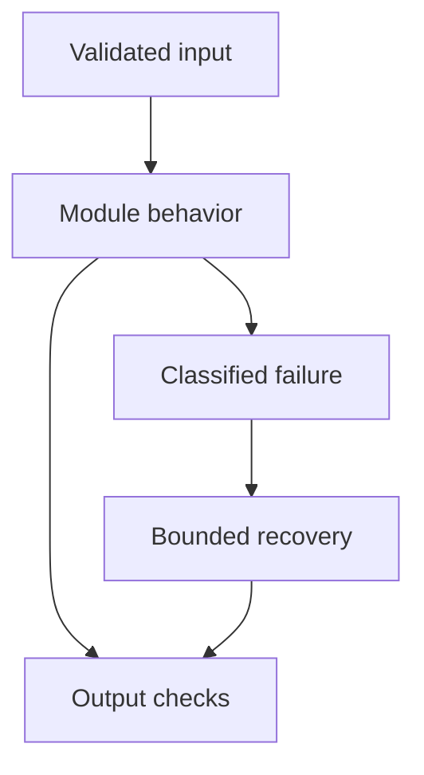

# 12: Custom Tools

[Previous module](../11-langchain/README.md) · [Repository home](../README.md) · [Next module](../13-function-calling/README.md)

## Simple explanation

A tool is a narrow, validated application capability exposed to a model. The model proposes inputs; trusted code decides whether the operation is allowed and executes it.

## Why, when, and how

Study this module to answer engineering scenarios, not only definitions. Work through the concepts below, run the example, explain its boundaries, then solve the exercise before reading interview answers.

## Concepts

### Schema and validation

Describe fields, types, constraints, and units in a tool schema. Validate again at runtime and reject unknown fields. A city name is not a URL; an employee ID is not an arbitrary SQL string. Use enums or structured operations when the valid space is small.

### Calculator

Use explicit operations and numbers instead of eval on model-generated text. Check divide-by-zero, magnitude, and finite output. For money use Decimal or integer minor units. The model can choose an operation but must not run arbitrary Python.

### Weather API

Accept a city or controlled location ID, use a configured API origin, and set a network timeout. Return timestamp and units. Keep keys on the server. An offline weather fixture is a test double and must not be presented as current weather.

### Database tool

Expose a read-only, authorized operation with parameterized values and row limits. For general text-to-SQL, parse and constrain syntax plus use a read-only database role and statement timeout. Schema validation alone does not make arbitrary SQL safe.

### Search tool

Call a configured search provider with bounded query length, response count, and timeout. Return source URLs and fetched times. If fetching pages, prevent SSRF, private-address access, and malicious redirects. Web content is untrusted evidence, not instructions.

### Internal employee tool

Resolve the caller identity from authentication, then enforce field-level and row-level permissions. Different roles may see name and team but not salary. Audit lookup purpose and access. Do not let the model select a more privileged identity.

### File processing tool

Parse approved file types in a restricted worker with size, time, and page limits. Preserve spans and extraction warnings. Avoid executing macros or embedded commands. Return extracted data with provenance rather than granting filesystem-wide read access.

### Execution and errors

Use a tool registry that maps allowed names to functions. Return structured success or error results with safe messages. Distinguish unavailable, invalid input, forbidden, and transient failure. Preserve call IDs so the model receives the observation for the correct invocation.

### Retries and timeouts

Use per-tool deadlines and a total task budget. Retry only safe transient failures. Side-effecting operations require idempotency keys and reconciliation. A model repeatedly requesting the same tool should trigger loop detection rather than unlimited retries.

### Selection and approval

Tool descriptions should explain applicability and limits. Restrict the offered tool set according to the authenticated user and task. Require approval for consequential actions where policy needs it. Bind approval to exact arguments and versions so a model cannot change the operation afterward.

## Architecture and implementation boundary

The example isolates one mechanism from this module. Its inputs, state transitions, and outputs should be inspectable in code. Use it as a tested teaching primitive, then add the integrations described below. Offline lexical search and fixture answers are explicitly different from learned embeddings and live LLM generation.



## Real-world scenario

> A model asks your employee tool for everyone’s salaries. What happens?

**Recommended approach:** The application checks the authenticated caller and policy, rejects unauthorized fields or scope, and returns a safe denial. The model’s request never grants permissions.

**Technical reasoning:** Use a trusted identity context distinct from tool arguments. Restrict the query through row and field controls and parameterized operations. Log an audit event without exposing the forbidden result. Do not rely on a prompt asking the model to behave. Tool schemas improve input shape; they are not authorization systems. For permitted exports, bound volume and require any mandated approval tied to the concrete export request.

## Code

This example runs on Python 3.12 with the standard library.

Run from the repository root:

```bash
python -m examples.tools
```

```python
from examples.core import execute_tool, Identity
if __name__ == '__main__':
    proposal = {'id':'call-1','name':'calculator',
                'arguments':{'operation':'multiply','a':12,'b':7}}
    print(execute_tool(proposal,Identity('demo','reader')))
```

Shared implementation: [core.py](../examples/core.py). Tests: [test_core.py](../tests/test_core.py). Optional adapters have separate validation status in [VALIDATION.md](../VALIDATION.md).

## Interview case

### Question

A model asks your employee tool for everyone’s salaries. What happens?

### Difficulty

Hard

### What interviewer is testing

Whether you can identify the actual engineering constraint, choose a bounded implementation, and justify its trade-offs.

### Short Answer

The application checks the authenticated caller and policy, rejects unauthorized fields or scope, and returns a safe denial. The model’s request never grants permissions.

### Interview Answer

The application checks the authenticated caller and policy, rejects unauthorized fields or scope, and returns a safe denial. The model’s request never grants permissions. Use a trusted identity context distinct from tool arguments. Restrict the query through row and field controls and parameterized operations. Log an audit event without exposing the forbidden result. Do not rely on a prompt asking the model to behave. Tool schemas improve input shape; they are not authorization systems. For permitted exports, bound volume and require any mandated approval tied to the concrete export request. I would start with a representative failing or demanding workload and define measurable acceptance criteria. I would test both successful behavior and the likely failure path, then compare the new implementation with a fixed baseline. I would report the implemented scope and remaining assumptions clearly.

### Deep Technical Answer

Use a trusted identity context distinct from tool arguments. Restrict the query through row and field controls and parameterized operations. Log an audit event without exposing the forbidden result. Do not rely on a prompt asking the model to behave. Tool schemas improve input shape; they are not authorization systems. For permitted exports, bound volume and require any mandated approval tied to the concrete export request. Keep input assumptions, state scope, failure classification, and deployment configuration explicit. Verify that the implementation is doing what the architecture claims by inspecting stage-level traces and authoritative outcomes. A successful demonstration is not enough evidence for an unmeasured scale claim.

### Real-World Example

Use the scenario above with a fixed source version and representative inputs. Save the expected result, observed result, and relevant trace so the investigation can be repeated.

### Code

Use the runnable example above and inspect the shared core for validation, lifecycle, or budget logic. Extend it only after the baseline behavior is understood.

### Follow-up Question

How would you prove this improvement still works after a dependency, model, or source-data change?

### Follow-up Answer

Version inputs and configuration, keep independent regression cases, compare quality and operational metrics, and test a rollback. Add a slice for the failure this change specifically addresses.

### Common Mistake

Giving a component name as the whole answer without explaining its contract, limitations, measurement, or failure behavior.

### Senior-Level Insight

Use a trusted identity context distinct from tool arguments. Restrict the query through row and field controls and parameterized operations. Log an audit event without exposing the forbidden result. Do not rely on a prompt asking the model to behave. Tool schemas improve input shape; they are not authorization systems. For permitted exports, bound volume and require any mandated approval tied to the concrete export request. Explain the simplest design that meets the requirement and what workload or evidence would make you replace it.

## Follow-up tree

1. Explain the mechanism using a tiny input.
2. Show the implementation and edge cases.
3. Explain the scenario above and the main bottleneck.
4. Show which metric would identify a regression.
5. Explain recovery after failure or a partial result.
6. Design the boundary under multiple tenants and ten times the workload.

## Debugging exercise

**Symptom:** the scenario fails after a configuration or data change. **Investigation:** capture exact inputs, versions, and stage outcomes; compare with the prior baseline. **Root cause:** identify the first stage violating its contract. **Fix:** change that stage and replay the case. **Prevention:** add the failing case and an operational signal to the regression suite. For concrete incidents, see [debugging runbooks](../28-debugging/runbooks.md).

## Production considerations

- **Reliability:** define deadlines, cancellation behavior, retryability, and recovery of partial work.
- **Security:** derive caller identity from authentication; scope data and tool permissions in trusted code.
- **Cost and performance:** measure stage latency, memory, token use, throughput, and cost per successful task.
- **Testing and evaluation:** validate hard invariants separately from semantic quality; keep representative held-out cases.
- **Deployment:** use tested dependency versions, external configuration, safe telemetry, and an actual rollback procedure.

## Levels of understanding

**Junior:** explain each concept and run the example with a small input.

**Mid-level:** adapt it to the real-world scenario, write edge tests, and diagnose a demonstrated failure.

**Senior:** Use a trusted identity context distinct from tool arguments. Restrict the query through row and field controls and parameterized operations. Log an audit event without exposing the forbidden result. Do not rely on a prompt asking the model to behave. Tool schemas improve input shape; they are not authorization systems. For permitted exports, bound volume and require any mandated approval tied to the concrete export request.

## What I must remember

A tool is a narrow, validated application capability exposed to a model. The model proposes inputs; trusted code decides whether the operation is allowed and executes it. The application checks the authenticated caller and policy, rejects unauthorized fields or scope, and returns a safe denial. The model’s request never grants permissions.

## What I must be able to code

Run, modify, and explain [tools.py](../examples/tools.py); implement the exercise below and relevant edge tests.

## What an interviewer may ask

The case above, each concept’s failure boundary, and the topic-specific questions in the [interview bank](../interview-questions/README.md).

## What senior engineers are expected to know

Requirements, observable evidence, uncertainty, dependency lifecycle, authorization, and the cost of operating the design. Explain what would change your decision.

## Common mistakes

Confusing an example with a production deployment; assuming a framework enforces business permissions; reporting unmeasured performance; skipping the failure path; and tuning on the final test set.

## Practical exercise and mini project

Build calculator, employee, weather-fixture, and file-summary tools. Test malformed input, unauthorized access, timeout, and repeated side effects. Label fixtures clearly.

**Acceptance:** include a normal case, empty or missing input, invalid input, a failure case, and one stated limitation. Record the observed result and explain why the checks match the actual requirement.

## GitHub task

```bash
git switch -c learn/12-tools
python -m unittest discover -s tests -v
git add 12-tools examples tests
git commit -m "docs: study custom tools and record exercise results"
git push -u origin learn/12-tools
```

Open a pull request with the implementation, measured validation, and remaining limits. Do not claim a lab result is a production benchmark.
