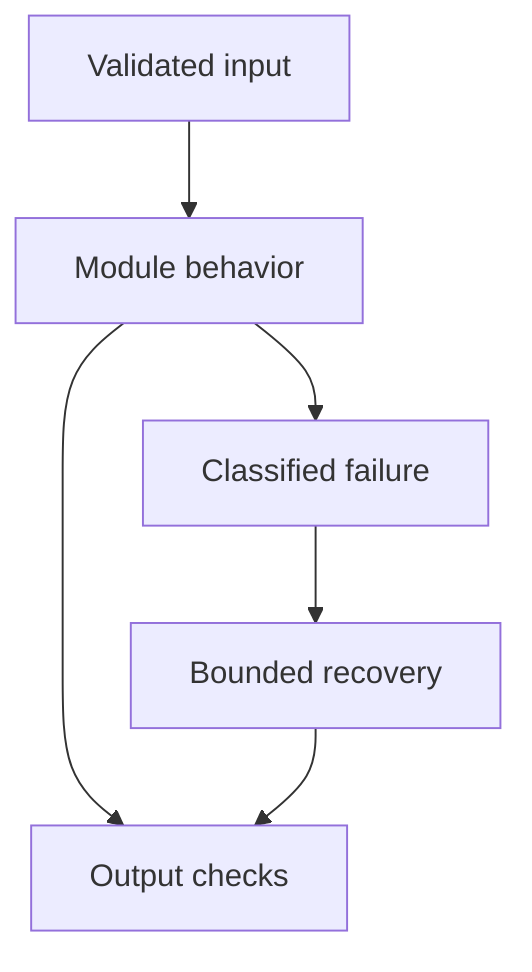

# 13: Function Calling and Tool Calling

[Previous module](../12-tools/README.md) · [Repository home](../README.md) · [Next module](../14-langgraph/README.md)

## Simple explanation

Tool calling is a protocol between a model and your program. It does not execute tools inside the model. Your program validates the proposed call, executes an allowed function, and sends the result back.

## Why, when, and how

Study this module to answer engineering scenarios, not only definitions. Work through the concepts below, run the example, explain its boundaries, then solve the exercise before reading interview answers.

## Concepts

### Normal model call

A normal call produces text or multimodal output. Use it for summarization and discussion when no external operation is required. Text mentioning a function name is not a real authorized call. Never parse free text into arbitrary code execution.

### Structured output

Structured output returns data conforming to a requested schema. It may be an extraction result, not a request for action. A structured invoice object should be stored only after validation. Distinguish generating fields from authorizing a payment.

### Function versus tool calling

Function calling generally refers to calling application functions; tool calling is the broader provider terminology and may include other tool types. Provider formats vary. Document your internal protocol explicitly rather than pretending terminology is universal.

### Decision and arguments

The model selects from offered tools and proposes arguments. Validate tool name, schema, size, and business rules. Do not accept a new tool name invented by the model. Model-suggested arguments may include fabricated identifiers or unsafe values.

### Application execution

Execute through a trusted registry with caller permissions and a deadline. Each function should be independently testable. Do not pass raw model-generated expressions into eval, shells, or SQL. Side effects use explicit idempotency and approval checks.

### Results and final answer

Return the observation under the matching tool-call ID, then ask the model to continue. Parallel calls require matching each result separately. Truncate oversized output while retaining meaningful error and provenance fields. The final answer must reflect errors rather than claim success after failure.

### Agent distinction

One tool call is not necessarily an agent. An agent iteratively chooses actions based on observations. A fixed workflow can also use tool calls at a bounded stage. More autonomy adds failure paths, latency, and testing burden.

### Parallel and dependent tools

Independent lookups can run concurrently; a second operation depending on the first result must wait. Bound parallelism and total cost. Failures should be represented per call. Never run competing writes concurrently merely because the model proposed them together.

### Loop boundaries

Set maximum steps, model calls, tool calls, output tokens, elapsed time, and repeat-call limits. A recursion limit is a final safety net, not a business stop policy. Return partial results or escalation when the budget is exhausted.

### Protocol testing

Use recorded proposals to test call IDs, argument validation, forbidden names, error handling, and repeated calls. Contract-test each provider adapter. Test that failures are not transformed into a successful-looking response.

## Architecture and implementation boundary

The example isolates one mechanism from this module. Its inputs, state transitions, and outputs should be inspectable in code. Use it as a tested teaching primitive, then add the integrations described below. Offline lexical search and fixture answers are explicitly different from learned embeddings and live LLM generation.



## Real-world scenario

> How is structured output different from a tool call?

**Recommended approach:** Structured output returns validated-shaped data. A tool call proposes an external operation that the application must authorize and execute. Both use schemas, but only a permitted executed operation changes external state.

**Technical reasoning:** A schema is a syntax and type contract. It cannot establish that an employee exists, the caller can read salary, or a payment is approved. The execution layer validates those facts against trusted systems. Tool-result messages carry observations associated with call IDs; the model uses them to formulate a response. Agents add repeated selection and observation around this protocol, so they require independent budgets and stop conditions.

## Code

This example runs on Python 3.12 with the standard library.

Run from the repository root:

```bash
python -m examples.tool_loop
```

```python
from examples.core import execute_plan, Identity
if __name__ == '__main__':
    proposal = {'id':'c1','name':'calculator','arguments':{'operation':'add','a':1,'b':2}}
    print(execute_plan([proposal,dict(proposal,id='c2')],Identity('demo','reader')))
```

Shared implementation: [core.py](../examples/core.py). Tests: [test_core.py](../tests/test_core.py). Optional adapters have separate validation status in [VALIDATION.md](../VALIDATION.md).

## Interview case

### Question

How is structured output different from a tool call?

### Difficulty

Hard

### What interviewer is testing

Whether you can identify the actual engineering constraint, choose a bounded implementation, and justify its trade-offs.

### Short Answer

Structured output returns validated-shaped data. A tool call proposes an external operation that the application must authorize and execute. Both use schemas, but only a permitted executed operation changes external state.

### Interview Answer

Structured output returns validated-shaped data. A tool call proposes an external operation that the application must authorize and execute. Both use schemas, but only a permitted executed operation changes external state. A schema is a syntax and type contract. It cannot establish that an employee exists, the caller can read salary, or a payment is approved. The execution layer validates those facts against trusted systems. Tool-result messages carry observations associated with call IDs; the model uses them to formulate a response. Agents add repeated selection and observation around this protocol, so they require independent budgets and stop conditions. I would start with a representative failing or demanding workload and define measurable acceptance criteria. I would test both successful behavior and the likely failure path, then compare the new implementation with a fixed baseline. I would report the implemented scope and remaining assumptions clearly.

### Deep Technical Answer

A schema is a syntax and type contract. It cannot establish that an employee exists, the caller can read salary, or a payment is approved. The execution layer validates those facts against trusted systems. Tool-result messages carry observations associated with call IDs; the model uses them to formulate a response. Agents add repeated selection and observation around this protocol, so they require independent budgets and stop conditions. Keep input assumptions, state scope, failure classification, and deployment configuration explicit. Verify that the implementation is doing what the architecture claims by inspecting stage-level traces and authoritative outcomes. A successful demonstration is not enough evidence for an unmeasured scale claim.

### Real-World Example

Use the scenario above with a fixed source version and representative inputs. Save the expected result, observed result, and relevant trace so the investigation can be repeated.

### Code

Use the runnable example above and inspect the shared core for validation, lifecycle, or budget logic. Extend it only after the baseline behavior is understood.

### Follow-up Question

How would you prove this improvement still works after a dependency, model, or source-data change?

### Follow-up Answer

Version inputs and configuration, keep independent regression cases, compare quality and operational metrics, and test a rollback. Add a slice for the failure this change specifically addresses.

### Common Mistake

Giving a component name as the whole answer without explaining its contract, limitations, measurement, or failure behavior.

### Senior-Level Insight

A schema is a syntax and type contract. It cannot establish that an employee exists, the caller can read salary, or a payment is approved. The execution layer validates those facts against trusted systems. Tool-result messages carry observations associated with call IDs; the model uses them to formulate a response. Agents add repeated selection and observation around this protocol, so they require independent budgets and stop conditions. Explain the simplest design that meets the requirement and what workload or evidence would make you replace it.

## Follow-up tree

1. Explain the mechanism using a tiny input.
2. Show the implementation and edge cases.
3. Explain the scenario above and the main bottleneck.
4. Show which metric would identify a regression.
5. Explain recovery after failure or a partial result.
6. Design the boundary under multiple tenants and ten times the workload.

## Debugging exercise

**Symptom:** the scenario fails after a configuration or data change. **Investigation:** capture exact inputs, versions, and stage outcomes; compare with the prior baseline. **Root cause:** identify the first stage violating its contract. **Fix:** change that stage and replay the case. **Prevention:** add the failing case and an operational signal to the regression suite. For concrete incidents, see [debugging runbooks](../28-debugging/runbooks.md).

## Production considerations

- **Reliability:** define deadlines, cancellation behavior, retryability, and recovery of partial work.
- **Security:** derive caller identity from authentication; scope data and tool permissions in trusted code.
- **Cost and performance:** measure stage latency, memory, token use, throughput, and cost per successful task.
- **Testing and evaluation:** validate hard invariants separately from semantic quality; keep representative held-out cases.
- **Deployment:** use tested dependency versions, external configuration, safe telemetry, and an actual rollback procedure.

## Levels of understanding

**Junior:** explain each concept and run the example with a small input.

**Mid-level:** adapt it to the real-world scenario, write edge tests, and diagnose a demonstrated failure.

**Senior:** A schema is a syntax and type contract. It cannot establish that an employee exists, the caller can read salary, or a payment is approved. The execution layer validates those facts against trusted systems. Tool-result messages carry observations associated with call IDs; the model uses them to formulate a response. Agents add repeated selection and observation around this protocol, so they require independent budgets and stop conditions.

## What I must remember

Tool calling is a protocol between a model and your program. It does not execute tools inside the model. Your program validates the proposed call, executes an allowed function, and sends the result back. Structured output returns validated-shaped data. A tool call proposes an external operation that the application must authorize and execute. Both use schemas, but only a permitted executed operation changes external state.

## What I must be able to code

Run, modify, and explain [tool_loop.py](../examples/tool_loop.py); implement the exercise below and relevant edge tests.

## What an interviewer may ask

The case above, each concept’s failure boundary, and the topic-specific questions in the [interview bank](../interview-questions/README.md).

## What senior engineers are expected to know

Requirements, observable evidence, uncertainty, dependency lifecycle, authorization, and the cost of operating the design. Explain what would change your decision.

## Common mistakes

Confusing an example with a production deployment; assuming a framework enforces business permissions; reporting unmeasured performance; skipping the failure path; and tuning on the final test set.

## Practical exercise and mini project

Implement a model proposal fixture, execute one calculator call, send the matching observation, and reject a proposal for an unknown tool. Add a hard stop after three calls.

**Acceptance:** include a normal case, empty or missing input, invalid input, a failure case, and one stated limitation. Record the observed result and explain why the checks match the actual requirement.

## GitHub task

```bash
git switch -c learn/13-function-calling
python -m unittest discover -s tests -v
git add 13-function-calling examples tests
git commit -m "docs: study function calling and tool calling and record exercise results"
git push -u origin learn/13-function-calling
```

Open a pull request with the implementation, measured validation, and remaining limits. Do not claim a lab result is a production benchmark.
