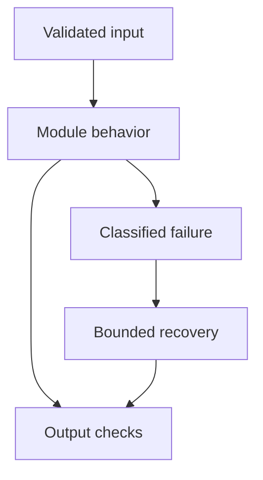

# 14: LangGraph

[Previous module](../13-function-calling/README.md) · [Repository home](../README.md) · [Next module](../15-agents/README.md)

## Simple explanation

LangGraph models a task as state plus transitions. This makes branches, loops, persistence, and pauses explicit, allowing you to explain exactly how a long-running agent proceeds and stops.

## Why, when, and how

Study this module to answer engineering scenarios, not only definitions. Work through the concepts below, run the example, explain its boundaries, then solve the exercise before reading interview answers.

## Concepts

### State

State is the data carried through the graph, commonly described with TypedDict or another supported schema. Include only what nodes need: query, evidence, decisions, and counters. Keep trusted identity outside model-editable fields. Define reducers carefully for list accumulation or parallel updates.

### Nodes and updates

A node reads state and returns updates. Avoid mutating shared nested state in place; return explicit changes. A model node, retrieval node, and validation node have different contracts. Unit-test them independently before testing the graph.

### Edges START END

START identifies entry and END termination. Static edges model fixed transitions. A simple graph can normalize a query then retrieve then answer. Keep the graph readable: a diagram should match implemented transitions, including error paths.

### Conditional edges

A routing function selects the next node from validated state. Use explicit routes such as answer, tool, retry, and escalate. Do not let arbitrary model text become a node name. Test every branch, especially exhausted budgets.

### Loops and budgets

Increase a step counter and enforce elapsed-time, token, and repeat-call budgets. Detect no progress, not only total count. The framework recursion limit can stop runaway transitions, but the user should receive a deliberate bounded result or escalation.

### Checkpoints

A checkpointer stores graph state at execution boundaries. thread_id selects a conversation or workflow execution context. InMemorySaver is useful for examples but loses state on restart. Production persistence must address durability, encryption, retention, migrations, and tenant access.

### Persistence and side effects

Checkpointing supports recovery; it does not automatically guarantee exactly-once external operations. A node may replay after failure or resumption. Use idempotency keys and reconcile ambiguous outcomes. Keep immutable operation records outside an unreliable model response.

### Human-in-the-loop

interrupt pauses a workflow and Command(resume=...) supplies the decision. Reuse the same thread ID and authorize who may resume it. Code before the interrupt can run again, so avoid irreversible side effects there. Tie approval to exact operation arguments.

### Retries and tools

Set retry policies for specific transient node failures and deadlines for tools. A retry after a timeout might duplicate an operation already completed remotely. Tool nodes must preserve schemas, errors, call IDs, and permissions.

### Progressive graphs

Build a simple graph, then a RAG graph, then a research loop, support workflow, and specialist orchestration. Each adds a specific need: state, routing, budgets, approval, or parallel reducers. Do not introduce multi-agent complexity until a single bounded workflow is understood.

## Architecture and implementation boundary

The example isolates one mechanism from this module. Its inputs, state transitions, and outputs should be inspectable in code. Use it as a tested teaching primitive, then add the integrations described below. Offline lexical search and fixture answers are explicitly different from learned embeddings and live LLM generation.



## Real-world scenario

> An agent calls the same tool forever. How would you redesign the graph?

**Recommended approach:** Add explicit budgets, repeated-call detection, and a no-progress condition. Route exhausted or invalid states to a final partial response or escalation. Keep the recursion limit as an additional safeguard.

**Technical reasoning:** Include step_count, tool fingerprints, elapsed time, and cumulative token cost in trusted orchestration state. A tool fingerprint includes name and canonical arguments, but repeated read calls may be legitimate if the state changed; define task-specific progress. Validate the routing decision before choosing an edge. Persist checkpoint state per authorized thread. For side effects, store a separate operation ID so checkpoint replay cannot duplicate business actions.

## Code

Optional dependencies and external access may be required; read examples/README.md first.

Run from the repository root:

```bash
python -m examples.langgraph_example
```

```python
# Optional: uv sync --extra frameworks. No API key required.
from typing import TypedDict
from langgraph.graph import StateGraph, START, END
from langgraph.checkpoint.memory import InMemorySaver
from langgraph.types import interrupt, Command
class State(TypedDict, total=False):
    question: str
    approved: bool
    answer: str
def approval(state: State):
    approved = interrupt({'action':'answer fixture question','question':state['question']})
    return {'approved': bool(approved)}
def answer(state: State):
    return {'answer': 'Approved fixture response.' if state['approved'] else 'Declined.'}
builder = StateGraph(State)
builder.add_node('approval',approval)
builder.add_node('answer',answer)
builder.add_edge(START,'approval')
builder.add_edge('approval','answer')
builder.add_edge('answer',END)
graph = builder.compile(checkpointer=InMemorySaver())
if __name__ == '__main__':
    config = {'configurable':{'thread_id':'demo-thread'}}
    paused = graph.invoke({'question':'Refund period?'},config)
    print('Paused:',paused)
    print('Resumed:',graph.invoke(Command(resume=True),config))
```

Shared implementation: [core.py](../examples/core.py). Tests: [test_core.py](../tests/test_core.py). Optional adapters have separate validation status in [VALIDATION.md](../VALIDATION.md).

## Interview case

### Question

An agent calls the same tool forever. How would you redesign the graph?

### Difficulty

Hard

### What interviewer is testing

Whether you can identify the actual engineering constraint, choose a bounded implementation, and justify its trade-offs.

### Short Answer

Add explicit budgets, repeated-call detection, and a no-progress condition. Route exhausted or invalid states to a final partial response or escalation. Keep the recursion limit as an additional safeguard.

### Interview Answer

Add explicit budgets, repeated-call detection, and a no-progress condition. Route exhausted or invalid states to a final partial response or escalation. Keep the recursion limit as an additional safeguard. Include step_count, tool fingerprints, elapsed time, and cumulative token cost in trusted orchestration state. A tool fingerprint includes name and canonical arguments, but repeated read calls may be legitimate if the state changed; define task-specific progress. Validate the routing decision before choosing an edge. Persist checkpoint state per authorized thread. For side effects, store a separate operation ID so checkpoint replay cannot duplicate business actions. I would start with a representative failing or demanding workload and define measurable acceptance criteria. I would test both successful behavior and the likely failure path, then compare the new implementation with a fixed baseline. I would report the implemented scope and remaining assumptions clearly.

### Deep Technical Answer

Include step_count, tool fingerprints, elapsed time, and cumulative token cost in trusted orchestration state. A tool fingerprint includes name and canonical arguments, but repeated read calls may be legitimate if the state changed; define task-specific progress. Validate the routing decision before choosing an edge. Persist checkpoint state per authorized thread. For side effects, store a separate operation ID so checkpoint replay cannot duplicate business actions. Keep input assumptions, state scope, failure classification, and deployment configuration explicit. Verify that the implementation is doing what the architecture claims by inspecting stage-level traces and authoritative outcomes. A successful demonstration is not enough evidence for an unmeasured scale claim.

### Real-World Example

Use the scenario above with a fixed source version and representative inputs. Save the expected result, observed result, and relevant trace so the investigation can be repeated.

### Code

Use the runnable example above and inspect the shared core for validation, lifecycle, or budget logic. Extend it only after the baseline behavior is understood.

### Follow-up Question

How would you prove this improvement still works after a dependency, model, or source-data change?

### Follow-up Answer

Version inputs and configuration, keep independent regression cases, compare quality and operational metrics, and test a rollback. Add a slice for the failure this change specifically addresses.

### Common Mistake

Giving a component name as the whole answer without explaining its contract, limitations, measurement, or failure behavior.

### Senior-Level Insight

Include step_count, tool fingerprints, elapsed time, and cumulative token cost in trusted orchestration state. A tool fingerprint includes name and canonical arguments, but repeated read calls may be legitimate if the state changed; define task-specific progress. Validate the routing decision before choosing an edge. Persist checkpoint state per authorized thread. For side effects, store a separate operation ID so checkpoint replay cannot duplicate business actions. Explain the simplest design that meets the requirement and what workload or evidence would make you replace it.

## Follow-up tree

1. Explain the mechanism using a tiny input.
2. Show the implementation and edge cases.
3. Explain the scenario above and the main bottleneck.
4. Show which metric would identify a regression.
5. Explain recovery after failure or a partial result.
6. Design the boundary under multiple tenants and ten times the workload.

## Debugging exercise

**Symptom:** the scenario fails after a configuration or data change. **Investigation:** capture exact inputs, versions, and stage outcomes; compare with the prior baseline. **Root cause:** identify the first stage violating its contract. **Fix:** change that stage and replay the case. **Prevention:** add the failing case and an operational signal to the regression suite. For concrete incidents, see [debugging runbooks](../28-debugging/runbooks.md).

## Production considerations

- **Reliability:** define deadlines, cancellation behavior, retryability, and recovery of partial work.
- **Security:** derive caller identity from authentication; scope data and tool permissions in trusted code.
- **Cost and performance:** measure stage latency, memory, token use, throughput, and cost per successful task.
- **Testing and evaluation:** validate hard invariants separately from semantic quality; keep representative held-out cases.
- **Deployment:** use tested dependency versions, external configuration, safe telemetry, and an actual rollback procedure.

## Levels of understanding

**Junior:** explain each concept and run the example with a small input.

**Mid-level:** adapt it to the real-world scenario, write edge tests, and diagnose a demonstrated failure.

**Senior:** Include step_count, tool fingerprints, elapsed time, and cumulative token cost in trusted orchestration state. A tool fingerprint includes name and canonical arguments, but repeated read calls may be legitimate if the state changed; define task-specific progress. Validate the routing decision before choosing an edge. Persist checkpoint state per authorized thread. For side effects, store a separate operation ID so checkpoint replay cannot duplicate business actions.

## What I must remember

LangGraph models a task as state plus transitions. This makes branches, loops, persistence, and pauses explicit, allowing you to explain exactly how a long-running agent proceeds and stops. Add explicit budgets, repeated-call detection, and a no-progress condition. Route exhausted or invalid states to a final partial response or escalation. Keep the recursion limit as an additional safeguard.

## What I must be able to code

Run, modify, and explain [langgraph_example.py](../examples/langgraph_example.py); implement the exercise below and relevant edge tests.

## What an interviewer may ask

The case above, each concept’s failure boundary, and the topic-specific questions in the [interview bank](../interview-questions/README.md).

## What senior engineers are expected to know

Requirements, observable evidence, uncertainty, dependency lifecycle, authorization, and the cost of operating the design. Explain what would change your decision.

## Common mistakes

Confusing an example with a production deployment; assuming a framework enforces business permissions; reporting unmeasured performance; skipping the failure path; and tuning on the final test set.

## Practical exercise and mini project

Run the offline LangGraph example, add a conditional retry edge with a two-attempt cap, then add an approval node. Restart with durable checkpoint storage as an extension and verify resumption permissions.

**Acceptance:** include a normal case, empty or missing input, invalid input, a failure case, and one stated limitation. Record the observed result and explain why the checks match the actual requirement.

## GitHub task

```bash
git switch -c learn/14-langgraph
python -m unittest discover -s tests -v
git add 14-langgraph examples tests
git commit -m "docs: study langgraph and record exercise results"
git push -u origin learn/14-langgraph
```

Open a pull request with the implementation, measured validation, and remaining limits. Do not claim a lab result is a production benchmark.
