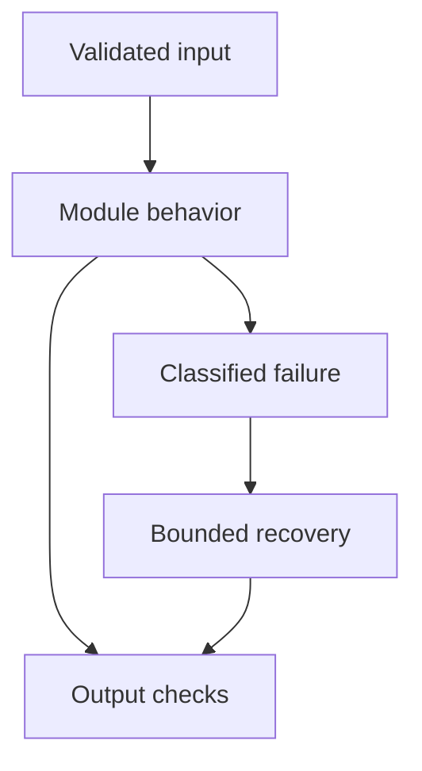

# 15: AI Agents

[Previous module](../14-langgraph/README.md) · [Repository home](../README.md) · [Next module](../16-memory/README.md)

## Simple explanation

An agent chooses actions using a model, observes results, and continues toward a task. Use an agent when the required steps vary meaningfully; use a fixed workflow when steps are known and reliability matters more than autonomy.

## Why, when, and how

Study this module to answer engineering scenarios, not only definitions. Work through the concepts below, run the example, explain its boundaries, then solve the exercise before reading interview answers.

## Concepts

### LLM chain workflow agent

An LLM generates outputs; a chain composes fixed calls; a workflow branches using explicit rules; an agent lets a model choose actions. An autonomous agent can operate with reduced human intervention. These categories overlap in implementation, so define the actual control boundary.

### Planning

A plan decomposes a goal into actions. Validate dependencies, required permissions, and budgets before execution. Plans can be wrong or stale. Short bounded replanning after new evidence is often safer than an enormous initial plan.

### Reasoning and observation

The agent conditions its next choice on tool observations and state. Expose concise action rationales and evidence, not hidden chain-of-thought. An observation is untrusted if it comes from a webpage or uploaded file. Validate its source and shape before reuse.

### Tools

Provide narrow capabilities rather than unrestricted shell, database, or browser access. Match permissions to the task and caller. A research agent may search public sources but does not need payroll access. Sandbox coding tools and limit egress and filesystem scope.

### State and execution

Track task goal, progress, evidence, tool calls, errors, and stop reasons. Keep state transitions auditable. The orchestration layer owns deadlines and authorization. Model text must not overwrite user identity or increase its own budget.

### Memory

Use session state for the current task and explicit authorized stores for longer-lived information. Memory is a hypothesis when generated by a model, not ground truth. Attach provenance, timestamps, confidence, and deletion controls.

### Retries and reflection

Reflection can identify missing work but is another model call with additional cost and potential errors. Use it when evaluation shows benefit. Retrying an unsuccessful plan without new information may repeat the same failure. Define an escalation threshold.

### Research and document agents

Research gathers sources, deduplicates facts, compares evidence, and cites claims. Document agents extract fields and handle missing data. Neither should treat embedded source instructions as authority. Verify important claims against original evidence.

### SQL support and coding agents

SQL agents need read-only scoped operations. Support agents need policy versioning and approval for consequential changes. Coding agents need isolated workspaces, tests, and review. Task success is the validated result, not a fluent final message.

### When not to use agents

Do not use an agent for a deterministic lookup, fixed classification, or a known transactional flow without clear added value. Measure success, tool accuracy, recovery, latency, and cost against a workflow baseline. Limit autonomy according to the impact of mistakes.

## Architecture and implementation boundary

The example isolates one mechanism from this module. Its inputs, state transitions, and outputs should be inspectable in code. Use it as a tested teaching primitive, then add the integrations described below. Offline lexical search and fixture answers are explicitly different from learned embeddings and live LLM generation.



## Real-world scenario

> When should you avoid an agent?

**Recommended approach:** Avoid one when steps are fixed, a deterministic API already solves the problem, or variable model decisions add risk without measurable benefit. A bounded workflow is usually easier to test, operate, and explain.

**Technical reasoning:** Choose agentic control only for uncertainty that deterministic orchestration cannot cheaply resolve. Compare against a baseline using completion accuracy, action permissions, unnecessary calls, duration, and cost. A model may choose search queries while a workflow owns source fetching, validation, and publishing. This hybrid reduces the surface where probabilistic decisions can cause damage. Production readiness requires observing behavior under adversarial and failed-tool conditions.

## Code

This example runs on Python 3.12 with the standard library.

Run from the repository root:

```bash
python -m examples.agent
```

```python
from examples.core import execute_plan, Identity
if __name__ == '__main__':
    proposals = [{'id':str(i),'name':'calculator',
                  'arguments':{'operation':'add','a':i,'b':1}} for i in range(10)]
    print(execute_plan(proposals,Identity('demo','reader'),limit=3))
    print('Fixed proposal fixture. Replace proposal generation with a model adapter.')
```

Shared implementation: [core.py](../examples/core.py). Tests: [test_core.py](../tests/test_core.py). Optional adapters have separate validation status in [VALIDATION.md](../VALIDATION.md).

## Interview case

### Question

When should you avoid an agent?

### Difficulty

Hard

### What interviewer is testing

Whether you can identify the actual engineering constraint, choose a bounded implementation, and justify its trade-offs.

### Short Answer

Avoid one when steps are fixed, a deterministic API already solves the problem, or variable model decisions add risk without measurable benefit. A bounded workflow is usually easier to test, operate, and explain.

### Interview Answer

Avoid one when steps are fixed, a deterministic API already solves the problem, or variable model decisions add risk without measurable benefit. A bounded workflow is usually easier to test, operate, and explain. Choose agentic control only for uncertainty that deterministic orchestration cannot cheaply resolve. Compare against a baseline using completion accuracy, action permissions, unnecessary calls, duration, and cost. A model may choose search queries while a workflow owns source fetching, validation, and publishing. This hybrid reduces the surface where probabilistic decisions can cause damage. Production readiness requires observing behavior under adversarial and failed-tool conditions. I would start with a representative failing or demanding workload and define measurable acceptance criteria. I would test both successful behavior and the likely failure path, then compare the new implementation with a fixed baseline. I would report the implemented scope and remaining assumptions clearly.

### Deep Technical Answer

Choose agentic control only for uncertainty that deterministic orchestration cannot cheaply resolve. Compare against a baseline using completion accuracy, action permissions, unnecessary calls, duration, and cost. A model may choose search queries while a workflow owns source fetching, validation, and publishing. This hybrid reduces the surface where probabilistic decisions can cause damage. Production readiness requires observing behavior under adversarial and failed-tool conditions. Keep input assumptions, state scope, failure classification, and deployment configuration explicit. Verify that the implementation is doing what the architecture claims by inspecting stage-level traces and authoritative outcomes. A successful demonstration is not enough evidence for an unmeasured scale claim.

### Real-World Example

Use the scenario above with a fixed source version and representative inputs. Save the expected result, observed result, and relevant trace so the investigation can be repeated.

### Code

Use the runnable example above and inspect the shared core for validation, lifecycle, or budget logic. Extend it only after the baseline behavior is understood.

### Follow-up Question

How would you prove this improvement still works after a dependency, model, or source-data change?

### Follow-up Answer

Version inputs and configuration, keep independent regression cases, compare quality and operational metrics, and test a rollback. Add a slice for the failure this change specifically addresses.

### Common Mistake

Giving a component name as the whole answer without explaining its contract, limitations, measurement, or failure behavior.

### Senior-Level Insight

Choose agentic control only for uncertainty that deterministic orchestration cannot cheaply resolve. Compare against a baseline using completion accuracy, action permissions, unnecessary calls, duration, and cost. A model may choose search queries while a workflow owns source fetching, validation, and publishing. This hybrid reduces the surface where probabilistic decisions can cause damage. Production readiness requires observing behavior under adversarial and failed-tool conditions. Explain the simplest design that meets the requirement and what workload or evidence would make you replace it.

## Follow-up tree

1. Explain the mechanism using a tiny input.
2. Show the implementation and edge cases.
3. Explain the scenario above and the main bottleneck.
4. Show which metric would identify a regression.
5. Explain recovery after failure or a partial result.
6. Design the boundary under multiple tenants and ten times the workload.

## Debugging exercise

**Symptom:** the scenario fails after a configuration or data change. **Investigation:** capture exact inputs, versions, and stage outcomes; compare with the prior baseline. **Root cause:** identify the first stage violating its contract. **Fix:** change that stage and replay the case. **Prevention:** add the failing case and an operational signal to the regression suite. For concrete incidents, see [debugging runbooks](../28-debugging/runbooks.md).

## Production considerations

- **Reliability:** define deadlines, cancellation behavior, retryability, and recovery of partial work.
- **Security:** derive caller identity from authentication; scope data and tool permissions in trusted code.
- **Cost and performance:** measure stage latency, memory, token use, throughput, and cost per successful task.
- **Testing and evaluation:** validate hard invariants separately from semantic quality; keep representative held-out cases.
- **Deployment:** use tested dependency versions, external configuration, safe telemetry, and an actual rollback procedure.

## Levels of understanding

**Junior:** explain each concept and run the example with a small input.

**Mid-level:** adapt it to the real-world scenario, write edge tests, and diagnose a demonstrated failure.

**Senior:** Choose agentic control only for uncertainty that deterministic orchestration cannot cheaply resolve. Compare against a baseline using completion accuracy, action permissions, unnecessary calls, duration, and cost. A model may choose search queries while a workflow owns source fetching, validation, and publishing. This hybrid reduces the surface where probabilistic decisions can cause damage. Production readiness requires observing behavior under adversarial and failed-tool conditions.

## What I must remember

An agent chooses actions using a model, observes results, and continues toward a task. Use an agent when the required steps vary meaningfully; use a fixed workflow when steps are known and reliability matters more than autonomy. Avoid one when steps are fixed, a deterministic API already solves the problem, or variable model decisions add risk without measurable benefit. A bounded workflow is usually easier to test, operate, and explain.

## What I must be able to code

Run, modify, and explain [agent.py](../examples/agent.py); implement the exercise below and relevant edge tests.

## What an interviewer may ask

The case above, each concept’s failure boundary, and the topic-specific questions in the [interview bank](../interview-questions/README.md).

## What senior engineers are expected to know

Requirements, observable evidence, uncertainty, dependency lifecycle, authorization, and the cost of operating the design. Explain what would change your decision.

## Common mistakes

Confusing an example with a production deployment; assuming a framework enforces business permissions; reporting unmeasured performance; skipping the failure path; and tuning on the final test set.

## Practical exercise and mini project

Build a research workflow with a deterministic stop policy. Compare fixed two-search execution with model-selected search count. Measure success and unnecessary calls rather than judging answer length.

**Acceptance:** include a normal case, empty or missing input, invalid input, a failure case, and one stated limitation. Record the observed result and explain why the checks match the actual requirement.

## GitHub task

```bash
git switch -c learn/15-agents
python -m unittest discover -s tests -v
git add 15-agents examples tests
git commit -m "docs: study ai agents and record exercise results"
git push -u origin learn/15-agents
```

Open a pull request with the implementation, measured validation, and remaining limits. Do not claim a lab result is a production benchmark.
