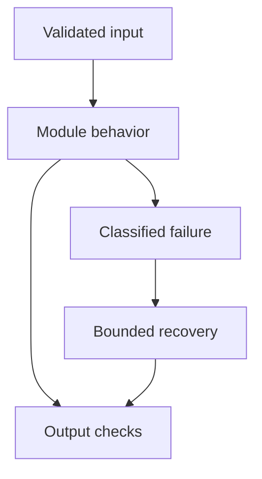

# 16: Memory

[Previous module](../15-agents/README.md) · [Repository home](../README.md) · [Next module](../17-multi-agent/README.md)

## Simple explanation

Memory supplies continuity across interactions. Databases supply authoritative business facts. Treat remembered summaries as derived information with scope, provenance, expiry, and deletion controls.

## Why, when, and how

Study this module to answer engineering scenarios, not only definitions. Work through the concepts below, run the example, explain its boundaries, then solve the exercise before reading interview answers.

## Concepts

### Conversation and short-term memory

Conversation history supports pronouns and ongoing tasks. Keep histories separate by authenticated user and session. Bound tokens by trimming or summarizing while retaining unresolved tool messages and decisions. A global list creates both privacy and correctness failures.

### Long-term memory

Persist selected information across sessions when the use case and permissions allow it. Store what is useful rather than everything the model sees. Include source, timestamp, retention, and user controls. Revalidate claims that may change.

### Semantic memory

Semantic memory stores facts or knowledge-like descriptions. It can help recall preferences, but inferred preferences may be wrong. Distinguish user statements from model inference. Conflicting facts should be resolved through provenance and recency rather than arbitrary vector closeness.

### Episodic memory

Episodic memory stores events such as a prior support incident and outcome. It can improve future assistance, but old actions are not permission for new actions. Preserve event context and authorization scope. Avoid replaying obsolete solutions automatically.

### User profile memory

Profiles can store language preference or preferred format. Sensitive attributes need strong justification and controls. Do not infer protected or intimate attributes unnecessarily. A user should be able to inspect and correct important remembered preferences.

### Vector memory

Vector retrieval can find semantically related past records. Apply user and tenant filters before exposing content. Similarity can retrieve an unrelated episode with similar wording. Combine timestamps, type filters, and provenance with semantic scoring.

### Memory versus database

Store balances, inventory, policy versions, and employee records in an authoritative database. Use memory for conversational continuity and approved preferences. Query the source of truth when correctness matters. A remembered salary or balance must not replace a current authorized lookup.

### Summarization and drift

Repeated summarization can lose conditions, dates, negatives, and uncertainty. Keep links to original messages and validate critical fields. Store structured decisions separately from free-text summaries. Test long conversations containing corrected facts.

### Poisoning and permissions

An attacker may plant a false preference or instruction in memory. Only trusted write paths should update durable memory. Scope writes and reads to the caller. Treat retrieved memory as data and avoid letting it change policy or tool permissions.

### Retention and deletion

Define expiry, export, correction, and deletion across caches, vectors, checkpoints, and backups. A vector deletion alone may leave content in logs. Document the recovery and retention policy. Test that a deleted record no longer affects answers.

## Architecture and implementation boundary

The example isolates one mechanism from this module. Its inputs, state transitions, and outputs should be inspectable in code. Use it as a tested teaching primitive, then add the integrations described below. Offline lexical search and fixture answers are explicitly different from learned embeddings and live LLM generation.



## Real-world scenario

> When should you store information in memory rather than retrieve it from a database?

**Recommended approach:** Use memory for approved conversational context and preferences. Retrieve current business facts from the authoritative database, with permissions and timestamps. Remembered text should not become an unverified source of truth.

**Technical reasoning:** Distinguish task state, derived summaries, profiles, and authoritative records. Each has different update frequency, correctness requirements, and retention. A profile saying the user prefers concise answers can be memory; their current account balance should come from the ledger. If storing derived facts, retain evidence, version, expiry, and correction controls. Reauthorization is needed whenever remembered context triggers a new privileged operation.

## Code

This example runs on Python 3.12 with the standard library.

Run from the repository root:

```bash
python -m examples.memory
```

```python
from examples.core import PreferenceMemory
if __name__ == '__main__':
    memory = PreferenceMemory()
    memory.put('demo','user1','language','English',ttl=10,now=100)
    print(memory.get('demo','user1','language',now=105))
    print('Other tenant:',memory.get('other','user1','language',now=105))
    print('Expired:',memory.get('demo','user1','language',now=111))
```

Shared implementation: [core.py](../examples/core.py). Tests: [test_core.py](../tests/test_core.py). Optional adapters have separate validation status in [VALIDATION.md](../VALIDATION.md).

## Interview case

### Question

When should you store information in memory rather than retrieve it from a database?

### Difficulty

Hard

### What interviewer is testing

Whether you can identify the actual engineering constraint, choose a bounded implementation, and justify its trade-offs.

### Short Answer

Use memory for approved conversational context and preferences. Retrieve current business facts from the authoritative database, with permissions and timestamps. Remembered text should not become an unverified source of truth.

### Interview Answer

Use memory for approved conversational context and preferences. Retrieve current business facts from the authoritative database, with permissions and timestamps. Remembered text should not become an unverified source of truth. Distinguish task state, derived summaries, profiles, and authoritative records. Each has different update frequency, correctness requirements, and retention. A profile saying the user prefers concise answers can be memory; their current account balance should come from the ledger. If storing derived facts, retain evidence, version, expiry, and correction controls. Reauthorization is needed whenever remembered context triggers a new privileged operation. I would start with a representative failing or demanding workload and define measurable acceptance criteria. I would test both successful behavior and the likely failure path, then compare the new implementation with a fixed baseline. I would report the implemented scope and remaining assumptions clearly.

### Deep Technical Answer

Distinguish task state, derived summaries, profiles, and authoritative records. Each has different update frequency, correctness requirements, and retention. A profile saying the user prefers concise answers can be memory; their current account balance should come from the ledger. If storing derived facts, retain evidence, version, expiry, and correction controls. Reauthorization is needed whenever remembered context triggers a new privileged operation. Keep input assumptions, state scope, failure classification, and deployment configuration explicit. Verify that the implementation is doing what the architecture claims by inspecting stage-level traces and authoritative outcomes. A successful demonstration is not enough evidence for an unmeasured scale claim.

### Real-World Example

Use the scenario above with a fixed source version and representative inputs. Save the expected result, observed result, and relevant trace so the investigation can be repeated.

### Code

Use the runnable example above and inspect the shared core for validation, lifecycle, or budget logic. Extend it only after the baseline behavior is understood.

### Follow-up Question

How would you prove this improvement still works after a dependency, model, or source-data change?

### Follow-up Answer

Version inputs and configuration, keep independent regression cases, compare quality and operational metrics, and test a rollback. Add a slice for the failure this change specifically addresses.

### Common Mistake

Giving a component name as the whole answer without explaining its contract, limitations, measurement, or failure behavior.

### Senior-Level Insight

Distinguish task state, derived summaries, profiles, and authoritative records. Each has different update frequency, correctness requirements, and retention. A profile saying the user prefers concise answers can be memory; their current account balance should come from the ledger. If storing derived facts, retain evidence, version, expiry, and correction controls. Reauthorization is needed whenever remembered context triggers a new privileged operation. Explain the simplest design that meets the requirement and what workload or evidence would make you replace it.

## Follow-up tree

1. Explain the mechanism using a tiny input.
2. Show the implementation and edge cases.
3. Explain the scenario above and the main bottleneck.
4. Show which metric would identify a regression.
5. Explain recovery after failure or a partial result.
6. Design the boundary under multiple tenants and ten times the workload.

## Debugging exercise

**Symptom:** the scenario fails after a configuration or data change. **Investigation:** capture exact inputs, versions, and stage outcomes; compare with the prior baseline. **Root cause:** identify the first stage violating its contract. **Fix:** change that stage and replay the case. **Prevention:** add the failing case and an operational signal to the regression suite. For concrete incidents, see [debugging runbooks](../28-debugging/runbooks.md).

## Production considerations

- **Reliability:** define deadlines, cancellation behavior, retryability, and recovery of partial work.
- **Security:** derive caller identity from authentication; scope data and tool permissions in trusted code.
- **Cost and performance:** measure stage latency, memory, token use, throughput, and cost per successful task.
- **Testing and evaluation:** validate hard invariants separately from semantic quality; keep representative held-out cases.
- **Deployment:** use tested dependency versions, external configuration, safe telemetry, and an actual rollback procedure.

## Levels of understanding

**Junior:** explain each concept and run the example with a small input.

**Mid-level:** adapt it to the real-world scenario, write edge tests, and diagnose a demonstrated failure.

**Senior:** Distinguish task state, derived summaries, profiles, and authoritative records. Each has different update frequency, correctness requirements, and retention. A profile saying the user prefers concise answers can be memory; their current account balance should come from the ledger. If storing derived facts, retain evidence, version, expiry, and correction controls. Reauthorization is needed whenever remembered context triggers a new privileged operation.

## What I must remember

Memory supplies continuity across interactions. Databases supply authoritative business facts. Treat remembered summaries as derived information with scope, provenance, expiry, and deletion controls. Use memory for approved conversational context and preferences. Retrieve current business facts from the authoritative database, with permissions and timestamps. Remembered text should not become an unverified source of truth.

## What I must be able to code

Run, modify, and explain [memory.py](../examples/memory.py); implement the exercise below and relevant edge tests.

## What an interviewer may ask

The case above, each concept’s failure boundary, and the topic-specific questions in the [interview bank](../interview-questions/README.md).

## What senior engineers are expected to know

Requirements, observable evidence, uncertainty, dependency lifecycle, authorization, and the cost of operating the design. Explain what would change your decision.

## Common mistakes

Confusing an example with a production deployment; assuming a framework enforces business permissions; reporting unmeasured performance; skipping the failure path; and tuning on the final test set.

## Practical exercise and mini project

Implement tenant-scoped preference memory with expiry and deletion. Update a preference and ensure the new value supersedes the old one without leaving contradictory retrieved records.

**Acceptance:** include a normal case, empty or missing input, invalid input, a failure case, and one stated limitation. Record the observed result and explain why the checks match the actual requirement.

## GitHub task

```bash
git switch -c learn/16-memory
python -m unittest discover -s tests -v
git add 16-memory examples tests
git commit -m "docs: study memory and record exercise results"
git push -u origin learn/16-memory
```

Open a pull request with the implementation, measured validation, and remaining limits. Do not claim a lab result is a production benchmark.
