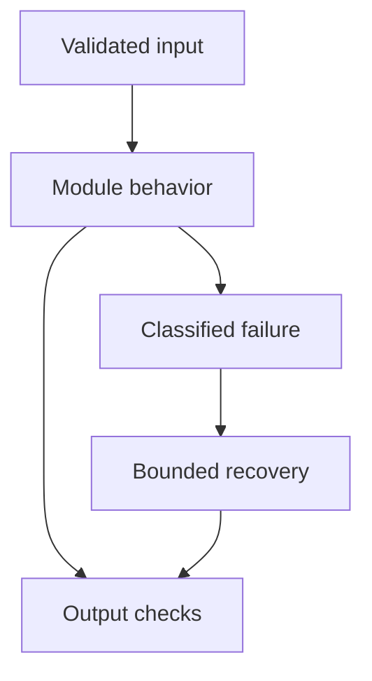

# 17: Multi-Agent Systems

[Previous module](../16-memory/README.md) · [Repository home](../README.md) · [Next module](../18-fine-tuning/README.md)

## Simple explanation

Multiple agents can divide expertise or independent work, but they also add coordination cost and failure paths. Compare them with a single model or workflow before claiming better quality.

## Why, when, and how

Study this module to answer engineering scenarios, not only definitions. Work through the concepts below, run the example, explain its boundaries, then solve the exercise before reading interview answers.

## Concepts

### Supervisor and workers

A supervisor routes tasks to workers and collects results. Workers should have narrow responsibilities, schemas, and budgets. The supervisor must not silently grant broader permissions. Test misrouting, unavailable workers, and incomplete results.

### Specialist agents

A specialist may handle retrieval, SQL planning, summarization, or fact checking. Domain prompts do not create genuine expertise. Evaluate each specialist and the integrated result. A shared underlying model may reproduce the same error across roles.

### Planner executor

A planner proposes steps; an executor performs permitted actions. Validate the plan through deterministic rules and budget checks. Separate proposing a write from authorizing it. Replanning should use new observations rather than repeat failed steps indefinitely.

### Sequential agents

Sequential stages are useful when one result depends on another: gather evidence, summarize, verify, answer. Each transformation can lose information. Preserve source spans through all stages. A final editor must not invent facts absent from earlier evidence.

### Parallel agents

Independent source checks can run concurrently. Parallelism reduces wall-clock latency but increases simultaneous quota and cost. Bound fanout, define cancellation behavior, and collect per-worker errors. Race-winning output is not automatically the best answer.

### Communication contracts

Use typed task and result messages with IDs, evidence, status, confidence, and failure reasons. Do not use unbounded conversational transcripts as the only protocol. Schema validation detects malformed results, while evidence checks address factual errors.

### State sharing

Use controlled shared state or explicit message passing. Parallel updates require defined reducers or conflict rules. A worker should not overwrite another’s evidence or the caller identity. Separate shared read access from write privileges.

### Fact checking

A checker verifies claims against original sources, not only the summarizer’s assertions. It should identify unsupported claims, contradiction, and stale sources. Multiple agreeing agents are not independent evidence. Avoid circular validation.

### Budget and termination

Allocate total task time, cost, token, and step budgets across workers. Reserve resources for final synthesis and failure handling. Stop repeated delegation or delegation cycles. Record why the system stopped and what remains incomplete.

### Research architecture

A bounded research workflow can search, collect sources, summarize evidence, check claims, and synthesize. Preserve original source IDs throughout. Compare quality and cost with a single-agent baseline on the same tasks before introducing more roles.

## Architecture and implementation boundary

The example isolates one mechanism from this module. Its inputs, state transitions, and outputs should be inspectable in code. Use it as a tested teaching primitive, then add the integrations described below. Offline lexical search and fixture answers are explicitly different from learned embeddings and live LLM generation.



## Real-world scenario

> Three agents agree on a false fact. Why did your checker fail?

**Recommended approach:** Agreement is not verification. The agents may share model biases or rely on the same incorrect summary. Verify claims against independent original sources and preserve provenance.

**Technical reasoning:** Check the evidence graph: did each worker access independent sources, or repeat one generated statement? If the fact checker only read the summarizer’s output, it had no external basis for judgment. Require claim-to-source-span mappings and separate evidence collection from synthesis. Use deterministic checks for dates, totals, and schema where possible. Evaluate whether multi-agent orchestration improves correctness enough to justify extra tokens and latency.

## Code

This example runs on Python 3.12 with the standard library.

Run from the repository root:

```bash
python -m examples.multi_agent
```

```python
import asyncio
from examples.core import bounded_map
async def search_fixture(source):
    await asyncio.sleep(0.01)
    return {'source_id':source,'claim':'Refund period is 14 days.','synthetic':True}
def supported(claim, evidence):
    # Exact fixture comparison, NOT semantic fact checking.
    return any(e['claim'] == claim for e in evidence)
async def main():
    outcomes = await bounded_map(['A','B'],search_fixture,2)
    evidence = [x.value for x in outcomes if not x.error]
    print(evidence)
    print('Unsupported claim rejected:',not supported('Refunds always available.',evidence))
if __name__ == '__main__':
    asyncio.run(main())
```

Shared implementation: [core.py](../examples/core.py). Tests: [test_core.py](../tests/test_core.py). Optional adapters have separate validation status in [VALIDATION.md](../VALIDATION.md).

## Interview case

### Question

Three agents agree on a false fact. Why did your checker fail?

### Difficulty

Hard

### What interviewer is testing

Whether you can identify the actual engineering constraint, choose a bounded implementation, and justify its trade-offs.

### Short Answer

Agreement is not verification. The agents may share model biases or rely on the same incorrect summary. Verify claims against independent original sources and preserve provenance.

### Interview Answer

Agreement is not verification. The agents may share model biases or rely on the same incorrect summary. Verify claims against independent original sources and preserve provenance. Check the evidence graph: did each worker access independent sources, or repeat one generated statement? If the fact checker only read the summarizer’s output, it had no external basis for judgment. Require claim-to-source-span mappings and separate evidence collection from synthesis. Use deterministic checks for dates, totals, and schema where possible. Evaluate whether multi-agent orchestration improves correctness enough to justify extra tokens and latency. I would start with a representative failing or demanding workload and define measurable acceptance criteria. I would test both successful behavior and the likely failure path, then compare the new implementation with a fixed baseline. I would report the implemented scope and remaining assumptions clearly.

### Deep Technical Answer

Check the evidence graph: did each worker access independent sources, or repeat one generated statement? If the fact checker only read the summarizer’s output, it had no external basis for judgment. Require claim-to-source-span mappings and separate evidence collection from synthesis. Use deterministic checks for dates, totals, and schema where possible. Evaluate whether multi-agent orchestration improves correctness enough to justify extra tokens and latency. Keep input assumptions, state scope, failure classification, and deployment configuration explicit. Verify that the implementation is doing what the architecture claims by inspecting stage-level traces and authoritative outcomes. A successful demonstration is not enough evidence for an unmeasured scale claim.

### Real-World Example

Use the scenario above with a fixed source version and representative inputs. Save the expected result, observed result, and relevant trace so the investigation can be repeated.

### Code

Use the runnable example above and inspect the shared core for validation, lifecycle, or budget logic. Extend it only after the baseline behavior is understood.

### Follow-up Question

How would you prove this improvement still works after a dependency, model, or source-data change?

### Follow-up Answer

Version inputs and configuration, keep independent regression cases, compare quality and operational metrics, and test a rollback. Add a slice for the failure this change specifically addresses.

### Common Mistake

Giving a component name as the whole answer without explaining its contract, limitations, measurement, or failure behavior.

### Senior-Level Insight

Check the evidence graph: did each worker access independent sources, or repeat one generated statement? If the fact checker only read the summarizer’s output, it had no external basis for judgment. Require claim-to-source-span mappings and separate evidence collection from synthesis. Use deterministic checks for dates, totals, and schema where possible. Evaluate whether multi-agent orchestration improves correctness enough to justify extra tokens and latency. Explain the simplest design that meets the requirement and what workload or evidence would make you replace it.

## Follow-up tree

1. Explain the mechanism using a tiny input.
2. Show the implementation and edge cases.
3. Explain the scenario above and the main bottleneck.
4. Show which metric would identify a regression.
5. Explain recovery after failure or a partial result.
6. Design the boundary under multiple tenants and ten times the workload.

## Debugging exercise

**Symptom:** the scenario fails after a configuration or data change. **Investigation:** capture exact inputs, versions, and stage outcomes; compare with the prior baseline. **Root cause:** identify the first stage violating its contract. **Fix:** change that stage and replay the case. **Prevention:** add the failing case and an operational signal to the regression suite. For concrete incidents, see [debugging runbooks](../28-debugging/runbooks.md).

## Production considerations

- **Reliability:** define deadlines, cancellation behavior, retryability, and recovery of partial work.
- **Security:** derive caller identity from authentication; scope data and tool permissions in trusted code.
- **Cost and performance:** measure stage latency, memory, token use, throughput, and cost per successful task.
- **Testing and evaluation:** validate hard invariants separately from semantic quality; keep representative held-out cases.
- **Deployment:** use tested dependency versions, external configuration, safe telemetry, and an actual rollback procedure.

## Levels of understanding

**Junior:** explain each concept and run the example with a small input.

**Mid-level:** adapt it to the real-world scenario, write edge tests, and diagnose a demonstrated failure.

**Senior:** Check the evidence graph: did each worker access independent sources, or repeat one generated statement? If the fact checker only read the summarizer’s output, it had no external basis for judgment. Require claim-to-source-span mappings and separate evidence collection from synthesis. Use deterministic checks for dates, totals, and schema where possible. Evaluate whether multi-agent orchestration improves correctness enough to justify extra tokens and latency.

## What I must remember

Multiple agents can divide expertise or independent work, but they also add coordination cost and failure paths. Compare them with a single model or workflow before claiming better quality. Agreement is not verification. The agents may share model biases or rely on the same incorrect summary. Verify claims against independent original sources and preserve provenance.

## What I must be able to code

Run, modify, and explain [multi_agent.py](../examples/multi_agent.py); implement the exercise below and relevant edge tests.

## What an interviewer may ask

The case above, each concept’s failure boundary, and the topic-specific questions in the [interview bank](../interview-questions/README.md).

## What senior engineers are expected to know

Requirements, observable evidence, uncertainty, dependency lifecycle, authorization, and the cost of operating the design. Explain what would change your decision.

## Common mistakes

Confusing an example with a production deployment; assuming a framework enforces business permissions; reporting unmeasured performance; skipping the failure path; and tuning on the final test set.

## Practical exercise and mini project

Run two independent fixture searches in parallel, combine evidence with stable IDs, and add a checker that rejects an unsupported claim. Inject a worker failure and return a partial, labeled result.

**Acceptance:** include a normal case, empty or missing input, invalid input, a failure case, and one stated limitation. Record the observed result and explain why the checks match the actual requirement.

## GitHub task

```bash
git switch -c learn/17-multi-agent
python -m unittest discover -s tests -v
git add 17-multi-agent examples tests
git commit -m "docs: study multi-agent systems and record exercise results"
git push -u origin learn/17-multi-agent
```

Open a pull request with the implementation, measured validation, and remaining limits. Do not claim a lab result is a production benchmark.
