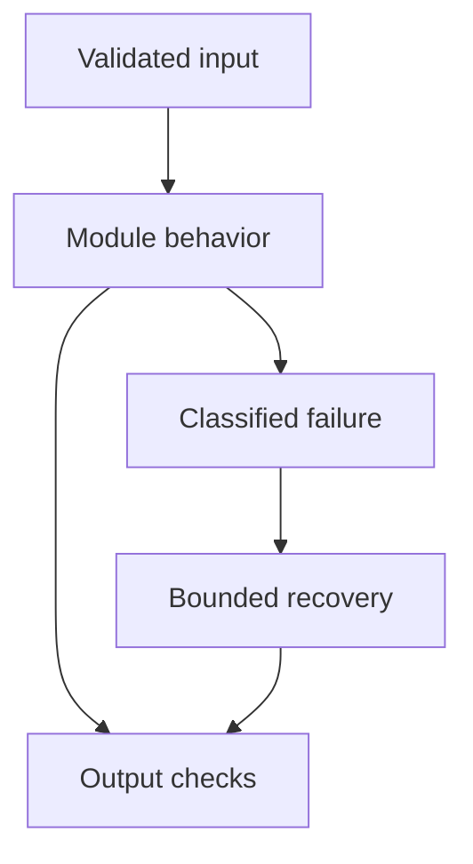

# 18: Fine-Tuning

[Previous module](../17-multi-agent/README.md) · [Repository home](../README.md) · [Next module](../19-llm-evaluation/README.md)

## Simple explanation

RAG changes information supplied at inference time. Fine-tuning changes model behavior by updating parameters. They address different problems and are often complementary.

## Why, when, and how

Study this module to answer engineering scenarios, not only definitions. Work through the concepts below, run the example, explain its boundaries, then solve the exercise before reading interview answers.

## Concepts

### Pretraining

Pretraining learns broad representations and next-token patterns from large datasets. It requires substantial data and compute and is usually outside a small application team’s scope. It does not mean memorized facts remain current or accessible with reliable attribution.

### Instruction tuning and SFT

Supervised fine-tuning trains on task inputs paired with desired outputs. It can improve style, formatting, domain behavior, or repeated task patterns. Good demonstrations need consistent labels and permissions. Keep validation and test examples separate from training.

### LoRA

LoRA trains low-rank updates to selected weight matrices while freezing base weights. W becomes W plus a scaled BA update. Rank, target modules, and learning rate affect adaptation. It reduces trainable parameters but still needs base-model storage, activations, and optimizer resources.

### QLoRA

QLoRA uses a quantized frozen base with trainable adapters and related memory-saving techniques. It is not simply full fine-tuning in four-bit precision. Quantization can affect performance and deployment compatibility. Verify memory estimates on the actual sequence length and hardware.

### PEFT

Parameter-efficient fine-tuning includes methods that update only selected parameters or small added modules. Adapter management includes base revision, tokenizer, template, license, and merge rules. A tiny adapter file is unusable without the matching base and runtime.

### Dataset preparation

Remove duplicates, secrets, contradictory labels, and evaluation contamination. Use the model’s chat template and appropriate loss masking. Cover abstention and failure cases. Split by customer, source family, or time so near-duplicates do not inflate quality.

### Training

Choose batch size, gradient accumulation, optimizer, schedule, and maximum sequence length. Monitor training and validation loss and task metrics. Save checkpoints and configuration. A decreasing training loss can coexist with worse deployment behavior.

### Evaluation

Compare the base model, prompting, RAG, and tuned model on the same held-out tasks. Test formatting, correctness, refusal boundaries, bias slices, and latency. Assess catastrophic forgetting and unsupported factual changes. Do not use training loss as the deployment gate.

### Catastrophic forgetting

Specialization can degrade capabilities outside the training domain. Diverse data mixtures, conservative learning rates, and adapter routing can help, but require evaluation. Maintain regression sets for existing behaviors, including security and language coverage.

### RAG versus tuning

Use RAG for fresh private knowledge, document permissions, and citations. Use tuning for consistent behavior and task patterns when prompting falls short and good data exists. Fine-tuning is a poor substitute for a frequently changing policy database. They can be combined: retrieve evidence, then use a model adapted to answer in the required style.

## Architecture and implementation boundary

The example isolates one mechanism from this module. Its inputs, state transitions, and outputs should be inspectable in code. Use it as a tested teaching primitive, then add the integrations described below. Offline lexical search and fixture answers are explicitly different from learned embeddings and live LLM generation.



## Real-world scenario

> Would you fine-tune a model on frequently changing company policies?

**Recommended approach:** I would usually retrieve current authorized policies with RAG. Fine-tuning can improve how the model follows the task or formats answers, but is not a reliable policy versioning, deletion, or citation mechanism.

**Technical reasoning:** Fine-tuning can encode behavior but knowledge updates require new training and may not overwrite every outdated fact. RAG preserves source provenance and supports document-level permission changes. Use tuning when a measured behavioral problem remains after strong prompts and enough high-quality examples exist. Compare operational costs: dataset maintenance, GPU time, serving, evaluation, and rollback versus retrieval infrastructure. Assess combinations under identical benchmarks.

## Code

This example runs on Python 3.12 with the standard library.

Run from the repository root:

```bash
python -m examples.dataset
```

```python
import json
from pathlib import Path
def validate(records):
    seen = set()
    for row in records:
        if set(row) != {'id','group','input','output'} or not all(isinstance(x,str) and x for x in row.values()):
            raise ValueError('invalid record')
        pair = (row['input'],row['output'])
        if pair in seen:
            raise ValueError('duplicate pair')
        seen.add(pair)
if __name__ == '__main__':
    rows = [{'id':str(i),'group':'train' if i<16 else 'test',
             'input':f'Extract amount from synthetic invoice {i}: INR {100+i}',
             'output':json.dumps({'currency':'INR','amount':100+i})} for i in range(20)]
    validate(rows)
    print('Validated synthetic records:',len(rows),'held out:',sum(r['group']=='test' for r in rows))
```

Shared implementation: [core.py](../examples/core.py). Tests: [test_core.py](../tests/test_core.py). Optional adapters have separate validation status in [VALIDATION.md](../VALIDATION.md).

## Interview case

### Question

Would you fine-tune a model on frequently changing company policies?

### Difficulty

Hard

### What interviewer is testing

Whether you can identify the actual engineering constraint, choose a bounded implementation, and justify its trade-offs.

### Short Answer

I would usually retrieve current authorized policies with RAG. Fine-tuning can improve how the model follows the task or formats answers, but is not a reliable policy versioning, deletion, or citation mechanism.

### Interview Answer

I would usually retrieve current authorized policies with RAG. Fine-tuning can improve how the model follows the task or formats answers, but is not a reliable policy versioning, deletion, or citation mechanism. Fine-tuning can encode behavior but knowledge updates require new training and may not overwrite every outdated fact. RAG preserves source provenance and supports document-level permission changes. Use tuning when a measured behavioral problem remains after strong prompts and enough high-quality examples exist. Compare operational costs: dataset maintenance, GPU time, serving, evaluation, and rollback versus retrieval infrastructure. Assess combinations under identical benchmarks. I would start with a representative failing or demanding workload and define measurable acceptance criteria. I would test both successful behavior and the likely failure path, then compare the new implementation with a fixed baseline. I would report the implemented scope and remaining assumptions clearly.

### Deep Technical Answer

Fine-tuning can encode behavior but knowledge updates require new training and may not overwrite every outdated fact. RAG preserves source provenance and supports document-level permission changes. Use tuning when a measured behavioral problem remains after strong prompts and enough high-quality examples exist. Compare operational costs: dataset maintenance, GPU time, serving, evaluation, and rollback versus retrieval infrastructure. Assess combinations under identical benchmarks. Keep input assumptions, state scope, failure classification, and deployment configuration explicit. Verify that the implementation is doing what the architecture claims by inspecting stage-level traces and authoritative outcomes. A successful demonstration is not enough evidence for an unmeasured scale claim.

### Real-World Example

Use the scenario above with a fixed source version and representative inputs. Save the expected result, observed result, and relevant trace so the investigation can be repeated.

### Code

Use the runnable example above and inspect the shared core for validation, lifecycle, or budget logic. Extend it only after the baseline behavior is understood.

### Follow-up Question

How would you prove this improvement still works after a dependency, model, or source-data change?

### Follow-up Answer

Version inputs and configuration, keep independent regression cases, compare quality and operational metrics, and test a rollback. Add a slice for the failure this change specifically addresses.

### Common Mistake

Giving a component name as the whole answer without explaining its contract, limitations, measurement, or failure behavior.

### Senior-Level Insight

Fine-tuning can encode behavior but knowledge updates require new training and may not overwrite every outdated fact. RAG preserves source provenance and supports document-level permission changes. Use tuning when a measured behavioral problem remains after strong prompts and enough high-quality examples exist. Compare operational costs: dataset maintenance, GPU time, serving, evaluation, and rollback versus retrieval infrastructure. Assess combinations under identical benchmarks. Explain the simplest design that meets the requirement and what workload or evidence would make you replace it.

## Follow-up tree

1. Explain the mechanism using a tiny input.
2. Show the implementation and edge cases.
3. Explain the scenario above and the main bottleneck.
4. Show which metric would identify a regression.
5. Explain recovery after failure or a partial result.
6. Design the boundary under multiple tenants and ten times the workload.

## Debugging exercise

**Symptom:** the scenario fails after a configuration or data change. **Investigation:** capture exact inputs, versions, and stage outcomes; compare with the prior baseline. **Root cause:** identify the first stage violating its contract. **Fix:** change that stage and replay the case. **Prevention:** add the failing case and an operational signal to the regression suite. For concrete incidents, see [debugging runbooks](../28-debugging/runbooks.md).

## Production considerations

- **Reliability:** define deadlines, cancellation behavior, retryability, and recovery of partial work.
- **Security:** derive caller identity from authentication; scope data and tool permissions in trusted code.
- **Cost and performance:** measure stage latency, memory, token use, throughput, and cost per successful task.
- **Testing and evaluation:** validate hard invariants separately from semantic quality; keep representative held-out cases.
- **Deployment:** use tested dependency versions, external configuration, safe telemetry, and an actual rollback procedure.

## Levels of understanding

**Junior:** explain each concept and run the example with a small input.

**Mid-level:** adapt it to the real-world scenario, write edge tests, and diagnose a demonstrated failure.

**Senior:** Fine-tuning can encode behavior but knowledge updates require new training and may not overwrite every outdated fact. RAG preserves source provenance and supports document-level permission changes. Use tuning when a measured behavioral problem remains after strong prompts and enough high-quality examples exist. Compare operational costs: dataset maintenance, GPU time, serving, evaluation, and rollback versus retrieval infrastructure. Assess combinations under identical benchmarks.

## What I must remember

RAG changes information supplied at inference time. Fine-tuning changes model behavior by updating parameters. They address different problems and are often complementary. I would usually retrieve current authorized policies with RAG. Fine-tuning can improve how the model follows the task or formats answers, but is not a reliable policy versioning, deletion, or citation mechanism.

## What I must be able to code

Run, modify, and explain [dataset.py](../examples/dataset.py); implement the exercise below and relevant edge tests.

## What an interviewer may ask

The case above, each concept’s failure boundary, and the topic-specific questions in the [interview bank](../interview-questions/README.md).

## What senior engineers are expected to know

Requirements, observable evidence, uncertainty, dependency lifecycle, authorization, and the cost of operating the design. Explain what would change your decision.

## Common mistakes

Confusing an example with a production deployment; assuming a framework enforces business permissions; reporting unmeasured performance; skipping the failure path; and tuning on the final test set.

## Practical exercise and mini project

Create a twenty-example synthetic extraction dataset with train and held-out groups. Validate records and detect duplicates. Write an experiment plan comparing prompt-only, RAG, and SFT without claiming that a toy dataset is sufficient for production.

**Acceptance:** include a normal case, empty or missing input, invalid input, a failure case, and one stated limitation. Record the observed result and explain why the checks match the actual requirement.

## GitHub task

```bash
git switch -c learn/18-fine-tuning
python -m unittest discover -s tests -v
git add 18-fine-tuning examples tests
git commit -m "docs: study fine-tuning and record exercise results"
git push -u origin learn/18-fine-tuning
```

Open a pull request with the implementation, measured validation, and remaining limits. Do not claim a lab result is a production benchmark.
