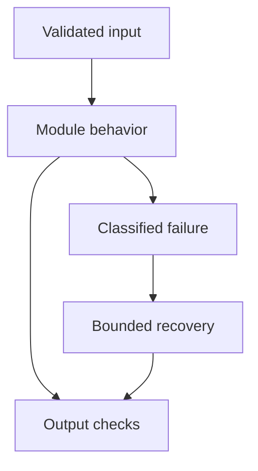

# 19: LLM and Agent Evaluation

[Previous module](../18-fine-tuning/README.md) · [Repository home](../README.md) · [Next module](../20-observability/README.md)

## Simple explanation

Evaluation turns claims such as better answers into testable evidence. Evaluate each stage and the final outcome using a dataset, metric definitions, repeatable configuration, and explicit uncertainty.

## Why, when, and how

Study this module to answer engineering scenarios, not only definitions. Work through the concepts below, run the example, explain its boundaries, then solve the exercise before reading interview answers.

## Concepts

### Correctness and relevance

Correctness asks whether the answer is right under trusted reference facts; relevance asks whether it addresses the request. A fluent relevant answer can still be wrong. Define acceptable alternatives and edge cases in a rubric rather than comparing every answer character-for-character.

### Faithfulness groundedness hallucination

Faithfulness or groundedness concerns support by provided evidence, though definitions vary across tools. Hallucination is an unsupported or incorrect generated claim according to the chosen rubric. An answer can be faithful to an outdated document and factually obsolete. State the metric definitions explicitly.

### Retrieval evaluation

Recall@k measures how many known relevant documents appear in the candidate set. MRR emphasizes the first relevant rank; nDCG accounts for graded relevance. Gold relevance labels are often incomplete, so inspect apparently false positives. Evaluate authorized relevance rather than treating forbidden documents as valid hits.

### Code-based evaluation

Use deterministic checks for schema, required fields, cited IDs, permitted tool use, arithmetic, and database outcomes. These checks are fast and repeatable. They cannot alone measure every semantic quality. Matching a keyword does not prove that an answer correctly addresses a question.

### LLM-as-a-judge

A judge model scores answers against a structured rubric and evidence. Calibrate it against human labels and test sensitivity to ordering, verbosity, and injection. Use blinded comparisons where possible. Judge agreement is not ground truth; avoid self-grading without independent evidence.

### Human evaluation

Humans assess nuanced correctness and business impact. Provide clear rubrics, examples, and adjudication for disagreement. Measure inter-rater consistency. Use targeted review of critical slices and failures rather than only random happy-path samples.

### Safety bias and toxicity

Define representative slices and context-specific harms. Separate undesired content from legitimate discussion or quoted evidence. Test refusal quality and overblocking. Safety evaluation must include actions and data access, not only final text.

### Latency cost and tokens

Record wall time, first-token time, p95, errors, input/output usage, tool time, and cost per completed task. Include failed requests and retries. Synthetic model rates in a lab are not vendor price quotes. Measure actual billed categories when deploying.

### Agent evaluation

Evaluate task completion, tool choice, argument validity, permissions, number of calls, recovery, and side effects. An agent that says done without performing the operation fails. Use tool traces and authoritative outcomes. Test loops, partial failures, and repeated writes.

### Regression and release gates

Version datasets, prompts, models, indexes, and evaluators. Use representative held-out cases and slice-level release gates. Track paired changes and confidence intervals. Online A/B tests complement offline evaluation; never tune repeatedly on the final test set.

## Architecture and implementation boundary

The example isolates one mechanism from this module. Its inputs, state transitions, and outputs should be inspectable in code. Use it as a tested teaching primitive, then add the integrations described below. Offline lexical search and fixture answers are explicitly different from learned embeddings and live LLM generation.



## Real-world scenario

> How would you build an LLM evaluation POC that proves something useful?

**Recommended approach:** Create a small representative labeled dataset, define deterministic and semantic rubrics, run a fixed baseline, record quality, citations, latency, and cost, and compare one controlled change. Manually inspect failures and calibrate any judge.

**Technical reasoning:** A POC can use 30 to 100 carefully chosen cases, but that sample does not establish universal reliability. Include answerable, unanswerable, contradictory, injection, and permission cases. Store JSONL with case IDs, source versions, expected facts, and permitted tool outcomes. Use code checks for hard invariants and human or calibrated judge review for semantic quality. Report counts and confidence, not just a single average. Preserve inputs and configuration so results can be reproduced.

## Code

This example runs on Python 3.12 with the standard library.

Run from the repository root:

```bash
python -m examples.evaluate
```

```python
import argparse, json, time
from pathlib import Path
from examples.core import OfflineRAG, demo_documents, retrieval_metrics
DEFAULT = Path(__file__).resolve().parents[1]/'data'/'eval.jsonl'
def run(path=DEFAULT):
    rag = OfflineRAG(demo_documents())
    results = []
    for line in Path(path).read_text().splitlines():
        case = json.loads(line)
        start = time.perf_counter()
        answer = rag.answer(case['tenant'],case['question'])
        hits = rag.retrieve(case['tenant'],case['question'])
        available = {r.id for _,r in hits}
        results.append({'id':case['id'],
            'abstention_pass':answer['abstained']==case['expect_abstain'],
            'citation_availability_pass':all(c['chunk_id'] in available for c in answer['citations']),
            **retrieval_metrics([r.source_id for _,r in hits],set(case['relevant_sources'])),
            'latency_ms':(time.perf_counter()-start)*1000,
            'semantic_review':'not performed', 'answer':answer})
    return results
if __name__ == '__main__':
    parser=argparse.ArgumentParser()
    parser.add_argument('--output',type=Path)
    args=parser.parse_args()
    result=run()
    print(json.dumps(result,indent=2))
    if args.output:
        args.output.parent.mkdir(parents=True,exist_ok=True)
        args.output.write_text(json.dumps(result,indent=2)+'\n')
```

Shared implementation: [core.py](../examples/core.py). Tests: [test_core.py](../tests/test_core.py). Optional adapters have separate validation status in [VALIDATION.md](../VALIDATION.md).

## Interview case

### Question

How would you build an LLM evaluation POC that proves something useful?

### Difficulty

Hard

### What interviewer is testing

Whether you can identify the actual engineering constraint, choose a bounded implementation, and justify its trade-offs.

### Short Answer

Create a small representative labeled dataset, define deterministic and semantic rubrics, run a fixed baseline, record quality, citations, latency, and cost, and compare one controlled change. Manually inspect failures and calibrate any judge.

### Interview Answer

Create a small representative labeled dataset, define deterministic and semantic rubrics, run a fixed baseline, record quality, citations, latency, and cost, and compare one controlled change. Manually inspect failures and calibrate any judge. A POC can use 30 to 100 carefully chosen cases, but that sample does not establish universal reliability. Include answerable, unanswerable, contradictory, injection, and permission cases. Store JSONL with case IDs, source versions, expected facts, and permitted tool outcomes. Use code checks for hard invariants and human or calibrated judge review for semantic quality. Report counts and confidence, not just a single average. Preserve inputs and configuration so results can be reproduced. I would start with a representative failing or demanding workload and define measurable acceptance criteria. I would test both successful behavior and the likely failure path, then compare the new implementation with a fixed baseline. I would report the implemented scope and remaining assumptions clearly.

### Deep Technical Answer

A POC can use 30 to 100 carefully chosen cases, but that sample does not establish universal reliability. Include answerable, unanswerable, contradictory, injection, and permission cases. Store JSONL with case IDs, source versions, expected facts, and permitted tool outcomes. Use code checks for hard invariants and human or calibrated judge review for semantic quality. Report counts and confidence, not just a single average. Preserve inputs and configuration so results can be reproduced. Keep input assumptions, state scope, failure classification, and deployment configuration explicit. Verify that the implementation is doing what the architecture claims by inspecting stage-level traces and authoritative outcomes. A successful demonstration is not enough evidence for an unmeasured scale claim.

### Real-World Example

Use the scenario above with a fixed source version and representative inputs. Save the expected result, observed result, and relevant trace so the investigation can be repeated.

### Code

Use the runnable example above and inspect the shared core for validation, lifecycle, or budget logic. Extend it only after the baseline behavior is understood.

### Follow-up Question

How would you prove this improvement still works after a dependency, model, or source-data change?

### Follow-up Answer

Version inputs and configuration, keep independent regression cases, compare quality and operational metrics, and test a rollback. Add a slice for the failure this change specifically addresses.

### Common Mistake

Giving a component name as the whole answer without explaining its contract, limitations, measurement, or failure behavior.

### Senior-Level Insight

A POC can use 30 to 100 carefully chosen cases, but that sample does not establish universal reliability. Include answerable, unanswerable, contradictory, injection, and permission cases. Store JSONL with case IDs, source versions, expected facts, and permitted tool outcomes. Use code checks for hard invariants and human or calibrated judge review for semantic quality. Report counts and confidence, not just a single average. Preserve inputs and configuration so results can be reproduced. Explain the simplest design that meets the requirement and what workload or evidence would make you replace it.

## Follow-up tree

1. Explain the mechanism using a tiny input.
2. Show the implementation and edge cases.
3. Explain the scenario above and the main bottleneck.
4. Show which metric would identify a regression.
5. Explain recovery after failure or a partial result.
6. Design the boundary under multiple tenants and ten times the workload.

## Debugging exercise

**Symptom:** the scenario fails after a configuration or data change. **Investigation:** capture exact inputs, versions, and stage outcomes; compare with the prior baseline. **Root cause:** identify the first stage violating its contract. **Fix:** change that stage and replay the case. **Prevention:** add the failing case and an operational signal to the regression suite. For concrete incidents, see [debugging runbooks](../28-debugging/runbooks.md).

## Production considerations

- **Reliability:** define deadlines, cancellation behavior, retryability, and recovery of partial work.
- **Security:** derive caller identity from authentication; scope data and tool permissions in trusted code.
- **Cost and performance:** measure stage latency, memory, token use, throughput, and cost per successful task.
- **Testing and evaluation:** validate hard invariants separately from semantic quality; keep representative held-out cases.
- **Deployment:** use tested dependency versions, external configuration, safe telemetry, and an actual rollback procedure.

## Levels of understanding

**Junior:** explain each concept and run the example with a small input.

**Mid-level:** adapt it to the real-world scenario, write edge tests, and diagnose a demonstrated failure.

**Senior:** A POC can use 30 to 100 carefully chosen cases, but that sample does not establish universal reliability. Include answerable, unanswerable, contradictory, injection, and permission cases. Store JSONL with case IDs, source versions, expected facts, and permitted tool outcomes. Use code checks for hard invariants and human or calibrated judge review for semantic quality. Report counts and confidence, not just a single average. Preserve inputs and configuration so results can be reproduced.

## What I must remember

Evaluation turns claims such as better answers into testable evidence. Evaluate each stage and the final outcome using a dataset, metric definitions, repeatable configuration, and explicit uncertainty. Create a small representative labeled dataset, define deterministic and semantic rubrics, run a fixed baseline, record quality, citations, latency, and cost, and compare one controlled change. Manually inspect failures and calibrate any judge.

## What I must be able to code

Run, modify, and explain [evaluate.py](../examples/evaluate.py); implement the exercise below and relevant edge tests.

## What an interviewer may ask

The case above, each concept’s failure boundary, and the topic-specific questions in the [interview bank](../interview-questions/README.md).

## What senior engineers are expected to know

Requirements, observable evidence, uncertainty, dependency lifecycle, authorization, and the cost of operating the design. Explain what would change your decision.

## Common mistakes

Confusing an example with a production deployment; assuming a framework enforces business permissions; reporting unmeasured performance; skipping the failure path; and tuning on the final test set.

## Practical exercise and mini project

Run the included JSONL evaluator. Add retrieval labels and a citation-availability check. Review why these checks do not establish semantic correctness; add a human scoring sheet and compare two configurations.

**Acceptance:** include a normal case, empty or missing input, invalid input, a failure case, and one stated limitation. Record the observed result and explain why the checks match the actual requirement.

## GitHub task

```bash
git switch -c learn/19-llm-evaluation
python -m unittest discover -s tests -v
git add 19-llm-evaluation examples tests
git commit -m "docs: study llm and agent evaluation and record exercise results"
git push -u origin learn/19-llm-evaluation
```

Open a pull request with the implementation, measured validation, and remaining limits. Do not claim a lab result is a production benchmark.
