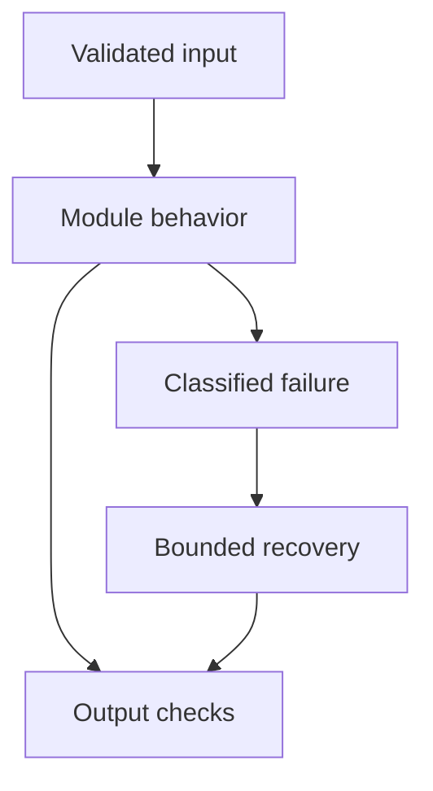

# 20: LLM Observability

[Previous module](../19-llm-evaluation/README.md) · [Repository home](../README.md) · [Next module](../21-security/README.md)

## Simple explanation

Observability explains what happened in a request and whether the service is healthy. Logs describe events, metrics summarize behavior, and traces connect stages into a causal request timeline.

## Why, when, and how

Study this module to answer engineering scenarios, not only definitions. Work through the concepts below, run the example, explain its boundaries, then solve the exercise before reading interview answers.

## Concepts

### Structured logging

Log JSON events with request ID, stage, safe error code, duration, and version identifiers. Avoid full prompts and responses by default. Centralize redaction and control access. Sample detailed payloads only under a justified retention policy.

### Tracing

A trace groups spans for API, retrieval, reranking, model, tools, and database calls. Propagate trace context across queues and service boundaries. Distinguish queue time from execution. Trace correlation reveals whether model latency or your own code dominates p95.

### Tokens and cost

Record provider-reported token usage and model configuration. Attribute cost by tenant, task, and stage without leaking sensitive payloads. Include retries, cache behavior, and failures. A successful-response-only dashboard underestimates actual spend.

### Latency and errors

Track percentiles and error categories, not only average latency. An increasing p99 can reveal saturation before mean latency changes. Separate validation failures, forbidden calls, rate limits, network failures, and model timeouts. Use alerts tied to user impact.

### Tool traces

Record allowed tool name, call ID, outcome, duration, and safe argument summary. Consequential actions need separate audit records. A trace helps debugging but is not a substitute for a durable business ledger. Test correlation under retries.

### Retrieval traces

Record index version, filter policy version, candidate IDs, scores, rank, and final supplied sources. Avoid raw sensitive chunks when IDs suffice. Preserve enough detail to reproduce a wrong answer using authorized access.

### Prompt and model versions

Attach prompt hash, output schema revision, model identifier, adapter revision, and sampling configuration. Hosted model aliases can change behavior. Versioning makes regressions diagnosable even when the provider does not expose exact internal weights.

### LangSmith

LangSmith offers tracing, evaluation, and dataset workflows across supported applications. Treat exported traces as sensitive data. Configure redaction, sampling, and access. Instrumentation needs its own failure policy so unavailable telemetry does not crash every request.

### OpenTelemetry

OpenTelemetry provides vendor-neutral instrumentation and context propagation concepts. Use spans, metrics, and exporters compatible with your infrastructure. Keep high-cardinality values out of metric labels; request IDs belong in logs and traces.

### MLflow and operations

MLflow concepts help track experiments, parameters, metrics, artifacts, and model versions. An experiment tracker does not replace runtime incident response. Define SLOs, alert owners, runbooks, retention, and restore procedures. Run a simulated incident to prove the dashboard is actionable.

## Architecture and implementation boundary

The example isolates one mechanism from this module. Its inputs, state transitions, and outputs should be inspectable in code. Use it as a tested teaching primitive, then add the integrations described below. Offline lexical search and fixture answers are explicitly different from learned embeddings and live LLM generation.



## Real-world scenario

> Token usage doubles overnight. How do you find the cause?

**Recommended approach:** Compare usage by prompt version, model, tenant, task, retries, tool loops, and retrieved context size. Correlate the change with releases and traffic mix, then isolate the stage responsible.

**Technical reasoning:** Check whether measurement changed before assuming behavior changed. Distinguish input growth from output growth and billed token categories. Inspect conversation trimming, duplicated retrieval chunks, expanded tool schemas, retries, and looping agents. Compare cost per successful task and volume separately. A prompt rollback may help, but only if traces show that prompt version caused the growth. Keep privacy-preserving records sufficient to reproduce the path.

## Code

This example runs on Python 3.12 with the standard library.

Run from the repository root:

```bash
python -m examples.trace
```

```python
import json, time, uuid
from contextlib import contextmanager
@contextmanager
def span(request_id,stage):
    start=time.perf_counter()
    status='ok'
    try:
        yield
    except Exception:
        status='error'
        raise
    finally:
        print(json.dumps({'request_id':request_id,'stage':stage,'status':status,
                          'duration_ms':(time.perf_counter()-start)*1000}))
if __name__ == '__main__':
    request_id=str(uuid.uuid4())
    with span(request_id,'request'):
        with span(request_id,'retrieval'):
            time.sleep(0.005)
        with span(request_id,'model-fixture'):
            time.sleep(0.01)
```

Shared implementation: [core.py](../examples/core.py). Tests: [test_core.py](../tests/test_core.py). Optional adapters have separate validation status in [VALIDATION.md](../VALIDATION.md).

## Interview case

### Question

Token usage doubles overnight. How do you find the cause?

### Difficulty

Hard

### What interviewer is testing

Whether you can identify the actual engineering constraint, choose a bounded implementation, and justify its trade-offs.

### Short Answer

Compare usage by prompt version, model, tenant, task, retries, tool loops, and retrieved context size. Correlate the change with releases and traffic mix, then isolate the stage responsible.

### Interview Answer

Compare usage by prompt version, model, tenant, task, retries, tool loops, and retrieved context size. Correlate the change with releases and traffic mix, then isolate the stage responsible. Check whether measurement changed before assuming behavior changed. Distinguish input growth from output growth and billed token categories. Inspect conversation trimming, duplicated retrieval chunks, expanded tool schemas, retries, and looping agents. Compare cost per successful task and volume separately. A prompt rollback may help, but only if traces show that prompt version caused the growth. Keep privacy-preserving records sufficient to reproduce the path. I would start with a representative failing or demanding workload and define measurable acceptance criteria. I would test both successful behavior and the likely failure path, then compare the new implementation with a fixed baseline. I would report the implemented scope and remaining assumptions clearly.

### Deep Technical Answer

Check whether measurement changed before assuming behavior changed. Distinguish input growth from output growth and billed token categories. Inspect conversation trimming, duplicated retrieval chunks, expanded tool schemas, retries, and looping agents. Compare cost per successful task and volume separately. A prompt rollback may help, but only if traces show that prompt version caused the growth. Keep privacy-preserving records sufficient to reproduce the path. Keep input assumptions, state scope, failure classification, and deployment configuration explicit. Verify that the implementation is doing what the architecture claims by inspecting stage-level traces and authoritative outcomes. A successful demonstration is not enough evidence for an unmeasured scale claim.

### Real-World Example

Use the scenario above with a fixed source version and representative inputs. Save the expected result, observed result, and relevant trace so the investigation can be repeated.

### Code

Use the runnable example above and inspect the shared core for validation, lifecycle, or budget logic. Extend it only after the baseline behavior is understood.

### Follow-up Question

How would you prove this improvement still works after a dependency, model, or source-data change?

### Follow-up Answer

Version inputs and configuration, keep independent regression cases, compare quality and operational metrics, and test a rollback. Add a slice for the failure this change specifically addresses.

### Common Mistake

Giving a component name as the whole answer without explaining its contract, limitations, measurement, or failure behavior.

### Senior-Level Insight

Check whether measurement changed before assuming behavior changed. Distinguish input growth from output growth and billed token categories. Inspect conversation trimming, duplicated retrieval chunks, expanded tool schemas, retries, and looping agents. Compare cost per successful task and volume separately. A prompt rollback may help, but only if traces show that prompt version caused the growth. Keep privacy-preserving records sufficient to reproduce the path. Explain the simplest design that meets the requirement and what workload or evidence would make you replace it.

## Follow-up tree

1. Explain the mechanism using a tiny input.
2. Show the implementation and edge cases.
3. Explain the scenario above and the main bottleneck.
4. Show which metric would identify a regression.
5. Explain recovery after failure or a partial result.
6. Design the boundary under multiple tenants and ten times the workload.

## Debugging exercise

**Symptom:** the scenario fails after a configuration or data change. **Investigation:** capture exact inputs, versions, and stage outcomes; compare with the prior baseline. **Root cause:** identify the first stage violating its contract. **Fix:** change that stage and replay the case. **Prevention:** add the failing case and an operational signal to the regression suite. For concrete incidents, see [debugging runbooks](../28-debugging/runbooks.md).

## Production considerations

- **Reliability:** define deadlines, cancellation behavior, retryability, and recovery of partial work.
- **Security:** derive caller identity from authentication; scope data and tool permissions in trusted code.
- **Cost and performance:** measure stage latency, memory, token use, throughput, and cost per successful task.
- **Testing and evaluation:** validate hard invariants separately from semantic quality; keep representative held-out cases.
- **Deployment:** use tested dependency versions, external configuration, safe telemetry, and an actual rollback procedure.

## Levels of understanding

**Junior:** explain each concept and run the example with a small input.

**Mid-level:** adapt it to the real-world scenario, write edge tests, and diagnose a demonstrated failure.

**Senior:** Check whether measurement changed before assuming behavior changed. Distinguish input growth from output growth and billed token categories. Inspect conversation trimming, duplicated retrieval chunks, expanded tool schemas, retries, and looping agents. Compare cost per successful task and volume separately. A prompt rollback may help, but only if traces show that prompt version caused the growth. Keep privacy-preserving records sufficient to reproduce the path.

## What I must remember

Observability explains what happened in a request and whether the service is healthy. Logs describe events, metrics summarize behavior, and traces connect stages into a causal request timeline. Compare usage by prompt version, model, tenant, task, retries, tool loops, and retrieved context size. Correlate the change with releases and traffic mix, then isolate the stage responsible.

## What I must be able to code

Run, modify, and explain [trace.py](../examples/trace.py); implement the exercise below and relevant edge tests.

## What an interviewer may ask

The case above, each concept’s failure boundary, and the topic-specific questions in the [interview bank](../interview-questions/README.md).

## What senior engineers are expected to know

Requirements, observable evidence, uncertainty, dependency lifecycle, authorization, and the cost of operating the design. Explain what would change your decision.

## Common mistakes

Confusing an example with a production deployment; assuming a framework enforces business permissions; reporting unmeasured performance; skipping the failure path; and tuning on the final test set.

## Practical exercise and mini project

Instrument a fake request with spans for retrieval and model calls. Inject a slow tool and compare stage timings with total latency. Write an alert rule for p95 degradation and a runbook.

**Acceptance:** include a normal case, empty or missing input, invalid input, a failure case, and one stated limitation. Record the observed result and explain why the checks match the actual requirement.

## GitHub task

```bash
git switch -c learn/20-observability
python -m unittest discover -s tests -v
git add 20-observability examples tests
git commit -m "docs: study llm observability and record exercise results"
git push -u origin learn/20-observability
```

Open a pull request with the implementation, measured validation, and remaining limits. Do not claim a lab result is a production benchmark.
