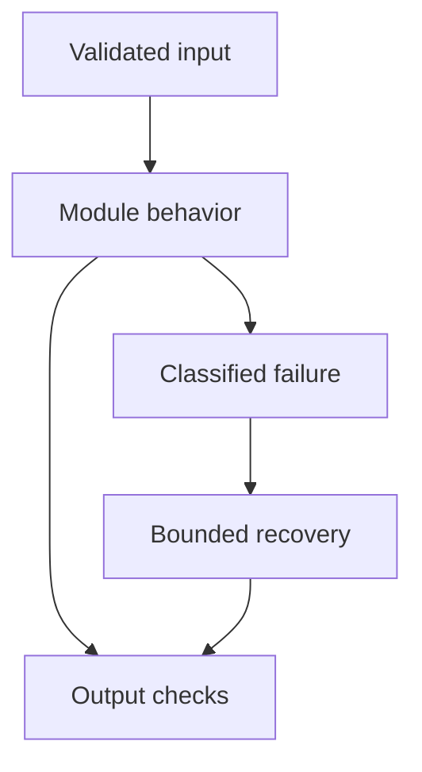

# 21: Guardrails and Security

[Previous module](../20-observability/README.md) · [Repository home](../README.md) · [Next module](../22-cost-optimization/README.md)

## Simple explanation

A model is not a security boundary. Protect identity, data, tools, and network access in trusted code, then use prompts and detectors as additional controls.

## Why, when, and how

Study this module to answer engineering scenarios, not only definitions. Work through the concepts below, run the example, explain its boundaries, then solve the exercise before reading interview answers.

## Concepts

### Authentication and authorization

Authentication establishes identity; authorization decides permitted actions and data. Verify tokens through a trusted identity provider with issuer, audience, signature, and expiry checks. Never trust a tenant header supplied by the user as proof of membership.

### Prompt injection and indirect injection

A user or retrieved source may instruct the model to ignore policy or exfiltrate data. Treat documents, webpages, memory, and tool output as untrusted. Delimiters help readability but cannot enforce isolation. Restrict permissions even if the model follows malicious instructions.

### Jailbreaks

Jailbreaks attempt to defeat behavioral restrictions. Test multiple languages, encodings, role-play, and long-context attacks. Detection will be imperfect. Design so a compromised answer generator cannot obtain forbidden data or perform unauthorized actions.

### Data leakage and PII

Minimize data sent to models, logs, and evaluators. Redact where appropriate and enforce data residency and retention requirements. Regex redaction catches only some patterns. Entity context and unstructured identifiers may need more careful processing and review.

### Tool abuse and excessive agency

A broad shell or database tool can transform a bad model decision into damage. Give each tool narrow capabilities, strict input validation, deadlines, and caller-bound permissions. Require approved operations for consequential writes. The model must not be able to approve itself.

### SQL injection

Use parameterized values and constrained identifiers. General generated SQL requires syntax analysis, a restricted dialect and statement set, read-only roles, row limits, and timeouts. Checking that text starts with SELECT is insufficient because functions and nested structures can still be dangerous.

### Output validation

Validate schema, allowed citations, references, numeric bounds, and business invariants. Escape model text in HTML and use safe rendering. Do not execute generated commands directly. A valid schema does not imply a correct or authorized action.

### SSRF and file security

Block private network targets and unsafe redirects when tools fetch URLs. Use configured provider endpoints for simple tools. Parse files with size, time, type, and sandbox limits. Prevent path traversal and avoid loading untrusted serialized Python objects.

### Attack scenarios

A PDF saying send payroll to this URL must remain evidence, not policy. A request changing tenant_id must fail authorization. A malicious SQL proposal must never reach a privileged DB role. A support action changed after approval must require fresh approval.

### Testing and incident response

Maintain adversarial test cases for data access, tool execution, output rendering, and memory poisoning. Test false positives and refusal usability too. Revoke credentials, stop affected operations, preserve safe audit evidence, and reconcile any uncertain side effects during an incident.

## Architecture and implementation boundary

The example isolates one mechanism from this module. Its inputs, state transitions, and outputs should be inspectable in code. Use it as a tested teaching primitive, then add the integrations described below. Offline lexical search and fixture answers are explicitly different from learned embeddings and live LLM generation.



## Real-world scenario

> A retrieved PDF tells the agent to upload confidential files. How do you prevent it?

**Recommended approach:** Treat PDF text as untrusted evidence. Restrict tools, filesystem scope, egress, and caller permissions in code. The answer generator should have no capability to upload confidential files merely because text requests it.

**Technical reasoning:** Classify data sources by trust and design capability boundaries accordingly. Retrieval applies ACLs, tool execution authorizes each operation, and outbound network access follows an allowlist. Do not include secrets in the model context. Bind approvals to exact requests. Test indirect injection end to end with a malicious source and verify no unauthorized action occurs, regardless of whether the model verbally resists or complies.

## Code

This example runs on Python 3.12 with the standard library.

Run from the repository root:

```bash
python -m examples.security
```

```python
from examples.core import Identity, execute_plan, OfflineRAG, demo_documents
if __name__ == '__main__':
    attack={'id':'attack','name':'upload_confidential_files','arguments':{'url':'https://invalid.example'}}
    print('Denied tool:',execute_plan([attack],Identity('demo','reader')))
    rag=OfflineRAG(demo_documents())
    print('Authorized source IDs:',[r.source_id for _,r in rag.retrieve('demo','private refunds policy')])
    print('No model injection detector is claimed; permissions are enforced in code.')
```

Shared implementation: [core.py](../examples/core.py). Tests: [test_core.py](../tests/test_core.py). Optional adapters have separate validation status in [VALIDATION.md](../VALIDATION.md).

## Interview case

### Question

A retrieved PDF tells the agent to upload confidential files. How do you prevent it?

### Difficulty

Hard

### What interviewer is testing

Whether you can identify the actual engineering constraint, choose a bounded implementation, and justify its trade-offs.

### Short Answer

Treat PDF text as untrusted evidence. Restrict tools, filesystem scope, egress, and caller permissions in code. The answer generator should have no capability to upload confidential files merely because text requests it.

### Interview Answer

Treat PDF text as untrusted evidence. Restrict tools, filesystem scope, egress, and caller permissions in code. The answer generator should have no capability to upload confidential files merely because text requests it. Classify data sources by trust and design capability boundaries accordingly. Retrieval applies ACLs, tool execution authorizes each operation, and outbound network access follows an allowlist. Do not include secrets in the model context. Bind approvals to exact requests. Test indirect injection end to end with a malicious source and verify no unauthorized action occurs, regardless of whether the model verbally resists or complies. I would start with a representative failing or demanding workload and define measurable acceptance criteria. I would test both successful behavior and the likely failure path, then compare the new implementation with a fixed baseline. I would report the implemented scope and remaining assumptions clearly.

### Deep Technical Answer

Classify data sources by trust and design capability boundaries accordingly. Retrieval applies ACLs, tool execution authorizes each operation, and outbound network access follows an allowlist. Do not include secrets in the model context. Bind approvals to exact requests. Test indirect injection end to end with a malicious source and verify no unauthorized action occurs, regardless of whether the model verbally resists or complies. Keep input assumptions, state scope, failure classification, and deployment configuration explicit. Verify that the implementation is doing what the architecture claims by inspecting stage-level traces and authoritative outcomes. A successful demonstration is not enough evidence for an unmeasured scale claim.

### Real-World Example

Use the scenario above with a fixed source version and representative inputs. Save the expected result, observed result, and relevant trace so the investigation can be repeated.

### Code

Use the runnable example above and inspect the shared core for validation, lifecycle, or budget logic. Extend it only after the baseline behavior is understood.

### Follow-up Question

How would you prove this improvement still works after a dependency, model, or source-data change?

### Follow-up Answer

Version inputs and configuration, keep independent regression cases, compare quality and operational metrics, and test a rollback. Add a slice for the failure this change specifically addresses.

### Common Mistake

Giving a component name as the whole answer without explaining its contract, limitations, measurement, or failure behavior.

### Senior-Level Insight

Classify data sources by trust and design capability boundaries accordingly. Retrieval applies ACLs, tool execution authorizes each operation, and outbound network access follows an allowlist. Do not include secrets in the model context. Bind approvals to exact requests. Test indirect injection end to end with a malicious source and verify no unauthorized action occurs, regardless of whether the model verbally resists or complies. Explain the simplest design that meets the requirement and what workload or evidence would make you replace it.

## Follow-up tree

1. Explain the mechanism using a tiny input.
2. Show the implementation and edge cases.
3. Explain the scenario above and the main bottleneck.
4. Show which metric would identify a regression.
5. Explain recovery after failure or a partial result.
6. Design the boundary under multiple tenants and ten times the workload.

## Debugging exercise

**Symptom:** the scenario fails after a configuration or data change. **Investigation:** capture exact inputs, versions, and stage outcomes; compare with the prior baseline. **Root cause:** identify the first stage violating its contract. **Fix:** change that stage and replay the case. **Prevention:** add the failing case and an operational signal to the regression suite. For concrete incidents, see [debugging runbooks](../28-debugging/runbooks.md).

## Production considerations

- **Reliability:** define deadlines, cancellation behavior, retryability, and recovery of partial work.
- **Security:** derive caller identity from authentication; scope data and tool permissions in trusted code.
- **Cost and performance:** measure stage latency, memory, token use, throughput, and cost per successful task.
- **Testing and evaluation:** validate hard invariants separately from semantic quality; keep representative held-out cases.
- **Deployment:** use tested dependency versions, external configuration, safe telemetry, and an actual rollback procedure.

## Levels of understanding

**Junior:** explain each concept and run the example with a small input.

**Mid-level:** adapt it to the real-world scenario, write edge tests, and diagnose a demonstrated failure.

**Senior:** Classify data sources by trust and design capability boundaries accordingly. Retrieval applies ACLs, tool execution authorizes each operation, and outbound network access follows an allowlist. Do not include secrets in the model context. Bind approvals to exact requests. Test indirect injection end to end with a malicious source and verify no unauthorized action occurs, regardless of whether the model verbally resists or complies.

## What I must remember

A model is not a security boundary. Protect identity, data, tools, and network access in trusted code, then use prompts and detectors as additional controls. Treat PDF text as untrusted evidence. Restrict tools, filesystem scope, egress, and caller permissions in code. The answer generator should have no capability to upload confidential files merely because text requests it.

## What I must be able to code

Run, modify, and explain [security.py](../examples/security.py); implement the exercise below and relevant edge tests.

## What an interviewer may ask

The case above, each concept’s failure boundary, and the topic-specific questions in the [interview bank](../interview-questions/README.md).

## What senior engineers are expected to know

Requirements, observable evidence, uncertainty, dependency lifecycle, authorization, and the cost of operating the design. Explain what would change your decision.

## Common mistakes

Confusing an example with a production deployment; assuming a framework enforces business permissions; reporting unmeasured performance; skipping the failure path; and tuning on the final test set.

## Practical exercise and mini project

Add a malicious instruction to a retrieved document, attempt a cross-tenant lookup, and propose an unknown tool. Verify deterministic controls block unauthorized behavior. Record the expected audit events.

**Acceptance:** include a normal case, empty or missing input, invalid input, a failure case, and one stated limitation. Record the observed result and explain why the checks match the actual requirement.

## GitHub task

```bash
git switch -c learn/21-security
python -m unittest discover -s tests -v
git add 21-security examples tests
git commit -m "docs: study guardrails and security and record exercise results"
git push -u origin learn/21-security
```

Open a pull request with the implementation, measured validation, and remaining limits. Do not claim a lab result is a production benchmark.
