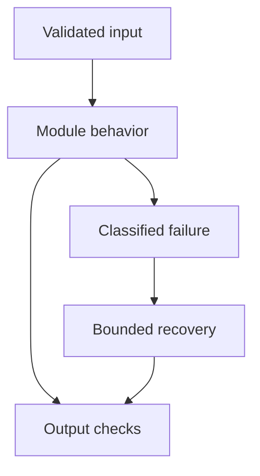

# 22: LLM Cost Optimization

[Previous module](../21-security/README.md) · [Repository home](../README.md) · [Next module](../23-system-design/README.md)

## Simple explanation

Reduce cost per successful useful task while preserving the required quality. A cheaper individual call is a poor optimization if it creates more retries, escalations, or incorrect outcomes.

## Why, when, and how

Study this module to answer engineering scenarios, not only definitions. Work through the concepts below, run the example, explain its boundaries, then solve the exercise before reading interview answers.

## Concepts

### Cost accounting

Break spend into model input, output, embeddings, reranking, tools, storage, and infrastructure. Include failed requests and retries. Attribute by tenant and workflow. Use current provider rate cards at deployment time; lab prices are fictional assumptions.

### Model routing

Route easy tasks to cheaper suitable models and hard tasks to stronger ones when measured quality justifies it. Use observable features or a calibrated classifier. A complexity estimate is not proof of quality. Keep fallback and escalation policies explicit.

### Prompt compression

Remove duplicate instructions, obsolete history, and irrelevant evidence before compressing useful content. Compression can drop exceptions, dates, units, and safety constraints. Evaluate preservation of key facts. Saving input tokens may add another model call and erase savings.

### Smaller and local models

Smaller models can reduce latency or cost for narrow tasks. Self-hosting adds GPU, idle capacity, ops, licensing, and reliability costs. Benchmark at expected utilization and language mix. Do not compare API token price with GPU cost while ignoring engineering effort.

### Batching

Offline batch processing may suit ingestion and evaluation when turnaround is flexible. Request batching changes scheduling and failure granularity. Interactive workloads have stricter latency requirements. Check provider limits and supported operations before using a batch API.

### Token reduction

Cap output appropriately, simplify schemas, avoid sending the same long tool description repeatedly when the protocol permits, and reduce context to relevant spans. Measure output truncation and answer completeness. Do not remove essential evidence to meet an arbitrary savings target.

### Exact response caching

Cache only when request, tenant, authorization scope, prompt version, model configuration, source version, and relevant user context agree. Set expiry and invalidation rules. A cache key omitting ACL version may serve revoked data.

### Semantic caching

Reuse answers for semantically related queries only when business equivalence is verified. Similar questions can differ by date, amount, customer, or negation. High-stakes and personalized operations need stronger checks or no semantic caching. Measure incorrect reuse separately.

### Retrieval optimization

Reduce duplicate chunks and unnecessary fanout, cache embeddings of safe repeat queries, and tune candidate count. Embedding cache keys include model revision and preprocessing. Optimize indexing and reranking after measuring their share of total cost.

### Fallback and rollout

A fallback should meet task capability and permission requirements. Model changes require regression tests and traffic monitoring. Track quality and savings together. For ₹5 lakh monthly spend, a 40% target means ₹3 lakh remaining spend, but only measured data can establish actual savings.

## Architecture and implementation boundary

The example isolates one mechanism from this module. Its inputs, state transitions, and outputs should be inspectable in code. Use it as a tested teaching primitive, then add the integrations described below. Offline lexical search and fixture answers are explicitly different from learned embeddings and live LLM generation.



## Real-world scenario

> Design a plan to reduce ₹5 lakh monthly LLM spend without harming critical support quality.

**Recommended approach:** Create a stage-level baseline, remove waste, test cheaper routing and permission-scoped caching, then roll out gradually under quality and latency gates. Target ₹2 lakh savings but validate it on representative traffic.

**Technical reasoning:** First separate traffic volume changes from cost-per-task changes. Estimate opportunities from cache-eligible requests, output length, oversized model use, duplicated context, and retry frequency. Experiment one change at a time and compare held-out critical slices. Savings compound differently than adding percentages: a 20% reduction followed by another 25% reduction yields 40% total. Monitor human escalation and failed-task costs before reporting business impact.

## Code

This example runs on Python 3.12 with the standard library.

Run from the repository root:

```bash
python -m examples.router
```

```python
from examples.core import cache_key, Identity
ROUTES={'classification':'small-model-config','complex-synthesis':'large-model-config'}
def route(task):
    if task not in ROUTES:
        raise ValueError('unsupported task')
    return ROUTES[task]
if __name__ == '__main__':
    print(route('classification'))
    print(cache_key(Identity('demo','reader'),'refund','index-v1','prompt-v1',route('classification'),'acl-v1'))
    print('Static route demo. No real model quality or savings measured.')
```

Shared implementation: [core.py](../examples/core.py). Tests: [test_core.py](../tests/test_core.py). Optional adapters have separate validation status in [VALIDATION.md](../VALIDATION.md).

## Interview case

### Question

Design a plan to reduce ₹5 lakh monthly LLM spend without harming critical support quality.

### Difficulty

Hard

### What interviewer is testing

Whether you can identify the actual engineering constraint, choose a bounded implementation, and justify its trade-offs.

### Short Answer

Create a stage-level baseline, remove waste, test cheaper routing and permission-scoped caching, then roll out gradually under quality and latency gates. Target ₹2 lakh savings but validate it on representative traffic.

### Interview Answer

Create a stage-level baseline, remove waste, test cheaper routing and permission-scoped caching, then roll out gradually under quality and latency gates. Target ₹2 lakh savings but validate it on representative traffic. First separate traffic volume changes from cost-per-task changes. Estimate opportunities from cache-eligible requests, output length, oversized model use, duplicated context, and retry frequency. Experiment one change at a time and compare held-out critical slices. Savings compound differently than adding percentages: a 20% reduction followed by another 25% reduction yields 40% total. Monitor human escalation and failed-task costs before reporting business impact. I would start with a representative failing or demanding workload and define measurable acceptance criteria. I would test both successful behavior and the likely failure path, then compare the new implementation with a fixed baseline. I would report the implemented scope and remaining assumptions clearly.

### Deep Technical Answer

First separate traffic volume changes from cost-per-task changes. Estimate opportunities from cache-eligible requests, output length, oversized model use, duplicated context, and retry frequency. Experiment one change at a time and compare held-out critical slices. Savings compound differently than adding percentages: a 20% reduction followed by another 25% reduction yields 40% total. Monitor human escalation and failed-task costs before reporting business impact. Keep input assumptions, state scope, failure classification, and deployment configuration explicit. Verify that the implementation is doing what the architecture claims by inspecting stage-level traces and authoritative outcomes. A successful demonstration is not enough evidence for an unmeasured scale claim.

### Real-World Example

Use the scenario above with a fixed source version and representative inputs. Save the expected result, observed result, and relevant trace so the investigation can be repeated.

### Code

Use the runnable example above and inspect the shared core for validation, lifecycle, or budget logic. Extend it only after the baseline behavior is understood.

### Follow-up Question

How would you prove this improvement still works after a dependency, model, or source-data change?

### Follow-up Answer

Version inputs and configuration, keep independent regression cases, compare quality and operational metrics, and test a rollback. Add a slice for the failure this change specifically addresses.

### Common Mistake

Giving a component name as the whole answer without explaining its contract, limitations, measurement, or failure behavior.

### Senior-Level Insight

First separate traffic volume changes from cost-per-task changes. Estimate opportunities from cache-eligible requests, output length, oversized model use, duplicated context, and retry frequency. Experiment one change at a time and compare held-out critical slices. Savings compound differently than adding percentages: a 20% reduction followed by another 25% reduction yields 40% total. Monitor human escalation and failed-task costs before reporting business impact. Explain the simplest design that meets the requirement and what workload or evidence would make you replace it.

## Follow-up tree

1. Explain the mechanism using a tiny input.
2. Show the implementation and edge cases.
3. Explain the scenario above and the main bottleneck.
4. Show which metric would identify a regression.
5. Explain recovery after failure or a partial result.
6. Design the boundary under multiple tenants and ten times the workload.

## Debugging exercise

**Symptom:** the scenario fails after a configuration or data change. **Investigation:** capture exact inputs, versions, and stage outcomes; compare with the prior baseline. **Root cause:** identify the first stage violating its contract. **Fix:** change that stage and replay the case. **Prevention:** add the failing case and an operational signal to the regression suite. For concrete incidents, see [debugging runbooks](../28-debugging/runbooks.md).

## Production considerations

- **Reliability:** define deadlines, cancellation behavior, retryability, and recovery of partial work.
- **Security:** derive caller identity from authentication; scope data and tool permissions in trusted code.
- **Cost and performance:** measure stage latency, memory, token use, throughput, and cost per successful task.
- **Testing and evaluation:** validate hard invariants separately from semantic quality; keep representative held-out cases.
- **Deployment:** use tested dependency versions, external configuration, safe telemetry, and an actual rollback procedure.

## Levels of understanding

**Junior:** explain each concept and run the example with a small input.

**Mid-level:** adapt it to the real-world scenario, write edge tests, and diagnose a demonstrated failure.

**Senior:** First separate traffic volume changes from cost-per-task changes. Estimate opportunities from cache-eligible requests, output length, oversized model use, duplicated context, and retry frequency. Experiment one change at a time and compare held-out critical slices. Savings compound differently than adding percentages: a 20% reduction followed by another 25% reduction yields 40% total. Monitor human escalation and failed-task costs before reporting business impact.

## What I must remember

Reduce cost per successful useful task while preserving the required quality. A cheaper individual call is a poor optimization if it creates more retries, escalations, or incorrect outcomes. Create a stage-level baseline, remove waste, test cheaper routing and permission-scoped caching, then roll out gradually under quality and latency gates. Target ₹2 lakh savings but validate it on representative traffic.

## What I must be able to code

Run, modify, and explain [router.py](../examples/router.py); implement the exercise below and relevant edge tests.

## What an interviewer may ask

The case above, each concept’s failure boundary, and the topic-specific questions in the [interview bank](../interview-questions/README.md).

## What senior engineers are expected to know

Requirements, observable evidence, uncertainty, dependency lifecycle, authorization, and the cost of operating the design. Explain what would change your decision.

## Common mistakes

Confusing an example with a production deployment; assuming a framework enforces business permissions; reporting unmeasured performance; skipping the failure path; and tuning on the final test set.

## Practical exercise and mini project

Run the fictional cost calculator, implement a route table for extraction versus complex synthesis, and compare measured task quality. Design cache keys including tenant and index version.

**Acceptance:** include a normal case, empty or missing input, invalid input, a failure case, and one stated limitation. Record the observed result and explain why the checks match the actual requirement.

## GitHub task

```bash
git switch -c learn/22-cost-optimization
python -m unittest discover -s tests -v
git add 22-cost-optimization examples tests
git commit -m "docs: study llm cost optimization and record exercise results"
git push -u origin learn/22-cost-optimization
```

Open a pull request with the implementation, measured validation, and remaining limits. Do not claim a lab result is a production benchmark.
