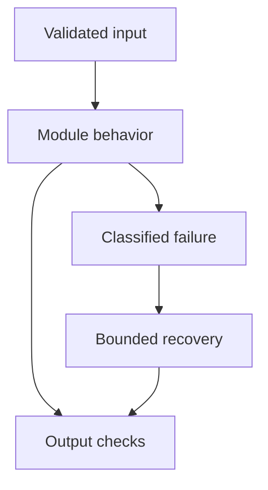

# 23: LLM System Design

[Previous module](../22-cost-optimization/README.md) · [Repository home](../README.md) · [Next module](../24-production/README.md)

## Simple explanation

A strong system-design answer starts with users, workload, correctness, and constraints. Then size the data and traffic, choose components, and explain how failures and trade-offs affect the user.

## Why, when, and how

Study this module to answer engineering scenarios, not only definitions. Work through the concepts below, run the example, explain its boundaries, then solve the exercise before reading interview answers.

## Concepts

### Requirements

Clarify user roles, document types, actions, languages, freshness, citations, and allowed mistakes. Functional requirements describe behavior; non-functional requirements describe latency, availability, security, and cost. Explicit assumptions are better than invented scale.

### APIs and contracts

Define ingestion jobs, status endpoints, queries, conversation IDs, and response evidence. Use pagination, idempotency keys, and structured error codes. Streaming requires an event contract. Version external contracts and keep internal provider details out of product APIs.

### Database and search

Relational tables hold users, ACLs, source versions, jobs, and audit records. Object storage holds originals. Vector indexes hold derived search representations. Do not make a vector database the only authoritative record of documents or permissions.

### Caching and queues

Cache safe repeat operations with tenant and version scope. Queue slow ingestion and long-running workflows. Use deduplication, backpressure, retries, dead-letter handling, and status tracking. Define how partial completion becomes visible.

### Model layer

Use provider adapters with capability checks, budgets, and controlled fallback. Track model and prompt configuration. A fallback may not support tools or structured output. Preserve response semantics and do not quietly degrade permissions.

### Scaling

Size active users and request rate rather than registered users alone. Estimate vector count, token volume, concurrency, and worker throughput. Horizontal API scaling does not remove provider quotas. Use load balancing and separate ingestion from latency-sensitive queries.

### Reliability

Set total and stage deadlines, classify retryable failures, and stop cascades with circuit breakers and admission control. Define degraded modes and escalation. Cache outages, DB failures, and ambiguous tool outcomes need different handling.

### Security and observability

Authorize retrieval and tools using authenticated identities. Protect PII in traces, use secrets management, and audit actions. Observe quality alongside latency and errors. An available service giving unsupported or unauthorized answers is still failing its purpose.

### Cost and trade-offs

Compare cost per completed task and operations overhead. Discuss managed versus self-hosted search, model size, reranking, chunk count, and caching. Explain why a simpler baseline may be sufficient. State what evidence would trigger a design change.

### Eight designs

The separate system-design directory contains worked designs for a chat service, enterprise RAG, support automation, PDF QA, coding assistance, SQL copilot, document intelligence, and multi-agent research. Each changes requirements and failure boundaries rather than only swapping the product name.

## Architecture and implementation boundary

The example isolates one mechanism from this module. Its inputs, state transitions, and outputs should be inspectable in code. Use it as a tested teaching primitive, then add the integrations described below. Offline lexical search and fixture answers are explicitly different from learned embeddings and live LLM generation.



## Real-world scenario

> How would you handle one million users?

**Recommended approach:** Clarify active concurrency and request rates, then size API replicas, queues, storage, provider quotas, and token budgets. Registered user count alone is insufficient. Enforce tenant isolation and load-test representative workflows.

**Technical reasoning:** If one million registered users generate 100 requests per second and mean service time is five seconds, roughly 500 requests are in flight before queueing, by Little’s law. At 3000 input and 500 output tokens per request, provider token throughput can dominate. Use admission control, per-tenant quotas, shared caching where safe, and async ingestion. Plan hot partitions, regional requirements, failure recovery, and SLO-based capacity margins. Validate the assumed workload with measurements.

## Code

This example runs on Python 3.12 with the standard library.

Run from the repository root:

```bash
python -m examples.capacity
```

```python
def estimate(qps, service_seconds, docs, chunks_per_doc, dimensions):
    if min(qps,service_seconds,docs,chunks_per_doc,dimensions)<0:
        raise ValueError('negative workload')
    return {'in_flight_mean':qps*service_seconds,
            'vectors':docs*chunks_per_doc,
            'raw_float32_GB':docs*chunks_per_doc*dimensions*4/1e9}
if __name__ == '__main__':
    print(estimate(100,5,500000,20,768))
    print('Exclude replicas, metadata, index overhead, headroom, and cache from this lower bound.')
```

Shared implementation: [core.py](../examples/core.py). Tests: [test_core.py](../tests/test_core.py). Optional adapters have separate validation status in [VALIDATION.md](../VALIDATION.md).

## Interview case

### Question

How would you handle one million users?

### Difficulty

Hard

### What interviewer is testing

Whether you can identify the actual engineering constraint, choose a bounded implementation, and justify its trade-offs.

### Short Answer

Clarify active concurrency and request rates, then size API replicas, queues, storage, provider quotas, and token budgets. Registered user count alone is insufficient. Enforce tenant isolation and load-test representative workflows.

### Interview Answer

Clarify active concurrency and request rates, then size API replicas, queues, storage, provider quotas, and token budgets. Registered user count alone is insufficient. Enforce tenant isolation and load-test representative workflows. If one million registered users generate 100 requests per second and mean service time is five seconds, roughly 500 requests are in flight before queueing, by Little’s law. At 3000 input and 500 output tokens per request, provider token throughput can dominate. Use admission control, per-tenant quotas, shared caching where safe, and async ingestion. Plan hot partitions, regional requirements, failure recovery, and SLO-based capacity margins. Validate the assumed workload with measurements. I would start with a representative failing or demanding workload and define measurable acceptance criteria. I would test both successful behavior and the likely failure path, then compare the new implementation with a fixed baseline. I would report the implemented scope and remaining assumptions clearly.

### Deep Technical Answer

If one million registered users generate 100 requests per second and mean service time is five seconds, roughly 500 requests are in flight before queueing, by Little’s law. At 3000 input and 500 output tokens per request, provider token throughput can dominate. Use admission control, per-tenant quotas, shared caching where safe, and async ingestion. Plan hot partitions, regional requirements, failure recovery, and SLO-based capacity margins. Validate the assumed workload with measurements. Keep input assumptions, state scope, failure classification, and deployment configuration explicit. Verify that the implementation is doing what the architecture claims by inspecting stage-level traces and authoritative outcomes. A successful demonstration is not enough evidence for an unmeasured scale claim.

### Real-World Example

Use the scenario above with a fixed source version and representative inputs. Save the expected result, observed result, and relevant trace so the investigation can be repeated.

### Code

Use the runnable example above and inspect the shared core for validation, lifecycle, or budget logic. Extend it only after the baseline behavior is understood.

### Follow-up Question

How would you prove this improvement still works after a dependency, model, or source-data change?

### Follow-up Answer

Version inputs and configuration, keep independent regression cases, compare quality and operational metrics, and test a rollback. Add a slice for the failure this change specifically addresses.

### Common Mistake

Giving a component name as the whole answer without explaining its contract, limitations, measurement, or failure behavior.

### Senior-Level Insight

If one million registered users generate 100 requests per second and mean service time is five seconds, roughly 500 requests are in flight before queueing, by Little’s law. At 3000 input and 500 output tokens per request, provider token throughput can dominate. Use admission control, per-tenant quotas, shared caching where safe, and async ingestion. Plan hot partitions, regional requirements, failure recovery, and SLO-based capacity margins. Validate the assumed workload with measurements. Explain the simplest design that meets the requirement and what workload or evidence would make you replace it.

## Follow-up tree

1. Explain the mechanism using a tiny input.
2. Show the implementation and edge cases.
3. Explain the scenario above and the main bottleneck.
4. Show which metric would identify a regression.
5. Explain recovery after failure or a partial result.
6. Design the boundary under multiple tenants and ten times the workload.

## Debugging exercise

**Symptom:** the scenario fails after a configuration or data change. **Investigation:** capture exact inputs, versions, and stage outcomes; compare with the prior baseline. **Root cause:** identify the first stage violating its contract. **Fix:** change that stage and replay the case. **Prevention:** add the failing case and an operational signal to the regression suite. For concrete incidents, see [debugging runbooks](../28-debugging/runbooks.md).

## Production considerations

- **Reliability:** define deadlines, cancellation behavior, retryability, and recovery of partial work.
- **Security:** derive caller identity from authentication; scope data and tool permissions in trusted code.
- **Cost and performance:** measure stage latency, memory, token use, throughput, and cost per successful task.
- **Testing and evaluation:** validate hard invariants separately from semantic quality; keep representative held-out cases.
- **Deployment:** use tested dependency versions, external configuration, safe telemetry, and an actual rollback procedure.

## Levels of understanding

**Junior:** explain each concept and run the example with a small input.

**Mid-level:** adapt it to the real-world scenario, write edge tests, and diagnose a demonstrated failure.

**Senior:** If one million registered users generate 100 requests per second and mean service time is five seconds, roughly 500 requests are in flight before queueing, by Little’s law. At 3000 input and 500 output tokens per request, provider token throughput can dominate. Use admission control, per-tenant quotas, shared caching where safe, and async ingestion. Plan hot partitions, regional requirements, failure recovery, and SLO-based capacity margins. Validate the assumed workload with measurements.

## What I must remember

A strong system-design answer starts with users, workload, correctness, and constraints. Then size the data and traffic, choose components, and explain how failures and trade-offs affect the user. Clarify active concurrency and request rates, then size API replicas, queues, storage, provider quotas, and token budgets. Registered user count alone is insufficient. Enforce tenant isolation and load-test representative workflows.

## What I must be able to code

Run, modify, and explain [capacity.py](../examples/capacity.py); implement the exercise below and relevant edge tests.

## What an interviewer may ask

The case above, each concept’s failure boundary, and the topic-specific questions in the [interview bank](../interview-questions/README.md).

## What senior engineers are expected to know

Requirements, observable evidence, uncertainty, dependency lifecycle, authorization, and the cost of operating the design. Explain what would change your decision.

## Common mistakes

Confusing an example with a production deployment; assuming a framework enforces business permissions; reporting unmeasured performance; skipping the failure path; and tuning on the final test set.

## Practical exercise and mini project

Choose one worked design and change its workload by ten times. Recalculate vector count, API concurrency, model tokens per minute, and ingestion throughput. Identify the first bottleneck.

**Acceptance:** include a normal case, empty or missing input, invalid input, a failure case, and one stated limitation. Record the observed result and explain why the checks match the actual requirement.

## GitHub task

```bash
git switch -c learn/23-system-design
python -m unittest discover -s tests -v
git add 23-system-design examples tests
git commit -m "docs: study llm system design and record exercise results"
git push -u origin learn/23-system-design
```

Open a pull request with the implementation, measured validation, and remaining limits. Do not claim a lab result is a production benchmark.
