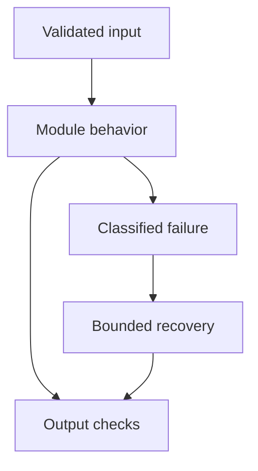

# 24: Production GenAI Services

[Previous module](../23-system-design/README.md) · [Repository home](../README.md) · [Next module](../25-docker/README.md)

## Simple explanation

Production quality means predictable behavior under concurrency, failure, malicious input, and change. A working notebook is a prototype; a service needs contracts, budgets, isolation, monitoring, and recovery.

## Why, when, and how

Study this module to answer engineering scenarios, not only definitions. Work through the concepts below, run the example, explain its boundaries, then solve the exercise before reading interview answers.

## Concepts

### API architecture

Separate transport validation, authorization, application logic, retrieval, model adapters, and persistence. Keep external provider schemas behind adapters. FastAPI and Pydantic fit request contracts; async dependencies need nonblocking libraries. Share clients through application lifecycle management.

### Authentication and rate limiting

Use a real identity provider and derive tenant and role from verified identity. Limit by user, tenant, and workflow cost, with shared state for multi-replica services. Protect both requests per second and token budgets. A local API key is only a development control.

### Retries and timeouts

Set connect, read, total stage, and request deadlines. Respect provider retry hints and use exponential backoff with jitter. Retry transient failures only within a total budget. Never allow nested retry layers to multiply unnoticed.

### Circuit breakers

Open a breaker after a measured failure threshold, then probe recovery cautiously. Breakers reduce calls to an unhealthy dependency but must not permanently block a recovered service. Separate circuit state by dependency and failure class. Test transitions and half-open behavior.

### Queues and backpressure

Queue slow work with job IDs and status. Bound queue depth and reject or defer excess load. Use idempotent workers, leases, retries, and dead-letter inspection. A growing queue is latency debt, not proof that the service is healthy.

### Caching

Use versioned, authorization-scoped keys and explicit invalidation. Separate source caches, embedding caches, and answer caches. Do not reuse personalized results across users. Cache failures should have a defined fail-open or fail-closed policy based on data sensitivity.

### Streaming and disconnects

Define start, token, error, and completion events. Propagate cancellation so disconnected clients do not continue costly work unnecessarily. Set buffer limits. A partial answer must not be reported as a completed successful result.

### Concurrency and scaling

Limit provider concurrency and CPU parsing separately. Multiple API replicas need shared quotas, state, and persistence where appropriate. Load balance stateless requests and handle durable sessions through stored state. Profile actual bottlenecks before adding replicas.

### Monitoring and alerting

Monitor request availability, latency, quality samples, retrieval health, token spend, queue lag, and permission failures. Alert on user impact with clear owners and runbooks. Avoid alerting every individual model timeout when retries and graceful behavior succeed.

### CI CD and rollout

Run unit, contract, integration, evaluation, and adversarial checks appropriate to the change. Pin tested dependencies, scan secrets, review schema migrations, and use controlled rollout with rollback. Canary traffic compares both quality and operational metrics. Backups and restore drills are part of release readiness.

## Architecture and implementation boundary

The example isolates one mechanism from this module. Its inputs, state transitions, and outputs should be inspectable in code. Use it as a tested teaching primitive, then add the integrations described below. Offline lexical search and fixture answers are explicitly different from learned embeddings and live LLM generation.



## Real-world scenario

> Your model provider starts returning rate limits. How should the API behave?

**Recommended approach:** Apply bounded backoff, shared admission control, per-tenant quotas, and an overall deadline. Avoid retry storms. Offer a queued, degraded, or explicit retryable result according to the endpoint contract.

**Technical reasoning:** Differentiate request-rate and token-rate limits and honor provider retry headers. A global concurrency cap alone may not regulate tokens per minute. Coordinate quotas across replicas, reserve capacity for critical workflows, and reduce fanout during saturation. Only use fallback models with validated task capabilities and data permissions. Track upstream saturation separately from local queue delay and tell clients whether the task is queued, partial, or failed.

## Code

This example runs on Python 3.12 with the standard library.

Run from the repository root:

```bash
python -m examples.reliability
```

```python
import asyncio
from examples.core import retry_read, TransientError
async def main():
    count=0
    async def read():
        nonlocal count
        count+=1
        if count<3:
            raise TransientError('fixture outage')
        return 'success'
    print(await retry_read(read),'attempts:',count)
if __name__ == '__main__':
    asyncio.run(main())
```

Shared implementation: [core.py](../examples/core.py). Tests: [test_core.py](../tests/test_core.py). Optional adapters have separate validation status in [VALIDATION.md](../VALIDATION.md).

## Interview case

### Question

Your model provider starts returning rate limits. How should the API behave?

### Difficulty

Hard

### What interviewer is testing

Whether you can identify the actual engineering constraint, choose a bounded implementation, and justify its trade-offs.

### Short Answer

Apply bounded backoff, shared admission control, per-tenant quotas, and an overall deadline. Avoid retry storms. Offer a queued, degraded, or explicit retryable result according to the endpoint contract.

### Interview Answer

Apply bounded backoff, shared admission control, per-tenant quotas, and an overall deadline. Avoid retry storms. Offer a queued, degraded, or explicit retryable result according to the endpoint contract. Differentiate request-rate and token-rate limits and honor provider retry headers. A global concurrency cap alone may not regulate tokens per minute. Coordinate quotas across replicas, reserve capacity for critical workflows, and reduce fanout during saturation. Only use fallback models with validated task capabilities and data permissions. Track upstream saturation separately from local queue delay and tell clients whether the task is queued, partial, or failed. I would start with a representative failing or demanding workload and define measurable acceptance criteria. I would test both successful behavior and the likely failure path, then compare the new implementation with a fixed baseline. I would report the implemented scope and remaining assumptions clearly.

### Deep Technical Answer

Differentiate request-rate and token-rate limits and honor provider retry headers. A global concurrency cap alone may not regulate tokens per minute. Coordinate quotas across replicas, reserve capacity for critical workflows, and reduce fanout during saturation. Only use fallback models with validated task capabilities and data permissions. Track upstream saturation separately from local queue delay and tell clients whether the task is queued, partial, or failed. Keep input assumptions, state scope, failure classification, and deployment configuration explicit. Verify that the implementation is doing what the architecture claims by inspecting stage-level traces and authoritative outcomes. A successful demonstration is not enough evidence for an unmeasured scale claim.

### Real-World Example

Use the scenario above with a fixed source version and representative inputs. Save the expected result, observed result, and relevant trace so the investigation can be repeated.

### Code

Use the runnable example above and inspect the shared core for validation, lifecycle, or budget logic. Extend it only after the baseline behavior is understood.

### Follow-up Question

How would you prove this improvement still works after a dependency, model, or source-data change?

### Follow-up Answer

Version inputs and configuration, keep independent regression cases, compare quality and operational metrics, and test a rollback. Add a slice for the failure this change specifically addresses.

### Common Mistake

Giving a component name as the whole answer without explaining its contract, limitations, measurement, or failure behavior.

### Senior-Level Insight

Differentiate request-rate and token-rate limits and honor provider retry headers. A global concurrency cap alone may not regulate tokens per minute. Coordinate quotas across replicas, reserve capacity for critical workflows, and reduce fanout during saturation. Only use fallback models with validated task capabilities and data permissions. Track upstream saturation separately from local queue delay and tell clients whether the task is queued, partial, or failed. Explain the simplest design that meets the requirement and what workload or evidence would make you replace it.

## Follow-up tree

1. Explain the mechanism using a tiny input.
2. Show the implementation and edge cases.
3. Explain the scenario above and the main bottleneck.
4. Show which metric would identify a regression.
5. Explain recovery after failure or a partial result.
6. Design the boundary under multiple tenants and ten times the workload.

## Debugging exercise

**Symptom:** the scenario fails after a configuration or data change. **Investigation:** capture exact inputs, versions, and stage outcomes; compare with the prior baseline. **Root cause:** identify the first stage violating its contract. **Fix:** change that stage and replay the case. **Prevention:** add the failing case and an operational signal to the regression suite. For concrete incidents, see [debugging runbooks](../28-debugging/runbooks.md).

## Production considerations

- **Reliability:** define deadlines, cancellation behavior, retryability, and recovery of partial work.
- **Security:** derive caller identity from authentication; scope data and tool permissions in trusted code.
- **Cost and performance:** measure stage latency, memory, token use, throughput, and cost per successful task.
- **Testing and evaluation:** validate hard invariants separately from semantic quality; keep representative held-out cases.
- **Deployment:** use tested dependency versions, external configuration, safe telemetry, and an actual rollback procedure.

## Levels of understanding

**Junior:** explain each concept and run the example with a small input.

**Mid-level:** adapt it to the real-world scenario, write edge tests, and diagnose a demonstrated failure.

**Senior:** Differentiate request-rate and token-rate limits and honor provider retry headers. A global concurrency cap alone may not regulate tokens per minute. Coordinate quotas across replicas, reserve capacity for critical workflows, and reduce fanout during saturation. Only use fallback models with validated task capabilities and data permissions. Track upstream saturation separately from local queue delay and tell clients whether the task is queued, partial, or failed.

## What I must remember

Production quality means predictable behavior under concurrency, failure, malicious input, and change. A working notebook is a prototype; a service needs contracts, budgets, isolation, monitoring, and recovery. Apply bounded backoff, shared admission control, per-tenant quotas, and an overall deadline. Avoid retry storms. Offer a queued, degraded, or explicit retryable result according to the endpoint contract.

## What I must be able to code

Run, modify, and explain [reliability.py](../examples/reliability.py); implement the exercise below and relevant edge tests.

## What an interviewer may ask

The case above, each concept’s failure boundary, and the topic-specific questions in the [interview bank](../interview-questions/README.md).

## What senior engineers are expected to know

Requirements, observable evidence, uncertainty, dependency lifecycle, authorization, and the cost of operating the design. Explain what would change your decision.

## Common mistakes

Confusing an example with a production deployment; assuming a framework enforces business permissions; reporting unmeasured performance; skipping the failure path; and tuning on the final test set.

## Practical exercise and mini project

Inject transient and permanent failures into a fake provider. Show that permanent errors are never retried and total attempts stay bounded. Add cancellation and a queue capacity test.

**Acceptance:** include a normal case, empty or missing input, invalid input, a failure case, and one stated limitation. Record the observed result and explain why the checks match the actual requirement.

## GitHub task

```bash
git switch -c learn/24-production
python -m unittest discover -s tests -v
git add 24-production examples tests
git commit -m "docs: study production genai services and record exercise results"
git push -u origin learn/24-production
```

Open a pull request with the implementation, measured validation, and remaining limits. Do not claim a lab result is a production benchmark.
