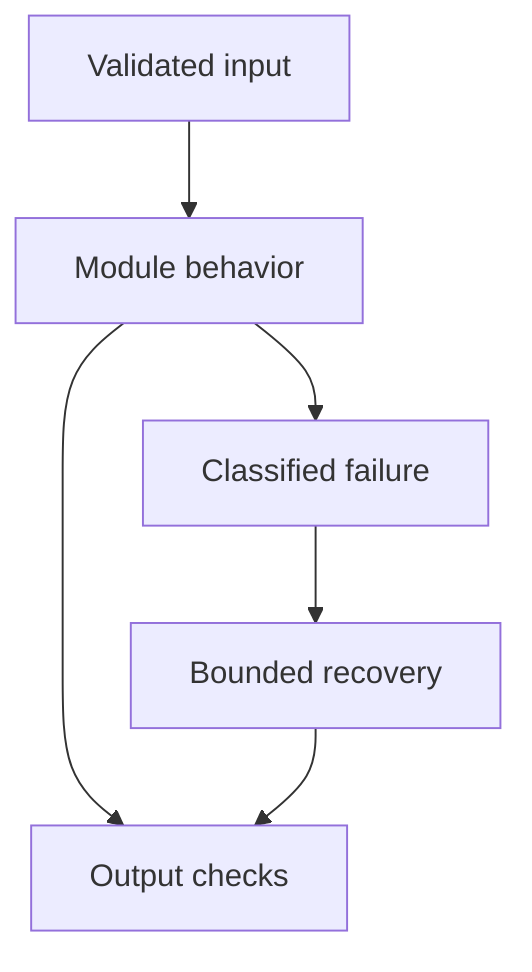

# 25: Docker and Deployment

[Previous module](../24-production/README.md) · [Repository home](../README.md) · [Next module](../26-aws/README.md)

## Simple explanation

Containers package an application and its runtime. Compose coordinates a local stack. Production deployment adds secrets, health checks, recovery, data durability, networking, and operational ownership.

## Why, when, and how

Study this module to answer engineering scenarios, not only definitions. Work through the concepts below, run the example, explain its boundaries, then solve the exercise before reading interview answers.

## Concepts

### Docker images

Build from a supported base, install explicit dependencies, copy only needed files, and run as a non-root user. Keep secrets out of build arguments and image layers. Use .dockerignore. Pin resolved packages and production image digests after testing.

### Compose services

Define API, frontend, PostgreSQL, Redis, and Qdrant as separate services in the included local stack. Use internal service names rather than localhost between containers. Local ports bind to loopback to reduce accidental exposure. Dependencies being started does not prove the application is ready.

### FastAPI process

Uvicorn serves ASGI requests. Worker counts affect memory and shared-state assumptions. An in-memory index is separate in each worker; it is not a distributed persistent store. Use managed process orchestration and graceful shutdown in production.

### Persistent volumes

Volumes keep database state beyond a container restart. They are not backups. Test database backup, restore, and schema compatibility. Do not delete volumes casually while studying commands; local data can be lost.

### Secrets and configuration

Load credentials from runtime secrets or environment under the orchestrator. .env.example contains placeholders only. Frontend JavaScript must never contain server API credentials. A deployment manifest should describe required values without committing real ones.

### Health readiness liveness

Liveness asks whether a process should restart; readiness asks whether it can accept traffic. Do not make every liveness probe call a costly external model. Use bounded dependency checks for readiness and expose safe health information.

### Networking and TLS

Expose only required entrypoints, use TLS at a trusted gateway, and restrict database and cache network access. Local Compose is a development topology. Production requires real authentication and encrypted connections where appropriate.

### ECS EKS and orchestration

ECS provides managed container scheduling; Kubernetes or EKS offers a broader orchestration system with more operational complexity. Choose according to team capability and requirements. Replicas and rolling updates need shared storage, compatible migrations, and capacity planning.

### Deployment strategy

Use immutable artifacts, reviewed configuration, staged migrations, and a canary or rolling rollout. Rollback must consider data changes, not only container tags. Keep runbooks and previous tested artifacts available.

### Included stack boundary

The Compose file runs the educational API with an offline index and fixture answering plus companion services. PostgreSQL, Redis, and Qdrant are provisioned for integration exercises; the default API does not secretly use them. Implement and test the adapters described in the capstone before claiming a complete production platform.

## Architecture and implementation boundary

The example isolates one mechanism from this module. Its inputs, state transitions, and outputs should be inspectable in code. Use it as a tested teaching primitive, then add the integrations described below. Offline lexical search and fixture answers are explicitly different from learned embeddings and live LLM generation.



## Real-world scenario

> Your app works locally but cannot connect to PostgreSQL in Compose. What do you inspect?

**Recommended approach:** Check the service hostname, internal port, network, readiness, credentials, and logs. Inside an API container, localhost is the API container, not the PostgreSQL service.

**Technical reasoning:** Use the Compose service name such as postgres and the database’s container port, not the host-mapped port. Verify startup order does not hide readiness races. Check environment precedence, credentials, and persisted volume initialization. A changed password variable does not necessarily change an already initialized database password. Add bounded connection retry and distinguish credential failures from transient startup failures.

## Code

This example runs on Python 3.12 with the standard library.

Run from the repository root:

```bash
python -m examples.deployment_check
```

```python
from pathlib import Path
if __name__ == '__main__':
    root=Path(__file__).resolve().parents[1]
    for name in ('Dockerfile','compose.yaml','.env.example','app/main.py'):
        print(name,'present:',(root/name).exists())
    print('File presence is not a deployment or health test. Run Compose locally to validate.')
```

Shared implementation: [core.py](../examples/core.py). Tests: [test_core.py](../tests/test_core.py). Optional adapters have separate validation status in [VALIDATION.md](../VALIDATION.md).

## Interview case

### Question

Your app works locally but cannot connect to PostgreSQL in Compose. What do you inspect?

### Difficulty

Hard

### What interviewer is testing

Whether you can identify the actual engineering constraint, choose a bounded implementation, and justify its trade-offs.

### Short Answer

Check the service hostname, internal port, network, readiness, credentials, and logs. Inside an API container, localhost is the API container, not the PostgreSQL service.

### Interview Answer

Check the service hostname, internal port, network, readiness, credentials, and logs. Inside an API container, localhost is the API container, not the PostgreSQL service. Use the Compose service name such as postgres and the database’s container port, not the host-mapped port. Verify startup order does not hide readiness races. Check environment precedence, credentials, and persisted volume initialization. A changed password variable does not necessarily change an already initialized database password. Add bounded connection retry and distinguish credential failures from transient startup failures. I would start with a representative failing or demanding workload and define measurable acceptance criteria. I would test both successful behavior and the likely failure path, then compare the new implementation with a fixed baseline. I would report the implemented scope and remaining assumptions clearly.

### Deep Technical Answer

Use the Compose service name such as postgres and the database’s container port, not the host-mapped port. Verify startup order does not hide readiness races. Check environment precedence, credentials, and persisted volume initialization. A changed password variable does not necessarily change an already initialized database password. Add bounded connection retry and distinguish credential failures from transient startup failures. Keep input assumptions, state scope, failure classification, and deployment configuration explicit. Verify that the implementation is doing what the architecture claims by inspecting stage-level traces and authoritative outcomes. A successful demonstration is not enough evidence for an unmeasured scale claim.

### Real-World Example

Use the scenario above with a fixed source version and representative inputs. Save the expected result, observed result, and relevant trace so the investigation can be repeated.

### Code

Use the runnable example above and inspect the shared core for validation, lifecycle, or budget logic. Extend it only after the baseline behavior is understood.

### Follow-up Question

How would you prove this improvement still works after a dependency, model, or source-data change?

### Follow-up Answer

Version inputs and configuration, keep independent regression cases, compare quality and operational metrics, and test a rollback. Add a slice for the failure this change specifically addresses.

### Common Mistake

Giving a component name as the whole answer without explaining its contract, limitations, measurement, or failure behavior.

### Senior-Level Insight

Use the Compose service name such as postgres and the database’s container port, not the host-mapped port. Verify startup order does not hide readiness races. Check environment precedence, credentials, and persisted volume initialization. A changed password variable does not necessarily change an already initialized database password. Add bounded connection retry and distinguish credential failures from transient startup failures. Explain the simplest design that meets the requirement and what workload or evidence would make you replace it.

## Follow-up tree

1. Explain the mechanism using a tiny input.
2. Show the implementation and edge cases.
3. Explain the scenario above and the main bottleneck.
4. Show which metric would identify a regression.
5. Explain recovery after failure or a partial result.
6. Design the boundary under multiple tenants and ten times the workload.

## Debugging exercise

**Symptom:** the scenario fails after a configuration or data change. **Investigation:** capture exact inputs, versions, and stage outcomes; compare with the prior baseline. **Root cause:** identify the first stage violating its contract. **Fix:** change that stage and replay the case. **Prevention:** add the failing case and an operational signal to the regression suite. For concrete incidents, see [debugging runbooks](../28-debugging/runbooks.md).

## Production considerations

- **Reliability:** define deadlines, cancellation behavior, retryability, and recovery of partial work.
- **Security:** derive caller identity from authentication; scope data and tool permissions in trusted code.
- **Cost and performance:** measure stage latency, memory, token use, throughput, and cost per successful task.
- **Testing and evaluation:** validate hard invariants separately from semantic quality; keep representative held-out cases.
- **Deployment:** use tested dependency versions, external configuration, safe telemetry, and an actual rollback procedure.

## Levels of understanding

**Junior:** explain each concept and run the example with a small input.

**Mid-level:** adapt it to the real-world scenario, write edge tests, and diagnose a demonstrated failure.

**Senior:** Use the Compose service name such as postgres and the database’s container port, not the host-mapped port. Verify startup order does not hide readiness races. Check environment precedence, credentials, and persisted volume initialization. A changed password variable does not necessarily change an already initialized database password. Add bounded connection retry and distinguish credential failures from transient startup failures.

## What I must remember

Containers package an application and its runtime. Compose coordinates a local stack. Production deployment adds secrets, health checks, recovery, data durability, networking, and operational ownership. Check the service hostname, internal port, network, readiness, credentials, and logs. Inside an API container, localhost is the API container, not the PostgreSQL service.

## What I must be able to code

Run, modify, and explain [deployment_check.py](../examples/deployment_check.py); implement the exercise below and relevant edge tests.

## What an interviewer may ask

The case above, each concept’s failure boundary, and the topic-specific questions in the [interview bank](../interview-questions/README.md).

## What senior engineers are expected to know

Requirements, observable evidence, uncertainty, dependency lifecycle, authorization, and the cost of operating the design. Explain what would change your decision.

## Common mistakes

Confusing an example with a production deployment; assuming a framework enforces business permissions; reporting unmeasured performance; skipping the failure path; and tuning on the final test set.

## Practical exercise and mini project

Build the image and start the stack. Inspect health, create a development document, restart the API, and explain why the offline in-memory data disappears. Integrate persistence as the next milestone.

**Acceptance:** include a normal case, empty or missing input, invalid input, a failure case, and one stated limitation. Record the observed result and explain why the checks match the actual requirement.

## GitHub task

```bash
git switch -c learn/25-docker
python -m unittest discover -s tests -v
git add 25-docker examples tests
git commit -m "docs: study docker and deployment and record exercise results"
git push -u origin learn/25-docker
```

Open a pull request with the implementation, measured validation, and remaining limits. Do not claim a lab result is a production benchmark.
