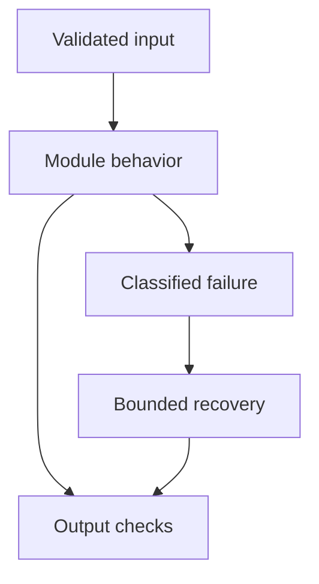

# 26: AWS for GenAI

[Previous module](../25-docker/README.md) · [Repository home](../README.md) · [Next module](../27-database/README.md)

## Simple explanation

AWS components provide storage, compute, identity, networking, and operations. For model calls, use caller-specific or workload-specific IAM identities rather than committing shared access keys.

## Why, when, and how

Study this module to answer engineering scenarios, not only definitions. Work through the concepts below, run the example, explain its boundaries, then solve the exercise before reading interview answers.

## Concepts

### S3

Store original documents and versioned derived artifacts in object storage. Use least-privilege access, encryption, retention, and controlled upload paths. Presigned URLs are temporary access grants and must be scoped and protected. Events can trigger asynchronous ingestion.

### EC2

EC2 offers virtual machines, useful for custom serving or specialized infrastructure. You own patching, scaling, availability, and GPU utilization. Attach instance roles for AWS access instead of embedding static keys. Model self-hosting needs realistic memory and throughput benchmarks.

### ECS and EKS

ECS runs containers with managed orchestration; EKS runs managed Kubernetes control planes. Use task or workload IAM identities with narrow permissions. Neither removes application reliability or data design work. EKS usually demands more platform expertise.

### Lambda

Lambda suits bounded event processing and lightweight endpoints when its runtime and resource constraints fit. Long model streams, large parsing jobs, or GPU workloads may need other compute. Check current service limits before selecting it. Design retries and duplicate events safely.

### RDS

Use RDS for relational metadata, ACLs, jobs, and authoritative business records. Plan connection pooling, backups, migrations, and high availability. Avoid placing every raw document into relational rows. Encryption and network restrictions complement database permissions.

### ElastiCache

Managed caching can provide Redis-compatible infrastructure for scoped caches, quotas, and transient state. Choose persistence and failover settings intentionally. Do not treat an evictable cache as the sole audit ledger or authoritative document store.

### CloudWatch

Collect logs, metrics, and alarms. Use safe structured events and explicit retention. Monitor ingestion lag, API latency, errors, model spend, and worker failures. Connect alerts to actionable runbooks rather than endless undifferentiated notifications.

### IAM and Secrets Manager

IAM grants AWS permissions to identities. Use SSO or federation for developers and roles for workloads. Secrets Manager stores credentials that cannot use IAM-native identity. Rotation does not fix overly broad access; restrict who can read or use each secret.

### API Gateway

A gateway can manage entrypoints, authentication integration, throttling, and routing. Evaluate streaming and timeout compatibility with your chosen mode. Gateway authentication does not implement document ACLs or tool authorization by itself.

### Bedrock and architecture

An AWS RAG design can use S3, an ingestion queue, ECS workers, RDS metadata, a search service, an API layer, and Bedrock inference. Developers use authorized temporary credentials; workloads use roles. A central model gateway can enforce budgets and audit access. Region, model access, and data policies must be validated for deployment.

## Architecture and implementation boundary

The example isolates one mechanism from this module. Its inputs, state transitions, and outputs should be inspectable in code. Use it as a tested teaching primitive, then add the integrations described below. Offline lexical search and fixture answers are explicitly different from learned embeddings and live LLM generation.



## Real-world scenario

> How can teammates test Bedrock without sharing your AWS API key?

**Recommended approach:** Give each teammate their own authorized SSO or federated identity with temporary credentials, or expose a company-authenticated model gateway whose workload role invokes Bedrock. Enforce least privilege, quotas, and audit logs.

**Technical reasoning:** Local SDK calls can use the standard AWS credential chain after SSO login under an approved profile. Production uses a task, instance, or workload role. If only a small component needs model access, a central gateway can narrow model IDs, token budgets, and data policy while clients authenticate through company identity. The gateway is a service with availability and rate-limit responsibilities; it should not become an unauthenticated key-sharing proxy.

## Code

Optional dependencies and external access may be required; read examples/README.md first.

Run from the repository root:

```bash
python -m examples.bedrock_example
```

```python
# Optional: uv sync --extra aws. Requires your own approved AWS identity.
import os
import boto3
if __name__ == '__main__':
    session=boto3.Session(profile_name=os.getenv('AWS_PROFILE'),
                          region_name=os.environ['AWS_REGION'])
    client=session.client('bedrock-runtime')
    response=client.converse(modelId=os.environ['BEDROCK_MODEL_ID'],
        messages=[{'role':'user','content':[{'text':'Summarize: retrieval supplies external evidence.'}]}],
        inferenceConfig={'maxTokens':128})
    print(response['output']['message']['content'])
    print(response.get('usage',{}))
```

Shared implementation: [core.py](../examples/core.py). Tests: [test_core.py](../tests/test_core.py). Optional adapters have separate validation status in [VALIDATION.md](../VALIDATION.md).

## Interview case

### Question

How can teammates test Bedrock without sharing your AWS API key?

### Difficulty

Hard

### What interviewer is testing

Whether you can identify the actual engineering constraint, choose a bounded implementation, and justify its trade-offs.

### Short Answer

Give each teammate their own authorized SSO or federated identity with temporary credentials, or expose a company-authenticated model gateway whose workload role invokes Bedrock. Enforce least privilege, quotas, and audit logs.

### Interview Answer

Give each teammate their own authorized SSO or federated identity with temporary credentials, or expose a company-authenticated model gateway whose workload role invokes Bedrock. Enforce least privilege, quotas, and audit logs. Local SDK calls can use the standard AWS credential chain after SSO login under an approved profile. Production uses a task, instance, or workload role. If only a small component needs model access, a central gateway can narrow model IDs, token budgets, and data policy while clients authenticate through company identity. The gateway is a service with availability and rate-limit responsibilities; it should not become an unauthenticated key-sharing proxy. I would start with a representative failing or demanding workload and define measurable acceptance criteria. I would test both successful behavior and the likely failure path, then compare the new implementation with a fixed baseline. I would report the implemented scope and remaining assumptions clearly.

### Deep Technical Answer

Local SDK calls can use the standard AWS credential chain after SSO login under an approved profile. Production uses a task, instance, or workload role. If only a small component needs model access, a central gateway can narrow model IDs, token budgets, and data policy while clients authenticate through company identity. The gateway is a service with availability and rate-limit responsibilities; it should not become an unauthenticated key-sharing proxy. Keep input assumptions, state scope, failure classification, and deployment configuration explicit. Verify that the implementation is doing what the architecture claims by inspecting stage-level traces and authoritative outcomes. A successful demonstration is not enough evidence for an unmeasured scale claim.

### Real-World Example

Use the scenario above with a fixed source version and representative inputs. Save the expected result, observed result, and relevant trace so the investigation can be repeated.

### Code

Use the runnable example above and inspect the shared core for validation, lifecycle, or budget logic. Extend it only after the baseline behavior is understood.

### Follow-up Question

How would you prove this improvement still works after a dependency, model, or source-data change?

### Follow-up Answer

Version inputs and configuration, keep independent regression cases, compare quality and operational metrics, and test a rollback. Add a slice for the failure this change specifically addresses.

### Common Mistake

Giving a component name as the whole answer without explaining its contract, limitations, measurement, or failure behavior.

### Senior-Level Insight

Local SDK calls can use the standard AWS credential chain after SSO login under an approved profile. Production uses a task, instance, or workload role. If only a small component needs model access, a central gateway can narrow model IDs, token budgets, and data policy while clients authenticate through company identity. The gateway is a service with availability and rate-limit responsibilities; it should not become an unauthenticated key-sharing proxy. Explain the simplest design that meets the requirement and what workload or evidence would make you replace it.

## Follow-up tree

1. Explain the mechanism using a tiny input.
2. Show the implementation and edge cases.
3. Explain the scenario above and the main bottleneck.
4. Show which metric would identify a regression.
5. Explain recovery after failure or a partial result.
6. Design the boundary under multiple tenants and ten times the workload.

## Debugging exercise

**Symptom:** the scenario fails after a configuration or data change. **Investigation:** capture exact inputs, versions, and stage outcomes; compare with the prior baseline. **Root cause:** identify the first stage violating its contract. **Fix:** change that stage and replay the case. **Prevention:** add the failing case and an operational signal to the regression suite. For concrete incidents, see [debugging runbooks](../28-debugging/runbooks.md).

## Production considerations

- **Reliability:** define deadlines, cancellation behavior, retryability, and recovery of partial work.
- **Security:** derive caller identity from authentication; scope data and tool permissions in trusted code.
- **Cost and performance:** measure stage latency, memory, token use, throughput, and cost per successful task.
- **Testing and evaluation:** validate hard invariants separately from semantic quality; keep representative held-out cases.
- **Deployment:** use tested dependency versions, external configuration, safe telemetry, and an actual rollback procedure.

## Levels of understanding

**Junior:** explain each concept and run the example with a small input.

**Mid-level:** adapt it to the real-world scenario, write edge tests, and diagnose a demonstrated failure.

**Senior:** Local SDK calls can use the standard AWS credential chain after SSO login under an approved profile. Production uses a task, instance, or workload role. If only a small component needs model access, a central gateway can narrow model IDs, token budgets, and data policy while clients authenticate through company identity. The gateway is a service with availability and rate-limit responsibilities; it should not become an unauthenticated key-sharing proxy.

## What I must remember

AWS components provide storage, compute, identity, networking, and operations. For model calls, use caller-specific or workload-specific IAM identities rather than committing shared access keys. Give each teammate their own authorized SSO or federated identity with temporary credentials, or expose a company-authenticated model gateway whose workload role invokes Bedrock. Enforce least privilege, quotas, and audit logs.

## What I must be able to code

Run, modify, and explain [bedrock_example.py](../examples/bedrock_example.py); implement the exercise below and relevant edge tests.

## What an interviewer may ask

The case above, each concept’s failure boundary, and the topic-specific questions in the [interview bank](../interview-questions/README.md).

## What senior engineers are expected to know

Requirements, observable evidence, uncertainty, dependency lifecycle, authorization, and the cost of operating the design. Explain what would change your decision.

## Common mistakes

Confusing an example with a production deployment; assuming a framework enforces business permissions; reporting unmeasured performance; skipping the failure path; and tuning on the final test set.

## Practical exercise and mini project

Write an IAM access design for developer and ECS workload identities. Use the Bedrock adapter example only with an authorized profile. Test denied model access and region mismatch without committing credentials.

**Acceptance:** include a normal case, empty or missing input, invalid input, a failure case, and one stated limitation. Record the observed result and explain why the checks match the actual requirement.

## GitHub task

```bash
git switch -c learn/26-aws
python -m unittest discover -s tests -v
git add 26-aws examples tests
git commit -m "docs: study aws for genai and record exercise results"
git push -u origin learn/26-aws
```

Open a pull request with the implementation, measured validation, and remaining limits. Do not claim a lab result is a production benchmark.
