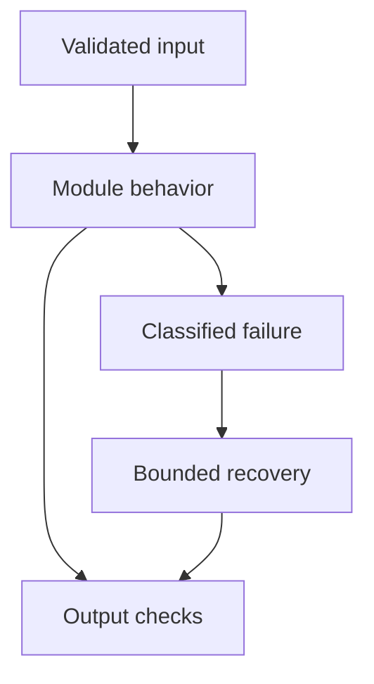

# 27: Databases and GenAI

[Previous module](../26-aws/README.md) · [Repository home](../README.md) · [Next module](../28-debugging/README.md)

## Simple explanation

Relational databases answer exact structured questions. Vector search finds semantically related content. Use each for its strengths and avoid asking a language model to invent numbers that SQL can compute reliably.

## Why, when, and how

Study this module to answer engineering scenarios, not only definitions. Work through the concepts below, run the example, explain its boundaries, then solve the exercise before reading interview answers.

## Concepts

### SQL fundamentals

Understand SELECT, WHERE, JOIN, GROUP BY, HAVING, ORDER BY, indexes, transactions, and query plans. Parameters represent values, not arbitrary table names. Relational constraints preserve consistency. Learn NULL behavior and duplicate joins before trusting analytical totals.

### PostgreSQL and MySQL

Both are relational databases with transactions and query planning, but dialects, extensions, and date semantics differ. Generate SQL for one explicit dialect. Test against realistic schema and data. Do not assume a query written for PostgreSQL runs unchanged on MySQL.

### Redis

Redis is useful for caches, counters, queues in suitable designs, and session data. Define expiry and memory policy. A cache hit is valid only for the correct authorization and data version. Redis should not replace a transactional ledger simply because it is fast.

### Text-to-SQL

Translate a question into a constrained logical plan or SQL proposal using authorized schema information. Validate before execution. Ask clarification when the business term is ambiguous. Record the question, approved plan, and result provenance.

### SQL agents

Agents may inspect schema and repair invalid queries, but must remain bounded. A syntax error can be repairable; a forbidden query is not an invitation to bypass controls. Use read-only roles, timeouts, row caps, and allowed schema. No model approval can raise privileges.

### Injection prevention

Use parameterized values and whitelist identifiers or structured operations. General SQL proposals need proper parsing and allow rules plus database permissions. Do not concatenate user text. Multiple statements, functions, comments, and nested expressions defeat naive string checks.

### Aggregations and semantics

For customers spending more than ₹1 lakh in six months, define currency, refund treatment, paid status, timezone, and rolling-month boundaries. Use integer minor units or NUMERIC. Avoid double-counting orders after joining order lines. HAVING filters aggregate totals.

### Metadata filtering

Keep tenant, ACL, version, and document state as structured data. Vector retrieval uses these constraints alongside similarity. Recheck permissions in the authoritative store if ACL freshness is not guaranteed. Do not allow user-provided filter fields to override tenant scope.

### Relational plus vector search

Use SQL for exact eligibility and vectors for content relevance. Join through stable document or record IDs. Handle stale derived indexes and deletions. A nearest-neighbor hit should never override a relational permission denial.

### Testing and audit

Test empty results, missing joins, boundary dates, canceled orders, multi-currency data, and cross-tenant attempts. Use EXPLAIN and query timeouts. Audit executed operations and safe result summaries. Evaluate result correctness, not only generated SQL similarity.

## Architecture and implementation boundary

The example isolates one mechanism from this module. Its inputs, state transitions, and outputs should be inspectable in code. Use it as a tested teaching primitive, then add the integrations described below. Offline lexical search and fixture answers are explicitly different from learned embeddings and live LLM generation.



## Real-world scenario

> A user asks for customers who purchased more than ₹1 lakh in the last six months. How do you answer safely?

**Recommended approach:** Clarify purchase and date semantics, produce a constrained read-only aggregate query, parameterize tenant, cutoff, and threshold, execute with least privilege and limits, then explain the returned result.

**Technical reasoning:** Use GROUP BY customer and HAVING SUM of eligible amounts above the threshold. Define six calendar months versus a fixed number of days and account for refunds and currency. The authenticated identity supplies tenant scope. A typed query plan is often safer than arbitrary generated SQL. The model summarizes returned rows; it must not invent customers absent from the result. Validate SQL structure and enforce permissions in the database.

## Code

This example runs on Python 3.12 with the standard library.

Run from the repository root:

```bash
python -m examples.sql
```

```python
import sqlite3
QUERY = """SELECT customer_id, SUM(amount_paise) AS total_paise
FROM orders WHERE tenant = ? AND purchased_on >= ? AND status = 'paid'
GROUP BY customer_id HAVING SUM(amount_paise) > ? ORDER BY customer_id LIMIT 100"""
def customers(conn, tenant, cutoff, threshold_paise=10000000):
    return conn.execute(QUERY,(tenant,cutoff,threshold_paise)).fetchall()
if __name__ == '__main__':
    with sqlite3.connect(':memory:') as conn:
        conn.execute('CREATE TABLE orders(tenant TEXT, customer_id TEXT, amount_paise INTEGER, purchased_on TEXT, status TEXT)')
        conn.executemany('INSERT INTO orders VALUES(?,?,?,?,?)',[
            ('demo','C1',7000000,'2026-06-01','paid'),
            ('demo','C1',4000000,'2026-08-01','paid'),
            ('demo','C2',9000000,'2026-07-01','paid'),
            ('other','C3',90000000,'2026-09-01','paid')])
        print(customers(conn,'demo','2026-04-03'))
        print('Cutoff is supplied explicitly; calendar-month subtraction is a business rule.')
```

Shared implementation: [core.py](../examples/core.py). Tests: [test_core.py](../tests/test_core.py). Optional adapters have separate validation status in [VALIDATION.md](../VALIDATION.md).

## Interview case

### Question

A user asks for customers who purchased more than ₹1 lakh in the last six months. How do you answer safely?

### Difficulty

Hard

### What interviewer is testing

Whether you can identify the actual engineering constraint, choose a bounded implementation, and justify its trade-offs.

### Short Answer

Clarify purchase and date semantics, produce a constrained read-only aggregate query, parameterize tenant, cutoff, and threshold, execute with least privilege and limits, then explain the returned result.

### Interview Answer

Clarify purchase and date semantics, produce a constrained read-only aggregate query, parameterize tenant, cutoff, and threshold, execute with least privilege and limits, then explain the returned result. Use GROUP BY customer and HAVING SUM of eligible amounts above the threshold. Define six calendar months versus a fixed number of days and account for refunds and currency. The authenticated identity supplies tenant scope. A typed query plan is often safer than arbitrary generated SQL. The model summarizes returned rows; it must not invent customers absent from the result. Validate SQL structure and enforce permissions in the database. I would start with a representative failing or demanding workload and define measurable acceptance criteria. I would test both successful behavior and the likely failure path, then compare the new implementation with a fixed baseline. I would report the implemented scope and remaining assumptions clearly.

### Deep Technical Answer

Use GROUP BY customer and HAVING SUM of eligible amounts above the threshold. Define six calendar months versus a fixed number of days and account for refunds and currency. The authenticated identity supplies tenant scope. A typed query plan is often safer than arbitrary generated SQL. The model summarizes returned rows; it must not invent customers absent from the result. Validate SQL structure and enforce permissions in the database. Keep input assumptions, state scope, failure classification, and deployment configuration explicit. Verify that the implementation is doing what the architecture claims by inspecting stage-level traces and authoritative outcomes. A successful demonstration is not enough evidence for an unmeasured scale claim.

### Real-World Example

Use the scenario above with a fixed source version and representative inputs. Save the expected result, observed result, and relevant trace so the investigation can be repeated.

### Code

Use the runnable example above and inspect the shared core for validation, lifecycle, or budget logic. Extend it only after the baseline behavior is understood.

### Follow-up Question

How would you prove this improvement still works after a dependency, model, or source-data change?

### Follow-up Answer

Version inputs and configuration, keep independent regression cases, compare quality and operational metrics, and test a rollback. Add a slice for the failure this change specifically addresses.

### Common Mistake

Giving a component name as the whole answer without explaining its contract, limitations, measurement, or failure behavior.

### Senior-Level Insight

Use GROUP BY customer and HAVING SUM of eligible amounts above the threshold. Define six calendar months versus a fixed number of days and account for refunds and currency. The authenticated identity supplies tenant scope. A typed query plan is often safer than arbitrary generated SQL. The model summarizes returned rows; it must not invent customers absent from the result. Validate SQL structure and enforce permissions in the database. Explain the simplest design that meets the requirement and what workload or evidence would make you replace it.

## Follow-up tree

1. Explain the mechanism using a tiny input.
2. Show the implementation and edge cases.
3. Explain the scenario above and the main bottleneck.
4. Show which metric would identify a regression.
5. Explain recovery after failure or a partial result.
6. Design the boundary under multiple tenants and ten times the workload.

## Debugging exercise

**Symptom:** the scenario fails after a configuration or data change. **Investigation:** capture exact inputs, versions, and stage outcomes; compare with the prior baseline. **Root cause:** identify the first stage violating its contract. **Fix:** change that stage and replay the case. **Prevention:** add the failing case and an operational signal to the regression suite. For concrete incidents, see [debugging runbooks](../28-debugging/runbooks.md).

## Production considerations

- **Reliability:** define deadlines, cancellation behavior, retryability, and recovery of partial work.
- **Security:** derive caller identity from authentication; scope data and tool permissions in trusted code.
- **Cost and performance:** measure stage latency, memory, token use, throughput, and cost per successful task.
- **Testing and evaluation:** validate hard invariants separately from semantic quality; keep representative held-out cases.
- **Deployment:** use tested dependency versions, external configuration, safe telemetry, and an actual rollback procedure.

## Levels of understanding

**Junior:** explain each concept and run the example with a small input.

**Mid-level:** adapt it to the real-world scenario, write edge tests, and diagnose a demonstrated failure.

**Senior:** Use GROUP BY customer and HAVING SUM of eligible amounts above the threshold. Define six calendar months versus a fixed number of days and account for refunds and currency. The authenticated identity supplies tenant scope. A typed query plan is often safer than arbitrary generated SQL. The model summarizes returned rows; it must not invent customers absent from the result. Validate SQL structure and enforce permissions in the database.

## What I must remember

Relational databases answer exact structured questions. Vector search finds semantically related content. Use each for its strengths and avoid asking a language model to invent numbers that SQL can compute reliably. Clarify purchase and date semantics, produce a constrained read-only aggregate query, parameterize tenant, cutoff, and threshold, execute with least privilege and limits, then explain the returned result.

## What I must be able to code

Run, modify, and explain [sql.py](../examples/sql.py); implement the exercise below and relevant edge tests.

## What an interviewer may ask

The case above, each concept’s failure boundary, and the topic-specific questions in the [interview bank](../interview-questions/README.md).

## What senior engineers are expected to know

Requirements, observable evidence, uncertainty, dependency lifecycle, authorization, and the cost of operating the design. Explain what would change your decision.

## Common mistakes

Confusing an example with a production deployment; assuming a framework enforces business permissions; reporting unmeasured performance; skipping the failure path; and tuning on the final test set.

## Practical exercise and mini project

Run the SQLite aggregate example with integer paise. Add canceled orders, refunds, another tenant, and a boundary date. Verify results and write a PostgreSQL equivalent.

**Acceptance:** include a normal case, empty or missing input, invalid input, a failure case, and one stated limitation. Record the observed result and explain why the checks match the actual requirement.

## GitHub task

```bash
git switch -c learn/27-database
python -m unittest discover -s tests -v
git add 27-database examples tests
git commit -m "docs: study databases and genai and record exercise results"
git push -u origin learn/27-database
```

Open a pull request with the implementation, measured validation, and remaining limits. Do not claim a lab result is a production benchmark.
