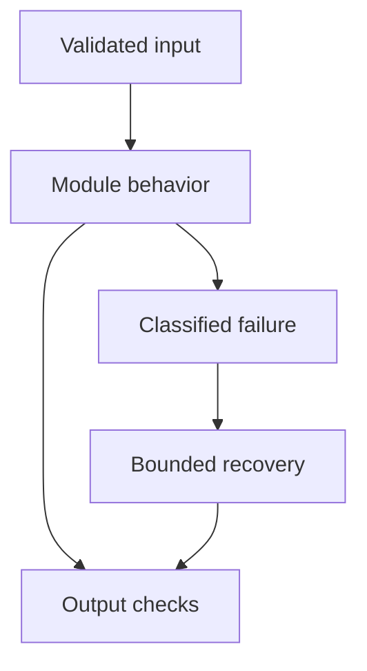

# 28: Real-World Debugging

[Previous module](../27-database/README.md) · [Repository home](../README.md) · [Next module](../29-coding-interview/README.md)

## Simple explanation

Debug from symptoms to evidence, isolate a stage, fix the demonstrated cause, and add prevention. Changing five things at once makes improvement difficult to explain or reproduce.

## Why, when, and how

Study this module to answer engineering scenarios, not only definitions. Work through the concepts below, run the example, explain its boundaries, then solve the exercise before reading interview answers.

## Concepts

### Irrelevant RAG results

Symptom: semantically similar but useless context. Investigation: inspect parsed text, query, filters, model revision, exact-search baseline, and reranking. Causes include missing evidence, truncated embeddings, mixed spaces, or weak lexical matches. Fix the affected stage and add labeled retrieval cases.

### Embedding failures

Symptom: empty vectors, dimension errors, or ingestion stalls. Inspect input size, quotas, batch IDs, encoding, and model configuration. Retry transient failures; reject permanent invalid records. Store batch outcomes and resume by document version instead of restarting blindly.

### Slow vector search

Inspect filter selectivity, payload indexes, candidate count, ANN settings, concurrent ingestion, and resource saturation. Compare exact and approximate recall and p95. A smaller candidate budget can reduce latency but may hurt quality. Add load tests and capacity thresholds.

### Hallucinated answers and citations

Trace final evidence, packing, source versions, unsupported claims, and citation mapping. Relevant context may lack the requested fact. Fix evidence selection or generation behavior and add abstention plus source-entailment tests. Do not assume low temperature solves truthfulness.

### Token and latency spikes

Compare prompt versions, history trimming, chunk count, output length, retries, and tool loops. Separate queue time from provider time. Roll back the demonstrated regression and add budgets plus stage-level metrics. Evaluate traffic changes before blaming the release.

### Infinite loops and invalid tools

Inspect step state, repeated tool fingerprints, validation errors, and routing. Stop on budgets or no progress and return a structured partial result. Tighten schemas and offered tools. Add tests for malformed arguments and repeated identical failures.

### Dangerous database queries

Inspect proposed plan and verify no privileged execution happened. Reject unsafe syntax, revoke excessive roles, and reconcile audit records. Use read-only scoped operations and query timeouts. A prompt asking for safe SQL does not prevent destructive execution.

### Injection and memory errors

Inspect source trust, authorized memory writes, provenance, and retrieved scope. Remove poisoned derived records through the proper lifecycle and test deletion. Fix deterministic permissions. Do not merely strip one suspicious phrase and declare the attack solved.

### Provider outage

Inspect error type, provider status, network path, and quotas. Bound retries and admit less traffic during saturation. Use validated fallback, queueing, or explicit failure according to task requirements. Preserve uncertain side-effect states for reconciliation.

### Streaming stops

Inspect disconnects, proxy buffering, timeouts, generator exceptions, and incomplete final events. Propagate cancellation and send a safe error event if possible. Do not record partial output as completed success. Test clients that disconnect and servers that fail midstream.

## Architecture and implementation boundary

The example isolates one mechanism from this module. Its inputs, state transitions, and outputs should be inspectable in code. Use it as a tested teaching primitive, then add the integrations described below. Offline lexical search and fixture answers are explicitly different from learned embeddings and live LLM generation.



## Real-world scenario

> Production latency increases, but model latency is unchanged. What is your debugging plan?

**Recommended approach:** Inspect queue delay, retrieval, reranking, tools, database connections, and event-loop blocking. Compare traces by stage and recent deployments. Fix the measured bottleneck and test under representative load.

**Technical reasoning:** Use stage spans and percentile distributions rather than averages. Event-loop blocking can delay many requests while individual model calls still look normal. Connection-pool exhaustion and high-cardinality filters can increase queueing. Reproduce the workload with controlled concurrency and inspect CPU, memory, locks, and pool occupancy. Change one factor, validate the hypothesis, and add a regression workload or alert for the demonstrated mechanism.

## Code

This example runs on Python 3.12 with the standard library.

Run from the repository root:

```bash
python -m examples.debug
```

```python
from examples.trace import span
import time
if __name__ == '__main__':
    with span('synthetic-incident','request'):
        with span('synthetic-incident','queue'):
            time.sleep(0.03)
        with span('synthetic-incident','model-fixture'):
            time.sleep(0.005)
```

Shared implementation: [core.py](../examples/core.py). Tests: [test_core.py](../tests/test_core.py). Optional adapters have separate validation status in [VALIDATION.md](../VALIDATION.md).

## Interview case

### Question

Production latency increases, but model latency is unchanged. What is your debugging plan?

### Difficulty

Hard

### What interviewer is testing

Whether you can identify the actual engineering constraint, choose a bounded implementation, and justify its trade-offs.

### Short Answer

Inspect queue delay, retrieval, reranking, tools, database connections, and event-loop blocking. Compare traces by stage and recent deployments. Fix the measured bottleneck and test under representative load.

### Interview Answer

Inspect queue delay, retrieval, reranking, tools, database connections, and event-loop blocking. Compare traces by stage and recent deployments. Fix the measured bottleneck and test under representative load. Use stage spans and percentile distributions rather than averages. Event-loop blocking can delay many requests while individual model calls still look normal. Connection-pool exhaustion and high-cardinality filters can increase queueing. Reproduce the workload with controlled concurrency and inspect CPU, memory, locks, and pool occupancy. Change one factor, validate the hypothesis, and add a regression workload or alert for the demonstrated mechanism. I would start with a representative failing or demanding workload and define measurable acceptance criteria. I would test both successful behavior and the likely failure path, then compare the new implementation with a fixed baseline. I would report the implemented scope and remaining assumptions clearly.

### Deep Technical Answer

Use stage spans and percentile distributions rather than averages. Event-loop blocking can delay many requests while individual model calls still look normal. Connection-pool exhaustion and high-cardinality filters can increase queueing. Reproduce the workload with controlled concurrency and inspect CPU, memory, locks, and pool occupancy. Change one factor, validate the hypothesis, and add a regression workload or alert for the demonstrated mechanism. Keep input assumptions, state scope, failure classification, and deployment configuration explicit. Verify that the implementation is doing what the architecture claims by inspecting stage-level traces and authoritative outcomes. A successful demonstration is not enough evidence for an unmeasured scale claim.

### Real-World Example

Use the scenario above with a fixed source version and representative inputs. Save the expected result, observed result, and relevant trace so the investigation can be repeated.

### Code

Use the runnable example above and inspect the shared core for validation, lifecycle, or budget logic. Extend it only after the baseline behavior is understood.

### Follow-up Question

How would you prove this improvement still works after a dependency, model, or source-data change?

### Follow-up Answer

Version inputs and configuration, keep independent regression cases, compare quality and operational metrics, and test a rollback. Add a slice for the failure this change specifically addresses.

### Common Mistake

Giving a component name as the whole answer without explaining its contract, limitations, measurement, or failure behavior.

### Senior-Level Insight

Use stage spans and percentile distributions rather than averages. Event-loop blocking can delay many requests while individual model calls still look normal. Connection-pool exhaustion and high-cardinality filters can increase queueing. Reproduce the workload with controlled concurrency and inspect CPU, memory, locks, and pool occupancy. Change one factor, validate the hypothesis, and add a regression workload or alert for the demonstrated mechanism. Explain the simplest design that meets the requirement and what workload or evidence would make you replace it.

## Follow-up tree

1. Explain the mechanism using a tiny input.
2. Show the implementation and edge cases.
3. Explain the scenario above and the main bottleneck.
4. Show which metric would identify a regression.
5. Explain recovery after failure or a partial result.
6. Design the boundary under multiple tenants and ten times the workload.

## Debugging exercise

**Symptom:** the scenario fails after a configuration or data change. **Investigation:** capture exact inputs, versions, and stage outcomes; compare with the prior baseline. **Root cause:** identify the first stage violating its contract. **Fix:** change that stage and replay the case. **Prevention:** add the failing case and an operational signal to the regression suite. For concrete incidents, see [debugging runbooks](../28-debugging/runbooks.md).

## Production considerations

- **Reliability:** define deadlines, cancellation behavior, retryability, and recovery of partial work.
- **Security:** derive caller identity from authentication; scope data and tool permissions in trusted code.
- **Cost and performance:** measure stage latency, memory, token use, throughput, and cost per successful task.
- **Testing and evaluation:** validate hard invariants separately from semantic quality; keep representative held-out cases.
- **Deployment:** use tested dependency versions, external configuration, safe telemetry, and an actual rollback procedure.

## Levels of understanding

**Junior:** explain each concept and run the example with a small input.

**Mid-level:** adapt it to the real-world scenario, write edge tests, and diagnose a demonstrated failure.

**Senior:** Use stage spans and percentile distributions rather than averages. Event-loop blocking can delay many requests while individual model calls still look normal. Connection-pool exhaustion and high-cardinality filters can increase queueing. Reproduce the workload with controlled concurrency and inspect CPU, memory, locks, and pool occupancy. Change one factor, validate the hypothesis, and add a regression workload or alert for the demonstrated mechanism.

## What I must remember

Debug from symptoms to evidence, isolate a stage, fix the demonstrated cause, and add prevention. Changing five things at once makes improvement difficult to explain or reproduce. Inspect queue delay, retrieval, reranking, tools, database connections, and event-loop blocking. Compare traces by stage and recent deployments. Fix the measured bottleneck and test under representative load.

## What I must be able to code

Run, modify, and explain [debug.py](../examples/debug.py); implement the exercise below and relevant edge tests.

## What an interviewer may ask

The case above, each concept’s failure boundary, and the topic-specific questions in the [interview bank](../interview-questions/README.md).

## What senior engineers are expected to know

Requirements, observable evidence, uncertainty, dependency lifecycle, authorization, and the cost of operating the design. Explain what would change your decision.

## Common mistakes

Confusing an example with a production deployment; assuming a framework enforces business permissions; reporting unmeasured performance; skipping the failure path; and tuning on the final test set.

## Practical exercise and mini project

Inject a delay separately into retrieval, model, and queue stages. Use traces to identify each source without reading the injected setting. Write symptom-investigation-cause-fix-prevention notes.

**Acceptance:** include a normal case, empty or missing input, invalid input, a failure case, and one stated limitation. Record the observed result and explain why the checks match the actual requirement.

## GitHub task

```bash
git switch -c learn/28-debugging
python -m unittest discover -s tests -v
git add 28-debugging examples tests
git commit -m "docs: study real-world debugging and record exercise results"
git push -u origin learn/28-debugging
```

Open a pull request with the implementation, measured validation, and remaining limits. Do not claim a lab result is a production benchmark.
