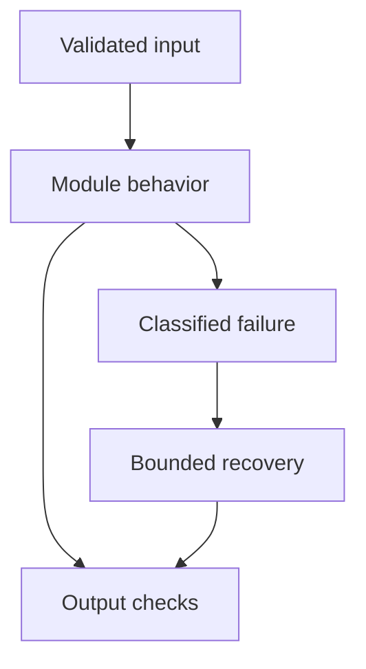

# 29: GenAI Coding Interviews

[Previous module](../28-debugging/README.md) · [Repository home](../README.md) · [Next module](../30-projects/README.md)

## Simple explanation

Interview code should make assumptions explicit, handle edge cases, and explain complexity. A correct small implementation with tests is stronger than a framework-heavy solution you cannot reason about.

## Why, when, and how

Study this module to answer engineering scenarios, not only definitions. Work through the concepts below, run the example, explain its boundaries, then solve the exercise before reading interview answers.

## Concepts

### Python exercises

Implement deduplication by stable ID, bounded batches, a generator, and a context manager. Discuss time and space complexity. Preserve ordering when it matters. Test empty input and mutable data rather than only one happy-path list.

### API exercises

Validate request fields, classify errors, and keep authorization out of user input. Build a small FastAPI endpoint as an optional lab. Test malformed JSON, excessive sizes, and missing authentication. Explain why schema validation is necessary but insufficient.

### Async exercises

Write bounded parallel calls with cancellation, timeouts, and per-record results. A semaphore caps active work; a bounded queue caps queued work. Show that failed calls do not disappear. Use deterministic fixtures to test peak concurrency.

### Embedding and similarity

Implement cosine, normalization, and top-k search. Validate dimensions, finite values, and zero vectors. Explain O(Nd) exact search and ANN trade-offs. Do not confuse similarity with probability of correctness.

### Chunking exercises

Implement overlapping windows with 0 ≤ overlap < size and termination guarantees. Preserve offsets and source IDs. Character windows are a baseline, not a substitute for token-aware splitting. Test documents shorter than one chunk and overlap equal to size.

### Retrieval and hybrid

Implement ranked retrieval with tenant filtering and reciprocal rank fusion. Deduplicate by stable ID. Explain why post-filtering a tiny candidate set harms authorized recall. Evaluate known relevant IDs and deterministic tie-breaking.

### RAG exercises

Compose ingestion, retrieval, answer generation, and citations with a fake model first. Add abstention and versioned sources. Then integrate a live model behind the same interface. The fake model is a test double, not proof of GenAI quality.

### Tools and agents

Build a registry with typed arguments, permissions, timeouts, and bounded execution. Detect unknown tools and no-progress loops. Distinguish safe read retries from side-effect retries. Test the trace and real result rather than the final text alone.

### Evaluation exercises

Compute precision, recall, MRR, and Recall@k with defined edge behavior. Build a JSONL runner that saves per-case metrics. Explain which checks are lexical or structural and which require semantic judgment. Avoid grading truth by keyword presence.

### Difficulty progression

Easy tasks cover metrics and data structures; medium covers chunking and retrieval; hard covers concurrency and workflow state; production tasks cover lifecycle, authorization, outages, and evidence. The coding-challenges directory includes forty practice tasks with constraints, tests to write, and reference implementations for the core primitives.

## Architecture and implementation boundary

The example isolates one mechanism from this module. Its inputs, state transitions, and outputs should be inspectable in code. Use it as a tested teaching primitive, then add the integrations described below. Offline lexical search and fixture answers are explicitly different from learned embeddings and live LLM generation.



## Real-world scenario

> Implement cosine similarity and explain the edge cases.

**Recommended approach:** Check equal nonzero dimensions and finite values, compute dot product and norms, reject zero vectors, then divide the dot product by the product of norms. The time complexity is O(d).

**Technical reasoning:** Zero-vector similarity is undefined, so choose an explicit error rather than silently treating it as relevance. Numerical roundoff can yield tiny boundary deviations; clamp for a score presentation if needed. Unit-normalized vectors make dot product equivalent to cosine. Test identical, opposite, orthogonal, mismatched, zero, and nonfinite vectors. Real semantic quality still depends on the embedding model and corpus.

## Code

This example runs on Python 3.12 with the standard library.

Run from the repository root:

```bash
python -m examples.coding
```

```python
from examples.core import chunks, cosine, retrieval_metrics
if __name__ == '__main__':
    print(chunks('abcdefghij',size=4,overlap=1))
    print(cosine([1,1],[1,0]))
    print(retrieval_metrics(['D2','D1'],{'D1'},2))
```

Shared implementation: [core.py](../examples/core.py). Tests: [test_core.py](../tests/test_core.py). Optional adapters have separate validation status in [VALIDATION.md](../VALIDATION.md).

## Interview case

### Question

Implement cosine similarity and explain the edge cases.

### Difficulty

Hard

### What interviewer is testing

Whether you can identify the actual engineering constraint, choose a bounded implementation, and justify its trade-offs.

### Short Answer

Check equal nonzero dimensions and finite values, compute dot product and norms, reject zero vectors, then divide the dot product by the product of norms. The time complexity is O(d).

### Interview Answer

Check equal nonzero dimensions and finite values, compute dot product and norms, reject zero vectors, then divide the dot product by the product of norms. The time complexity is O(d). Zero-vector similarity is undefined, so choose an explicit error rather than silently treating it as relevance. Numerical roundoff can yield tiny boundary deviations; clamp for a score presentation if needed. Unit-normalized vectors make dot product equivalent to cosine. Test identical, opposite, orthogonal, mismatched, zero, and nonfinite vectors. Real semantic quality still depends on the embedding model and corpus. I would start with a representative failing or demanding workload and define measurable acceptance criteria. I would test both successful behavior and the likely failure path, then compare the new implementation with a fixed baseline. I would report the implemented scope and remaining assumptions clearly.

### Deep Technical Answer

Zero-vector similarity is undefined, so choose an explicit error rather than silently treating it as relevance. Numerical roundoff can yield tiny boundary deviations; clamp for a score presentation if needed. Unit-normalized vectors make dot product equivalent to cosine. Test identical, opposite, orthogonal, mismatched, zero, and nonfinite vectors. Real semantic quality still depends on the embedding model and corpus. Keep input assumptions, state scope, failure classification, and deployment configuration explicit. Verify that the implementation is doing what the architecture claims by inspecting stage-level traces and authoritative outcomes. A successful demonstration is not enough evidence for an unmeasured scale claim.

### Real-World Example

Use the scenario above with a fixed source version and representative inputs. Save the expected result, observed result, and relevant trace so the investigation can be repeated.

### Code

Use the runnable example above and inspect the shared core for validation, lifecycle, or budget logic. Extend it only after the baseline behavior is understood.

### Follow-up Question

How would you prove this improvement still works after a dependency, model, or source-data change?

### Follow-up Answer

Version inputs and configuration, keep independent regression cases, compare quality and operational metrics, and test a rollback. Add a slice for the failure this change specifically addresses.

### Common Mistake

Giving a component name as the whole answer without explaining its contract, limitations, measurement, or failure behavior.

### Senior-Level Insight

Zero-vector similarity is undefined, so choose an explicit error rather than silently treating it as relevance. Numerical roundoff can yield tiny boundary deviations; clamp for a score presentation if needed. Unit-normalized vectors make dot product equivalent to cosine. Test identical, opposite, orthogonal, mismatched, zero, and nonfinite vectors. Real semantic quality still depends on the embedding model and corpus. Explain the simplest design that meets the requirement and what workload or evidence would make you replace it.

## Follow-up tree

1. Explain the mechanism using a tiny input.
2. Show the implementation and edge cases.
3. Explain the scenario above and the main bottleneck.
4. Show which metric would identify a regression.
5. Explain recovery after failure or a partial result.
6. Design the boundary under multiple tenants and ten times the workload.

## Debugging exercise

**Symptom:** the scenario fails after a configuration or data change. **Investigation:** capture exact inputs, versions, and stage outcomes; compare with the prior baseline. **Root cause:** identify the first stage violating its contract. **Fix:** change that stage and replay the case. **Prevention:** add the failing case and an operational signal to the regression suite. For concrete incidents, see [debugging runbooks](../28-debugging/runbooks.md).

## Production considerations

- **Reliability:** define deadlines, cancellation behavior, retryability, and recovery of partial work.
- **Security:** derive caller identity from authentication; scope data and tool permissions in trusted code.
- **Cost and performance:** measure stage latency, memory, token use, throughput, and cost per successful task.
- **Testing and evaluation:** validate hard invariants separately from semantic quality; keep representative held-out cases.
- **Deployment:** use tested dependency versions, external configuration, safe telemetry, and an actual rollback procedure.

## Levels of understanding

**Junior:** explain each concept and run the example with a small input.

**Mid-level:** adapt it to the real-world scenario, write edge tests, and diagnose a demonstrated failure.

**Senior:** Zero-vector similarity is undefined, so choose an explicit error rather than silently treating it as relevance. Numerical roundoff can yield tiny boundary deviations; clamp for a score presentation if needed. Unit-normalized vectors make dot product equivalent to cosine. Test identical, opposite, orthogonal, mismatched, zero, and nonfinite vectors. Real semantic quality still depends on the embedding model and corpus.

## What I must remember

Interview code should make assumptions explicit, handle edge cases, and explain complexity. A correct small implementation with tests is stronger than a framework-heavy solution you cannot reason about. Check equal nonzero dimensions and finite values, compute dot product and norms, reject zero vectors, then divide the dot product by the product of norms. The time complexity is O(d).

## What I must be able to code

Run, modify, and explain [coding.py](../examples/coding.py); implement the exercise below and relevant edge tests.

## What an interviewer may ask

The case above, each concept’s failure boundary, and the topic-specific questions in the [interview bank](../interview-questions/README.md).

## What senior engineers are expected to know

Requirements, observable evidence, uncertainty, dependency lifecycle, authorization, and the cost of operating the design. Explain what would change your decision.

## Common mistakes

Confusing an example with a production deployment; assuming a framework enforces business permissions; reporting unmeasured performance; skipping the failure path; and tuning on the final test set.

## Practical exercise and mini project

Solve four challenges without looking at solutions: cosine, overlapping chunks, async batching, and Recall@k. Then compare with the core code and add one missing edge test.

**Acceptance:** include a normal case, empty or missing input, invalid input, a failure case, and one stated limitation. Record the observed result and explain why the checks match the actual requirement.

## GitHub task

```bash
git switch -c learn/29-coding-interview
python -m unittest discover -s tests -v
git add 29-coding-interview examples tests
git commit -m "docs: study genai coding interviews and record exercise results"
git push -u origin learn/29-coding-interview
```

Open a pull request with the implementation, measured validation, and remaining limits. Do not claim a lab result is a production benchmark.
