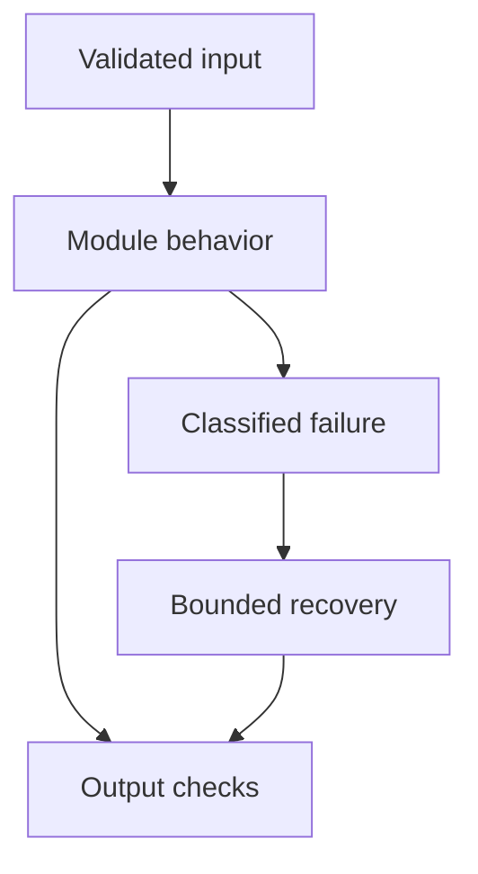

# 30: Project-Based Interview Preparation

[Previous module](../29-coding-interview/README.md) · [Repository home](../README.md) · [Capstone](../capstone/README.md)

## Simple explanation

A portfolio project demonstrates choices and measured behavior. Ten honest, focused projects with failure tests are more useful than ten copied interfaces that claim unsupported production readiness.

## Why, when, and how

Study this module to answer engineering scenarios, not only definitions. Work through the concepts below, run the example, explain its boundaries, then solve the exercise before reading interview answers.

## Concepts

### Production-style RAG

Build versioned ingestion, authorized retrieval, source-linked answers, and an evaluation suite. Start from the runnable offline reference and replace adapters deliberately. Report actual quality and latency after testing, not invented percentages. Explain parsing and freshness failures.

### Customer support agent

Use current policy evidence, ticket lookup, escalation, and approval for consequential actions. Separate informational responses from business operations. Test unauthorized refunds and stale policy versions. Measure resolution and escalation correctness.

### Research agent

Collect bounded sources, preserve provenance, summarize claims, and verify support. Use a fixed workflow baseline before adding dynamic planning. Test conflicting and malicious sources. Quality depends on evidence, not the number of agents.

### SQL agent

Translate questions into constrained plans and read-only queries. Define tenant, currency, dates, and aggregation semantics. Test query results on seeded data. Avoid declaring arbitrary generated SQL safe after one string check.

### Document intelligence

Extract fields and source spans from varied document layouts. Handle OCR, missing values, units, confidence, and human review. Preserve original source versions. Test scanned pages and tables rather than only text files.

### AI question bank

Generate questions from approved educational content and validate answer support, difficulty, duplication, and coverage. Separate practice questions from revealed answers. A question bank needs review; a model-generated answer key may be wrong.

### Evaluation platform

Store versioned cases, run configurations, per-case metrics, human judgments, and comparisons. Support deterministic checks plus calibrated semantic review. Do not label a keyword checker as an expert grader. Reproduce a past experiment.

### Multi-agent research

Divide collection, synthesis, and checking with explicit contracts and budgets. Compare against single-agent results. Test one unavailable worker and correlated errors. Preserve evidence through the handoffs.

### Enterprise knowledge assistant

Combine identity, ACLs, source lifecycle, retrieval, optional tools, observability, and deployment. The capstone guide specifies integration milestones and acceptance gates. Provisioned infrastructure alone is not a completed integration.

### Cost optimization router

Build configuration-driven routes with capability checks and task quality thresholds. Use fictional rates only for demonstrations. Evaluate savings and errors together, including fallback and failed attempts. Scope cache keys by tenant and version.

## Architecture and implementation boundary

The example isolates one mechanism from this module. Its inputs, state transitions, and outputs should be inspectable in code. Use it as a tested teaching primitive, then add the integrations described below. Offline lexical search and fixture answers are explicitly different from learned embeddings and live LLM generation.



## Real-world scenario

> How do you describe a portfolio project honestly in an interview?

**Recommended approach:** Explain the problem, implemented scope, architecture choices, failure cases, actual tests, measured results, and remaining limitations. Distinguish the learning demo from integrated production behavior.

**Technical reasoning:** Walk through one request and one failure path. Show the evaluation dataset and explain how metrics were defined. If an adapter or deployment is planned, say so rather than implying it exists. A strong resume bullet names a real implemented capability and measured evidence; use placeholders until measurements are available. Discuss the trade-off you rejected and what workload would change your decision.

## Code

This example runs on Python 3.12 with the standard library.

Run from the repository root:

```bash
python -m examples.portfolio
```

```python
from examples.evaluate import run
if __name__ == '__main__':
    results=run()
    print('Measured on synthetic offline cases:',len(results))
    print('Abstention expectation passes:',sum(x['abstention_pass'] for x in results))
    print('No live-model semantic or production-readiness claim is made.')
```

Shared implementation: [core.py](../examples/core.py). Tests: [test_core.py](../tests/test_core.py). Optional adapters have separate validation status in [VALIDATION.md](../VALIDATION.md).

## Interview case

### Question

How do you describe a portfolio project honestly in an interview?

### Difficulty

Hard

### What interviewer is testing

Whether you can identify the actual engineering constraint, choose a bounded implementation, and justify its trade-offs.

### Short Answer

Explain the problem, implemented scope, architecture choices, failure cases, actual tests, measured results, and remaining limitations. Distinguish the learning demo from integrated production behavior.

### Interview Answer

Explain the problem, implemented scope, architecture choices, failure cases, actual tests, measured results, and remaining limitations. Distinguish the learning demo from integrated production behavior. Walk through one request and one failure path. Show the evaluation dataset and explain how metrics were defined. If an adapter or deployment is planned, say so rather than implying it exists. A strong resume bullet names a real implemented capability and measured evidence; use placeholders until measurements are available. Discuss the trade-off you rejected and what workload would change your decision. I would start with a representative failing or demanding workload and define measurable acceptance criteria. I would test both successful behavior and the likely failure path, then compare the new implementation with a fixed baseline. I would report the implemented scope and remaining assumptions clearly.

### Deep Technical Answer

Walk through one request and one failure path. Show the evaluation dataset and explain how metrics were defined. If an adapter or deployment is planned, say so rather than implying it exists. A strong resume bullet names a real implemented capability and measured evidence; use placeholders until measurements are available. Discuss the trade-off you rejected and what workload would change your decision. Keep input assumptions, state scope, failure classification, and deployment configuration explicit. Verify that the implementation is doing what the architecture claims by inspecting stage-level traces and authoritative outcomes. A successful demonstration is not enough evidence for an unmeasured scale claim.

### Real-World Example

Use the scenario above with a fixed source version and representative inputs. Save the expected result, observed result, and relevant trace so the investigation can be repeated.

### Code

Use the runnable example above and inspect the shared core for validation, lifecycle, or budget logic. Extend it only after the baseline behavior is understood.

### Follow-up Question

How would you prove this improvement still works after a dependency, model, or source-data change?

### Follow-up Answer

Version inputs and configuration, keep independent regression cases, compare quality and operational metrics, and test a rollback. Add a slice for the failure this change specifically addresses.

### Common Mistake

Giving a component name as the whole answer without explaining its contract, limitations, measurement, or failure behavior.

### Senior-Level Insight

Walk through one request and one failure path. Show the evaluation dataset and explain how metrics were defined. If an adapter or deployment is planned, say so rather than implying it exists. A strong resume bullet names a real implemented capability and measured evidence; use placeholders until measurements are available. Discuss the trade-off you rejected and what workload would change your decision. Explain the simplest design that meets the requirement and what workload or evidence would make you replace it.

## Follow-up tree

1. Explain the mechanism using a tiny input.
2. Show the implementation and edge cases.
3. Explain the scenario above and the main bottleneck.
4. Show which metric would identify a regression.
5. Explain recovery after failure or a partial result.
6. Design the boundary under multiple tenants and ten times the workload.

## Debugging exercise

**Symptom:** the scenario fails after a configuration or data change. **Investigation:** capture exact inputs, versions, and stage outcomes; compare with the prior baseline. **Root cause:** identify the first stage violating its contract. **Fix:** change that stage and replay the case. **Prevention:** add the failing case and an operational signal to the regression suite. For concrete incidents, see [debugging runbooks](../28-debugging/runbooks.md).

## Production considerations

- **Reliability:** define deadlines, cancellation behavior, retryability, and recovery of partial work.
- **Security:** derive caller identity from authentication; scope data and tool permissions in trusted code.
- **Cost and performance:** measure stage latency, memory, token use, throughput, and cost per successful task.
- **Testing and evaluation:** validate hard invariants separately from semantic quality; keep representative held-out cases.
- **Deployment:** use tested dependency versions, external configuration, safe telemetry, and an actual rollback procedure.

## Levels of understanding

**Junior:** explain each concept and run the example with a small input.

**Mid-level:** adapt it to the real-world scenario, write edge tests, and diagnose a demonstrated failure.

**Senior:** Walk through one request and one failure path. Show the evaluation dataset and explain how metrics were defined. If an adapter or deployment is planned, say so rather than implying it exists. A strong resume bullet names a real implemented capability and measured evidence; use placeholders until measurements are available. Discuss the trade-off you rejected and what workload would change your decision.

## What I must remember

A portfolio project demonstrates choices and measured behavior. Ten honest, focused projects with failure tests are more useful than ten copied interfaces that claim unsupported production readiness. Explain the problem, implemented scope, architecture choices, failure cases, actual tests, measured results, and remaining limitations. Distinguish the learning demo from integrated production behavior.

## What I must be able to code

Run, modify, and explain [portfolio.py](../examples/portfolio.py); implement the exercise below and relevant edge tests.

## What an interviewer may ask

The case above, each concept’s failure boundary, and the topic-specific questions in the [interview bank](../interview-questions/README.md).

## What senior engineers are expected to know

Requirements, observable evidence, uncertainty, dependency lifecycle, authorization, and the cost of operating the design. Explain what would change your decision.

## Common mistakes

Confusing an example with a production deployment; assuming a framework enforces business permissions; reporting unmeasured performance; skipping the failure path; and tuning on the final test set.

## Practical exercise and mini project

Complete the RAG project first. Record a baseline and one controlled improvement, write an incident note, and explain the architecture without looking at the README. Add measured resume bullets only after running evaluation.

**Acceptance:** include a normal case, empty or missing input, invalid input, a failure case, and one stated limitation. Record the observed result and explain why the checks match the actual requirement.

## GitHub task

```bash
git switch -c learn/30-projects
python -m unittest discover -s tests -v
git add 30-projects examples tests
git commit -m "docs: study project-based interview preparation and record exercise results"
git push -u origin learn/30-projects
```

Open a pull request with the implementation, measured validation, and remaining limits. Do not claim a lab result is a production benchmark.
