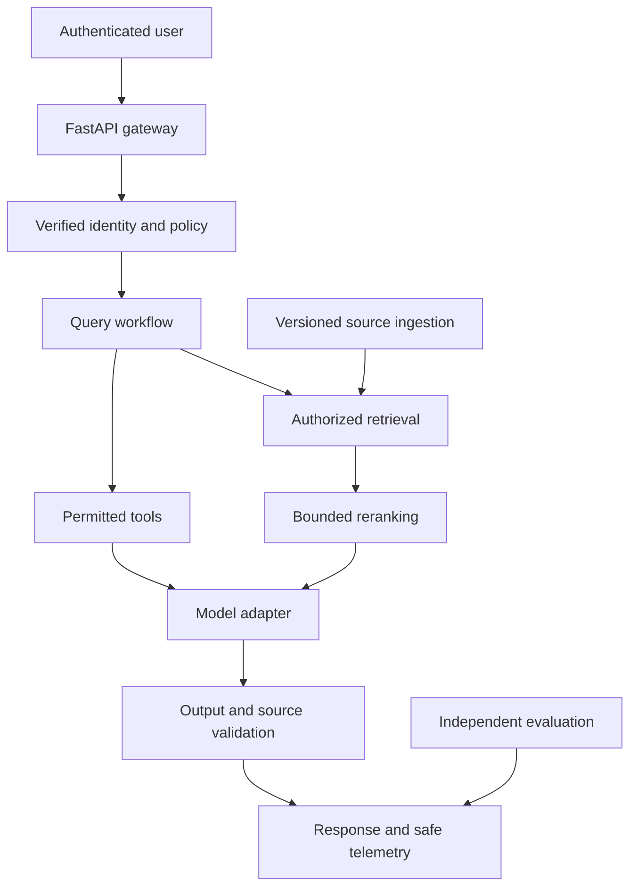

# Capstone: Enterprise AI Knowledge Platform

Build an authenticated knowledge service with versioned ingestion, authorized search, narrow tools, grounded answers, independent evaluation, and safe operations. The repository supplies an offline service reference, teaching primitives, optional integration examples, and an integration plan. It does not claim that every production adapter is already implemented.

## Architecture

Online evaluation should sample and audit safely; do not add an unbounded judge call to every request merely because a diagram includes evaluation.

## Data ownership

Object storage owns original source artifacts. PostgreSQL owns source versions, identity mappings, ACLs, job state, and operation records. Qdrant or another selected search system owns derived vectors. Redis can hold scoped caches and quota state. The model provider generates outputs; it is not an authoritative database or permission system.

## Milestone 1 — Contracts and baseline

Run the offline RAG, evaluation, and tests. Define QueryRequest, QueryResponse, IngestJob, SourceVersion, Principal, and ToolResult contracts. Label the lexical/extractive fixture mode clearly. The default API in app/main.py is a development reference with in-memory state.

Acceptance: empty and unanswerable inputs behave deliberately; source IDs and versions survive retrieval; another tenant’s data is absent; structural checks are distinct from semantic evaluation.

## Milestone 2 — Durable data and ingestion

Implement relational tables for sources, source_versions, chunks, grants, jobs, and operations. Store original files in object storage. Add queue workers for extraction, chunking, embedding, and atomic active-version changes. Assign stable IDs and handle shorter replacements, deletion, and retry safely.

Acceptance: restart preserves intended data; partial ingestion is not active; retries do not duplicate chunks; deletion and permission changes reach search and caches.

## Milestone 3 — Real authentication and authorization

Replace the development key with company identity verification. Verify issuer, audience, signature, expiry, and allowed tenant membership. Derive principal scope from trusted claims and directory policy. Apply document filters in search and recheck ACL freshness before serving content.

Acceptance: malformed, expired, wrong-audience, cross-tenant, and revoked-access requests fail without exposing data. A user-supplied tenant_id cannot raise privileges.

## Milestone 4 — Retrieval and real models

Integrate a selected embedding model and vector database. Version embedding model, preprocessing, dimensions, and index configuration. Compare exact and ANN retrieval. Add lexical fusion and bounded reranking only when evaluation shows benefit. Use a configured model adapter for source-grounded answers with explicit abstention.

Acceptance: held-out retrieval and answer tests meet stated thresholds. Citation ID checks and semantic support review both run. An embedding migration uses a shadow index, comparison, alias switch, and rollback.

## Milestone 5 — Narrow tools and orchestration

Add permitted account or SQL tools with strict schemas, caller-bound permissions, deadlines, and safe errors. Introduce LangGraph only where branching, persistence, approval, or recovery requires it. Store operation IDs independently from checkpoint state.

Acceptance: unknown tools, malformed arguments, repeated failures, and exhausted budgets stop safely. Approved operations use unchanged arguments. Replay and ambiguous timeouts cannot duplicate consequential actions.

## Milestone 6 — Evaluation and observability

Version representative datasets with normal, unanswerable, contradictory, stale, injection, and permission cases. Track retrieval, answer support, correctness, citation support, agent outcome, latency, cost, and errors. Calibrate judges against human review and keep private test cases untouched.

Trace stage timings and safe configuration identifiers. Redact raw sensitive content. Dashboards should show task success and quality beside availability and spend. Define incident owners and runbooks.

## Milestone 7 — Reliability and deployment

Add shared rate control, stage and total deadlines, cancellation, bounded retry, queue backpressure, and circuit breakers. Test concurrency under realistic mixed traffic. Lock tested dependencies and package immutable images. Compose is a local development stack; it is not a production release certificate.

On AWS, use S3 for sources, a queue for ingestion, ECS tasks or suitable compute for APIs/workers, RDS metadata, approved search infrastructure, managed caching where appropriate, and CloudWatch telemetry. Workloads use least-privilege roles; developers use authorized SSO/federation or a company-authenticated gateway. Model IDs and regions are configuration.

Acceptance: provider and search outages produce explicit bounded behavior; secrets are runtime-managed; data backup restore works; schema and model rollbacks are rehearsed.

## Milestone 8 — Review and portfolio

Present one request and one failure trace, a data lifecycle diagram, authorization tests, actual evaluation results, and the measured workload. Report planned integrations separately from implemented behavior. Add resume metrics only after observing them.

## API proposal

POST /sources, GET /jobs/{id}, PATCH /sources/{id}/grants, POST /query, POST /operations/propose, POST /operations/{id}/approve, GET /health/ready, and restricted audit export. Requests cannot supply trusted principal identity. Long operations return a job ID; streaming outputs have explicit completion state.

## Interview defense

Why RAG instead of tuning for changing policy? Why this chunk strategy? How are permissions refreshed? What prevents repeated actions after replay? What if the citation exists but does not support the claim? What is the first bottleneck at ten times load? How do you know the model change is better? How do you recover from a partial index migration? What evidence supports your cost claim? What remains unimplemented?
